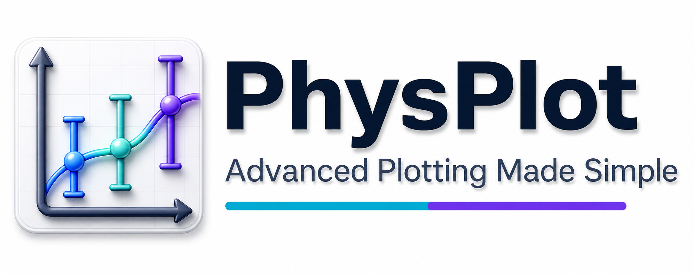

  

# PhysPlot: Advanced Plotting Made Simple

PhysPlot is a scientific plotting software with a graphical user interface, designed to produce publication-ready 2D plots. It supports vector and bitmap output, including PDF, Postscript, SVG and EPS. It allows data to be imported from text, CSV and Excel files and It can export data in text format. Datasets can also be entered within the program, and new datasets can be created via the manipulation of existing datasets using mathematical expressions.

## License, Tutorials, and Contributions

PhysPlot source code is licensed under the PolyForm Noncommercial License 1.0.0. You may fork PhysPlot, study the code, make noncommercial improvements, and submit revisions back through pull requests.

Commercial use is not allowed without prior written permission from the project originator.

Documentation, screenshots, tutorials, website text, walkthroughs, and educational media are licensed under Creative Commons Attribution-NonCommercial 4.0 International (CC BY-NC 4.0) unless otherwise stated. Noncommercial tutorials and educational guides are welcome.

The PhysPlot name, logo, app icon, GUI branding, and official visual identity are reserved by the project originator. Unofficial forks or modified builds must not be presented as official PhysPlot releases.

Only pull requests merged by the maintainer are official PhysPlot revisions. For details, see [CONTRIBUTING.md](CONTRIBUTING.md) and [TRADEMARK.md](TRADEMARK.md).
