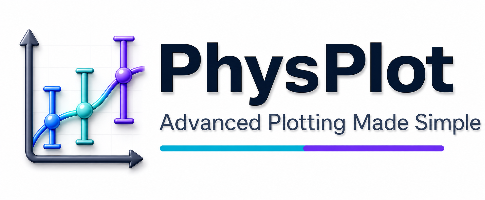

# PhysPlot

<p align="center">
  
</p>

## Overview

PhysPlot is a scientific plotting and workflow automation application for researchers, engineers, and students who require fast, reproducible, publication-quality figures without relying on large commercial software packages.

Originally conceived in 2019 following a suggestion from **Dr. Muhammad Sabieh Anwar**, PhysPlot has evolved into a modular scientific plotting platform supporting graphical workflows, reusable plotting protocols, and automated batch processing.

The workflow is intentionally simple:

```text
Load Data
      ↓
Assign Column Roles
      ↓
Apply Transformations
      ↓
Generate Publication-Quality Plot
      ↓
Save Workflow
      ↓
Reuse or Run in Bulk
```

---

# Features

- Scientific plotting desktop application built with PyQt
- Publication-quality figure generation
- Spreadsheet-style data editor
- CSV, TXT, Excel, Nanoindentation, and DataFrame support
- Dynamic data loaders
- Dynamic mathematical transformation modules
- Modular plotting architecture
- Figure templates
- Reusable workflow protocols
- Automated batch processing
- Headless command-line execution
- Python API
- FigureForge-powered figure editor
- Plugin-friendly architecture

---

# Video Tutorials

Short live recordings of PhysPlot, one per feature. Click a thumbnail to watch it on
YouTube. The same videos play inside the matching pages of the
[documentation](https://physplot.readthedocs.io/en/latest/ui/videos.html).

**[PhysPlot Basics](https://www.youtube.com/playlist?list=PLPkYnHekjU24)**: Simple Mode,
from typing data to curve fitting.

<table>
  <tr>
    <td align="center" width="25%"><a href="https://youtu.be/JhQnXwG3moY"></a><br><sub><b>1. The PhysPlot Window</b> · 0:18</sub></td>
    <td align="center" width="25%"><a href="https://youtu.be/Is0FpUS9vv8"></a><br><sub><b>2. Entering Values</b> · 0:21</sub></td>
    <td align="center" width="25%"><a href="https://youtu.be/PvGC_4iodYI"></a><br><sub><b>3. Column Roles</b> · 0:11</sub></td>
    <td align="center" width="25%"><a href="https://youtu.be/DbsN_NGNpCM"></a><br><sub><b>4. Generating Plots</b> · 0:19</sub></td>
  </tr>
  <tr>
    <td align="center" width="25%"><a href="https://youtu.be/4KBA064UiQc"></a><br><sub><b>5. Error Bars</b> · 0:24</sub></td>
    <td align="center" width="25%"><a href="https://youtu.be/SnhtG1Fdh4Y"></a><br><sub><b>6. Curve Fitting</b> · 0:23</sub></td>
    <td align="center" width="25%"><a href="https://youtu.be/AzZ-AloPkW0"></a><br><sub><b>7. Importing Data</b> · 0:16</sub></td>
    <td align="center" width="25%"><a href="https://youtu.be/8iVsJG8xUQ0"></a><br><sub><b>8. Transformations</b> · 0:31</sub></td>
  </tr>
</table>

**[PhysPlot Advanced](https://www.youtube.com/playlist?list=PLelbbYnCXEdU)**: recorded
protocols, `Sequence.py` files, bulk runs, and writing your own file loaders and plotter
modules.

<table>
  <tr>
    <td align="center" width="25%"><a href="https://youtu.be/I5nPKIvLaWk"></a><br><sub><b>1. Recorded Protocol</b> · 0:17</sub></td>
    <td align="center" width="25%"><a href="https://youtu.be/l1zGnY109j4"></a><br><sub><b>2. Saving a Sequence</b> · 0:12</sub></td>
    <td align="center" width="25%"><a href="https://youtu.be/XzgZrVX2wkM"></a><br><sub><b>3. Bulk Processing</b> · 0:21</sub></td>
    <td align="center" width="25%"><a href="https://youtu.be/M_ypJWTtSnY"></a><br><sub><b>4. New File Loader</b> · 1:52</sub></td>
  </tr>
  <tr>
    <td align="center" width="25%"><a href="https://youtu.be/AHWbQDqHvQ0"></a><br><sub><b>5. New Plotter Module</b> · 2:01</sub></td>
    <td align="center" width="25%"><a href="https://youtu.be/9Waw3iNOO1s"></a><br><sub><b>6. Bulk OES Spectra</b> · 1:21</sub></td>
  </tr>
</table>

---

# Installation

## Option 1 — macOS: one command (Recommended on Mac)

Open **Terminal** and paste:

```bash
curl -fsSL https://raw.githubusercontent.com/MShirazAhmad/PhysPlot/indevelopment/scripts/install_macos.sh | bash
```

The script finds Python 3.11–3.13 (or installs Python 3.12 with Homebrew), installs
PhysPlot and its dependencies into `~/.physplot`, and creates **PhysPlot.app** in
`~/Applications`. Run it again to update; uninstall with
`rm -rf ~/.physplot ~/Applications/PhysPlot.app`.

---

## Option 2 — Windows: one command

Open **PowerShell** and paste:

```powershell
irm https://raw.githubusercontent.com/MShirazAhmad/PhysPlot/indevelopment/scripts/install_windows.ps1 | iex
```

The script finds Python 3.11–3.13 (or installs Python 3.12 with `winget`), installs
PhysPlot and its dependencies into `%LOCALAPPDATA%\PhysPlot`, and adds a **PhysPlot**
Start-menu shortcut. Close PhysPlot and run it again to update.

A classic setup program can be built with `scripts/build_windows_installer.ps1`; when a
release on the [Releases page](https://github.com/MShirazAhmad/PhysPlot/releases)
includes `PhysPlot-<version>-Windows-Setup.exe`, you can download that instead.

---

## Option 3 — Run from Source

Clone the repository:

```bash
git clone https://github.com/MShirazAhmad/PhysPlot.git
cd PhysPlot
```

Create a virtual environment:

```bash
/opt/homebrew/opt/python@3.12/bin/python3.12 -m venv .venv
source .venv/bin/activate
```

Verify Python:

```bash
python --version
```

Expected output:

```text
Python 3.12.x
```

Upgrade pip and install the project requirements:

```bash
python -m pip install --upgrade pip
python -m pip install -e ".[dev]"
```

Launch PhysPlot:

```bash
.venv/bin/python -m physplot_gui
```

When the virtual environment is activated, the console entry point is also
available:

```bash
physplot-gui
```

---

# Tested Environment

PhysPlot has been tested with:

| Component | Version |
|------------|---------|
| Python | 3.12.x (Homebrew) |
| Operating System | macOS (Apple Silicon) |

The package metadata in **pyproject.toml** is the source of truth for runtime
and development dependencies. **requirements.txt** mirrors the runtime
dependencies for environments that require requirements-file installs.

---

# Documentation

Complete project documentation is available online.

- Documentation
  https://physplot.readthedocs.io/

- Video tutorials (YouTube playlists)
  [PhysPlot Basics](https://www.youtube.com/playlist?list=PLPkYnHekjU24) ·
  [PhysPlot Advanced](https://www.youtube.com/playlist?list=PLelbbYnCXEdU)

- GitHub Repository
  https://github.com/MShirazAhmad/PhysPlot

- Issue Tracker
  https://github.com/MShirazAhmad/PhysPlot/issues

Additional project documentation:

- Maintainer Project Guide
- Contributing Guide
- Trademark and Branding

---

# GUI Workflow

The graphical interface follows a table-first workflow.

### Simple Mode

1. Import Data
2. Apply Mathematical Transformations
3. Select Plot Module
4. Apply Figure Template
5. Generate Plot
6. Edit Figure
7. Export Figure

### Advanced Mode

#### Build Protocol

Create, edit, save, and reuse Python workflow protocols.

#### Run Sequence

Execute saved workflows on entire folders for automated batch processing.

---

# Python API

PhysPlot can also be used directly from Python.

```python
from physplot import PhysPlot

pp = PhysPlot()

pp.load("data.csv")
pp.set_roles(
    x="Time",
    y="Voltage"
)

fig = pp.plot_with_module(
    "basic",
    "scatter"
)
```

---

# Command-Line Examples

Show version:

```bash
physplot --version
```

Run a workflow:

```bash
physplot run-workflow workflow.py \
    --input data.csv \
    --output outputs/run
```

Run batch processing:

```bash
physplot run-bulk workflow.py \
    --input-folder data \
    --output-folder outputs/batch
```

---

# Supported Data Sources

- CSV
- TXT
- Microsoft Excel
- Nanoindentation datasets
- Pandas DataFrames

---

# License

PhysPlot source code is licensed under the **PolyForm Noncommercial License 1.0.0**.

You may:

- Study the source code
- Fork the repository
- Modify the software for noncommercial purposes
- Submit improvements through pull requests

Commercial use requires prior written permission from the project originator.

Documentation, tutorials, screenshots, and educational material are licensed under the **Creative Commons Attribution–NonCommercial 4.0 International (CC BY-NC 4.0)** unless otherwise noted.

The **PhysPlot** name, logo, application icon, GUI branding, and visual identity remain reserved by the project originator. Modified versions must not be represented as official PhysPlot releases.

For contribution policies and branding guidelines, see:

- `CONTRIBUTING.md`
- `TRADEMARK.md`
