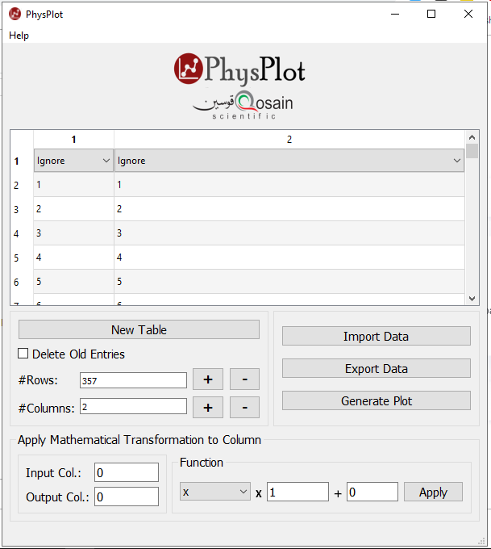

# Introduction

PhysPlot is a scientific plotting software with a graphical user interface, designed to produce publication-ready 2D plots. It supports vector and bitmap output, including PDF, Postscript, SVG and EPS. It allows data to be imported from text, CSV and Excel files and It can export data in text format. Datasets can also be entered within the program, and new datasets can be created via the manipulation of existing datasets using mathematical expressions.

It is in two flavours:
* Windows Installer: [Download Page](https://www.physlab.org/physplot/)
* Python Scripting: `PhysPlot.py` is the source file, which on execution loads icon (`ico.ico`) and logo (`PhysPlotLogo.png`) file from the same directory.

This software is developed under the following platforms:
* [PhysLab](https://www.physlab.org/physplot/)
* [Qosain Scientific](https://www.qosain.pk/)

### If you are a programmer and have any ideas, wishes, etc you are welcomed to fork the repository and submit a pull request.

# Pictorial procedure for data analysis

