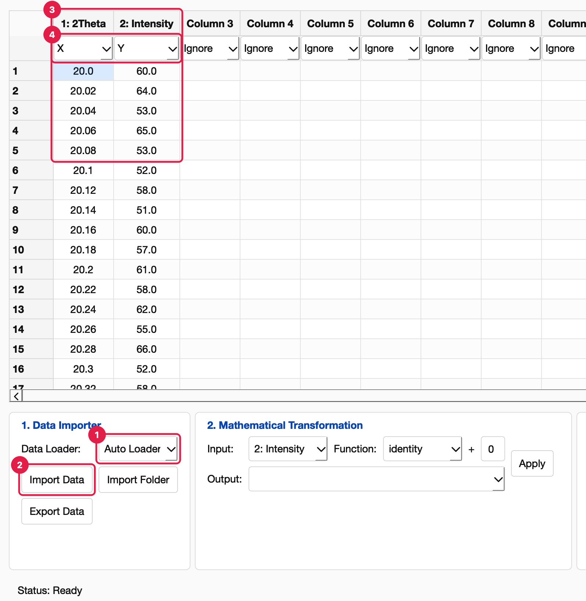
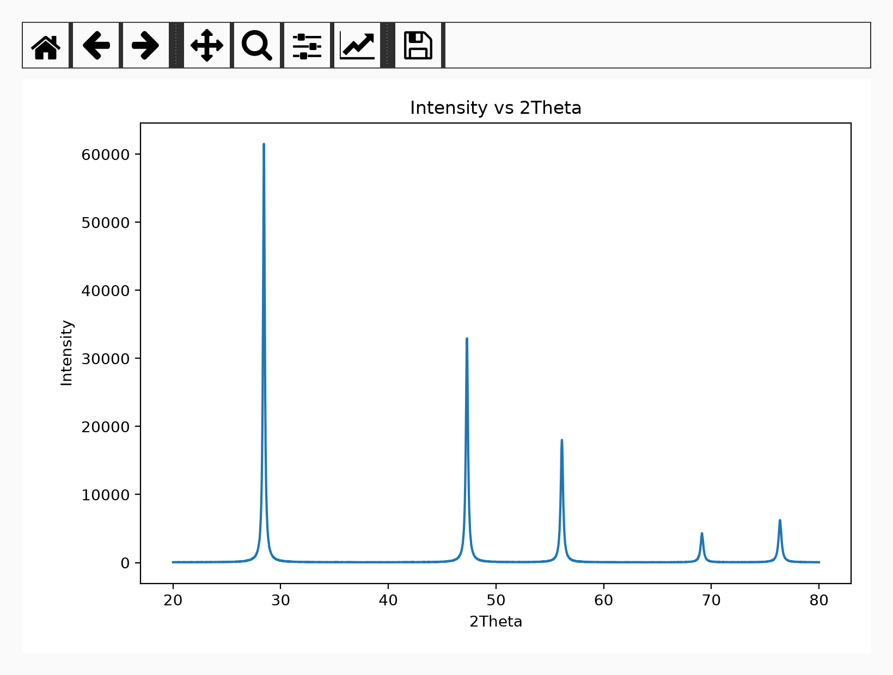
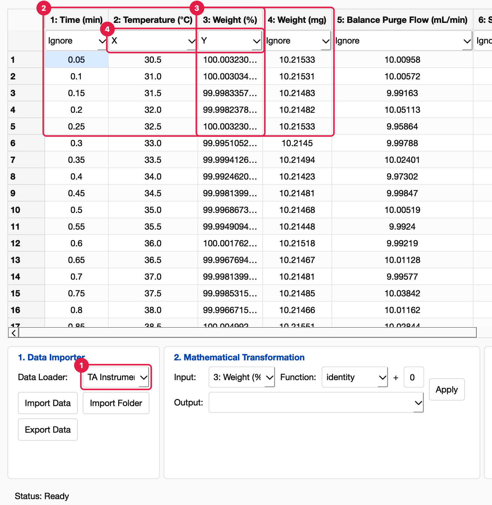
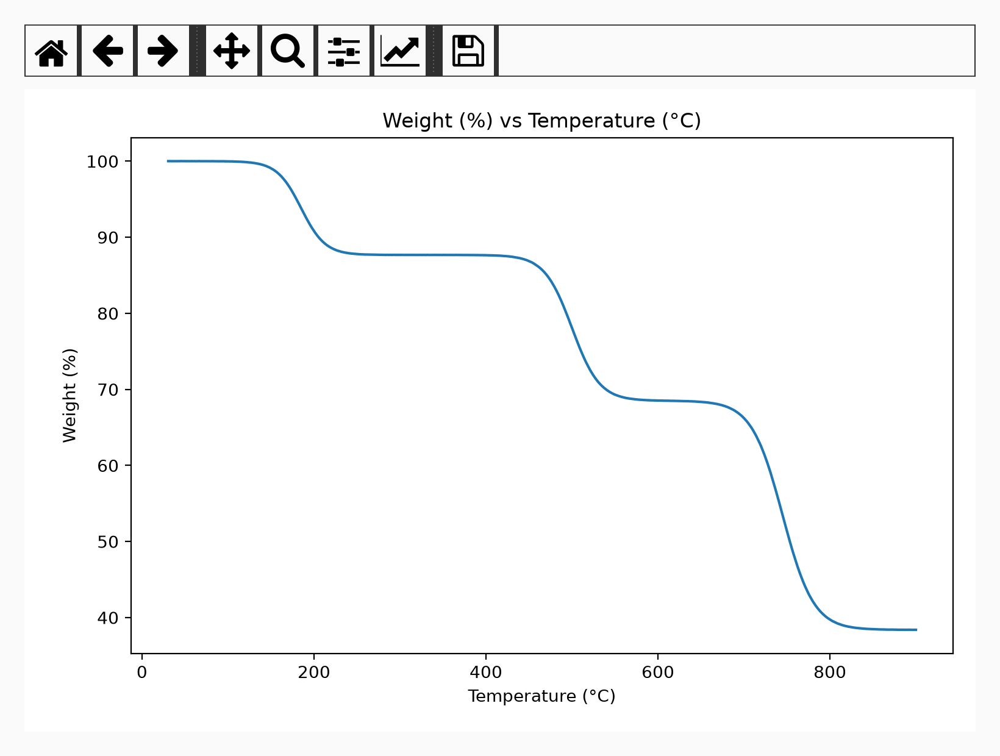
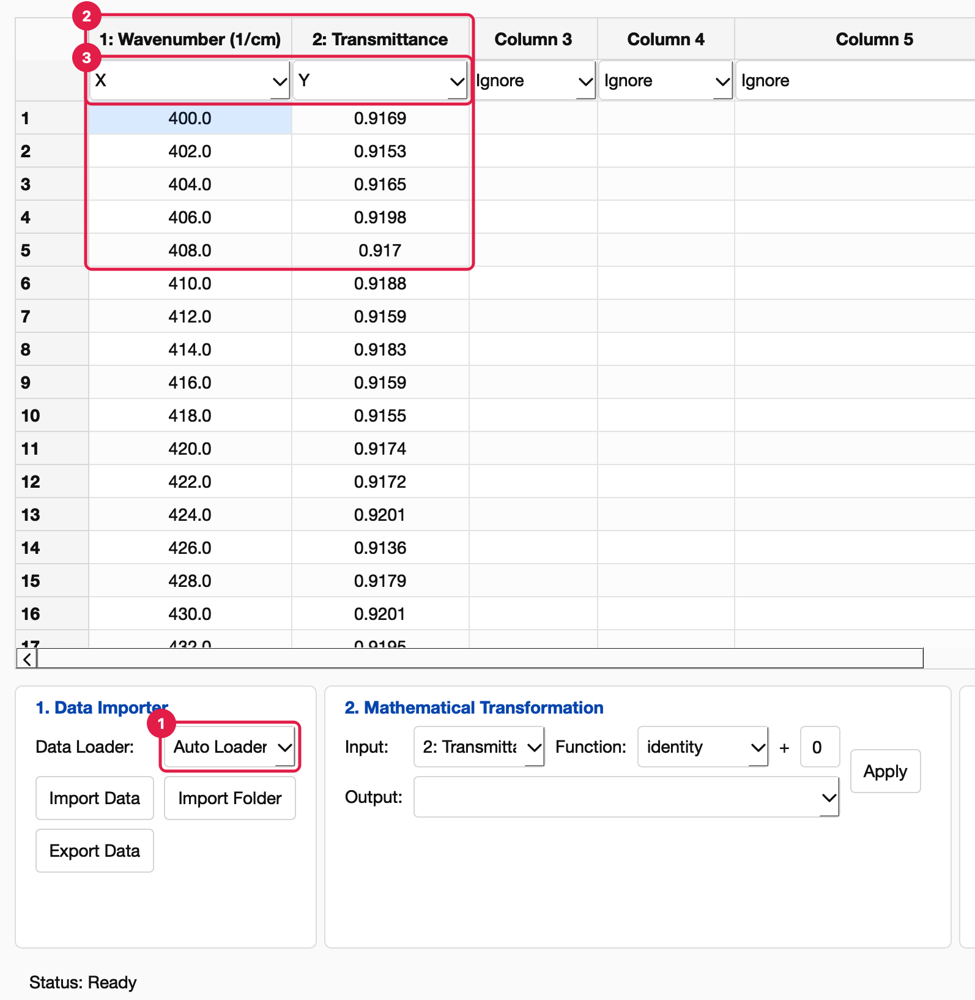
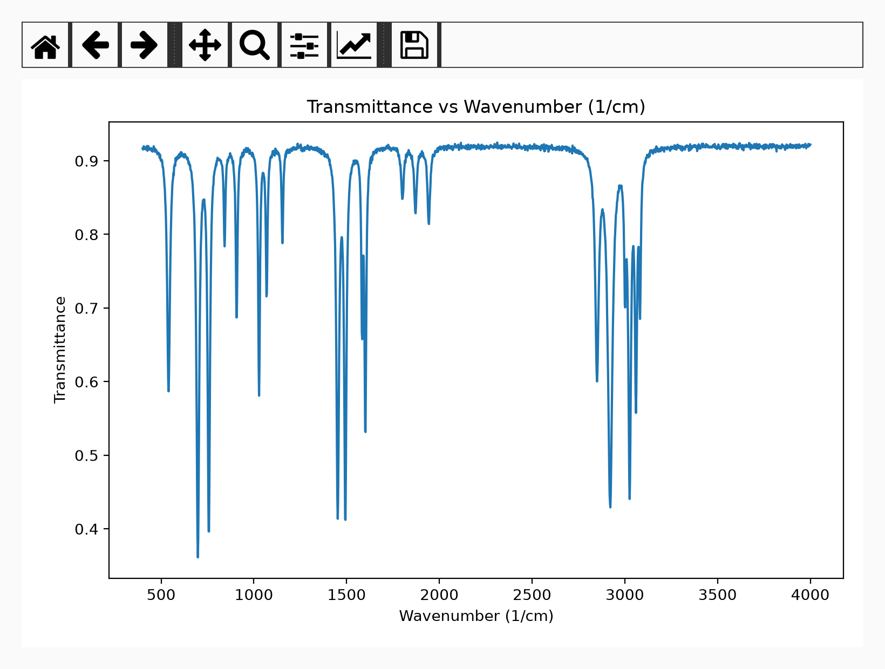

File-Loader Plugins
===================

A file loader turns one instrument file into the table PhysPlot shows. This page
explains what a loader must provide, then works through three complete examples. Each
example shows:

1. **the raw file**, exactly as the instrument writes it;
2. **the loader**: what it reads from the file and what it returns;
3. **the result in the GUI**: the imported table and a plot.

All three loaders ship with PhysPlot in ``config/data_importers/``, and their sample
files are in ``test_data/``, so you can repeat every step. The sample values are
simulated, but each file keeps the layout of a real export.

.. contents:: On this page
   :local:
   :depth: 1

How a loader works
------------------

.. code-block:: text

   instrument file  ──►  load_data(file_path)  ──►  table  ──►  PhysPlot table
   (any layout)          your Python code           rows ×      column names, roles,
                                                    columns     a File Loader step

PhysPlot calls ``load_data`` with the path of the file the user picked. Whatever the
file looks like, the loader returns a rectangular table. PhysPlot then names the
columns, sets their roles and records a *File Loader* step. From there on, the data
behaves like any other: it can be transformed, plotted, replayed and bulk-run.

A loader is one Python file that defines:

.. list-table::
   :header-rows: 1
   :widths: 24 12 64

   * - Name
     - Required
     - What it does
   * - ``title``
     - yes
     - The label in the **Data Loader** menu.
   * - ``load_data(file_path)``
     - yes
     - Receives the chosen file's path as a string. Returns a ``pandas.DataFrame``,
       whose column names are kept, or a 2-D array or list of rows.
   * - ``COLUMN_NAMES``
     - no
     - Names for the columns of an array result, for example ``["2Theta", "Intensity"]``.
       A DataFrame already carries its names.
   * - ``DEFAULT_COLUMN_ROLES``
     - no
     - One role per column, in order: ``"X"``, ``"Y"``, ``"X Error"``, ``"Y Error"``,
       ``"Group"``, ``"Label"`` or ``"Ignore"``. Columns without a role stay *Ignore*.
   * - ``FILE_EXTENSIONS``
     - no
     - File types this loader reads, for example ``[".ras"]``. **Auto Loader** then
       uses it for those files, and so do replayed sequences, ``physplot
       run-workflow`` and bulk runs. This applies only to extensions no built-in loader
       reads (so not ``.csv`` or ``.txt``). The **Import Data** dialog lists these types
       too.
   * - ``PLOTTERS``
     - no
     - Plotters shown in **Plotter Module** while this loader's data is loaded (see
       :doc:`modularity`).

**Where loaders live.** Bundled loaders are in ``config/data_importers/``. Your own go
in ``Documents/PhysPlot/config/data_importers/``, which **File → Open Config Folder**
opens. A file there replaces a bundled file with the same name. After adding or
editing a loader, choose **File → Reload Config Modules**: no restart is needed.

**What gets recorded.** The *File Loader* step stores the file, the loader and the
column roles. Replays, exported ``Sequence.py`` files and bulk runs therefore read
every file with the same loader.

Example 1: Rigaku SmartLab XRD scan (``.ras``)
----------------------------------------------

This example shows how to find the data between marker lines, apply a correction to
every point, and return an array named by ``COLUMN_NAMES``. It also opens
automatically through ``FILE_EXTENSIONS``.

The raw file
~~~~~~~~~~~~

Sample: ``test_data/XRD/smartlab_si_powder.ras``, a silicon powder scan with Cu Kα
radiation. SmartLab writes a header of ``*KEY "value"`` lines. The points follow
``*RAS_INT_START``, one per line: angle, counts and the attenuator factor.

.. code-block:: text

   *RAS_DATA_START
   *RAS_HEADER_START
   *FILE_SAMPLE "Si powder (simulated)"
   *FILE_TYPE "RAS_RAW"
   *HW_XG_TARGET_NAME "Cu"
   *MEAS_SCAN_AXIS_X "TwoThetaTheta"
   *MEAS_SCAN_START "20.0000"
   *MEAS_SCAN_STEP "0.0200"
   *MEAS_SCAN_STOP "80.0000"
   *MEAS_SCAN_UNIT_X "deg"
   *MEAS_SCAN_UNIT_Y "counts"
   ...                                   (about 30 header lines in total)
   *RAS_HEADER_END
   *RAS_INT_START
   20.0000 60.0000 1.0000
   20.0200 64.0000 1.0000
   20.0400 53.0000 1.0000
   ...
   28.4200 5107.0000 11.2300             ← at the strong Si (111) peak an attenuator
   28.4400 5479.0000 11.2300               is in the beam: true intensity = 5479 × 11.23
   ...
   80.0000 47.0000 1.0000
   *RAS_INT_END
   *RAS_DATA_END

What the loader has to do:

- **Skip the header.** Every line starting with ``*`` is metadata.
- **Read only the points.** These are the lines between ``*RAS_INT_START`` and
  ``*RAS_INT_END``.
- **Correct each point.** Multiply the counts by the attenuator factor. Plotting the
  raw counts would cut the strongest peaks by a factor of about 11.

From file to table
~~~~~~~~~~~~~~~~~~

.. list-table::
   :header-rows: 1
   :widths: 50 50

   * - In the file
     - In the table
   * - Lines starting with ``*``
     - skipped
   * - Each line between ``*RAS_INT_START`` and ``*RAS_INT_END``
     - one row (3001 rows)
   * - Column 1, for example ``28.4400``
     - ``2Theta`` = 28.44
   * - Column 2 × column 3, for example ``5479 × 11.23``
     - ``Intensity`` = 61529.2
   * - The ``.ras`` extension
     - Auto Loader picks this loader (``FILE_EXTENSIONS``)

The loader
~~~~~~~~~~

``config/data_importers/rigaku_ras_loader.py``, complete:

.. literalinclude:: ../../config/data_importers/rigaku_ras_loader.py
   :language: python

What ``load_data`` returns
~~~~~~~~~~~~~~~~~~~~~~~~~~

.. code-block:: python

   >>> import runpy
   >>> loader = runpy.run_path("config/data_importers/rigaku_ras_loader.py")
   >>> table = loader["load_data"]("test_data/XRD/smartlab_si_powder.ras")
   >>> table.shape
   (3001, 2)
   >>> table[:3]
   array([[20.  , 60.  ],
          [20.02, 64.  ],
          [20.04, 53.  ]])

The result is a NumPy array with no column names. PhysPlot takes the names from
``COLUMN_NAMES`` (``2Theta``, ``Intensity``) and the roles from
``DEFAULT_COLUMN_ROLES`` (X, Y).

In the GUI
~~~~~~~~~~

In **1. Data Importer**, keep **Auto Loader**, click **Import Data** and choose the
``.ras`` file. The dialog lists ``.ras`` files because the loader declares the
extension.

1. **Data Loader: Auto Loader.** It hands ``.ras`` files to the Rigaku loader.
2. **Import Data.**
3. **The two columns** from ``COLUMN_NAMES``, 3001 rows.
4. **Roles** from ``DEFAULT_COLUMN_ROLES``: ``2Theta`` is X, ``Intensity`` is Y.

**Plotter Module** ``Line Plotter``, **Plot Type** ``line``, **Generate Plot**:

The Si (111) peak at 28.4° reaches about 61,500 counts because the attenuator is
corrected for; the raw counts in the file stop near 5,500.

Example 2: TA Instruments TGA/DSC export (``.txt``)
---------------------------------------------------

This example shows how to take column names from the file itself, return a DataFrame,
use header information to add a column, and drop rows that are not measurements. The
file is a ``.txt``, which the built-in TXT loader also claims. You therefore choose
this loader in the **Data Loader** menu.

The raw file
~~~~~~~~~~~~

Sample: ``test_data/Thermal/tga_calcium_oxalate.txt``, calcium oxalate monohydrate
heated at 10 °C/min to 900 °C. This is the standard TGA reference material, which loses
water, CO and CO₂ in three steps. The file is a TA Instruments Universal Analysis
text export: UTF-16 text, tab-separated.

.. code-block:: text

   CLOSED
   Version       2.0
   Instrument    TGA Q500 V20.13 Build 39
   Sample        Calcium oxalate monohydrate (simulated)
   Size          10.2150     mg                ← sample mass
   ...
   Nsig          5
   Sig1          Time (min)                    ← names of the data columns,
   Sig2          Temperature (°C)                in order
   Sig3          Weight (mg)
   Sig4          Balance Purge Flow (mL/min)
   Sig5          Sample Purge Flow (mL/min)
   ...
   OrgMethod     2: Ramp 10.00 °C/min to 900.00 °C
   StartOfData                                 ← readings start here
   -3.000000     1.000000   0.0000000  0.0000000  0.0000000   ← segment marker
   0.05          30.50000   10.21533   10.00958   90.06598
   0.1           31.00000   10.21531   10.00572   89.97481
   ...
   87            900.00000  3.92112    10.00138   90.02870
   -1.000000     900.00000  0.0000000  0.0000000  0.0000000   ← segment marker

What the loader has to do:

- **Decode the text.** Universal Analysis exports from Q-series instruments are UTF-16;
  the loader also accepts the same layout saved as UTF-8.
- **Name the columns.** The names come from the ``Sig1`` … ``Sig5`` lines, not from a
  header row.
- **Read the readings.** These are the lines after ``StartOfData``.
- **Drop segment markers.** These rows have a negative time (``-3``, ``-1``).
- **Add Weight (%).** TGA results are compared as a percentage of the starting mass,
  which the file gives in ``Size``.

From file to table
~~~~~~~~~~~~~~~~~~

.. list-table::
   :header-rows: 1
   :widths: 50 50

   * - In the file
     - In the table
   * - ``Sig1`` … ``Sig5`` lines
     - column names ``Time (min)``, ``Temperature (°C)``, ``Weight (mg)``, …
   * - Rows after ``StartOfData`` with time ≥ 0
     - one row each (1740 rows)
   * - Rows with a negative time
     - dropped
   * - ``Weight (mg)`` ÷ ``Size`` × 100
     - new column ``Weight (%)``, placed just before ``Weight (mg)``
   * - Column order Time, Temperature, Weight (%), …
     - ``DEFAULT_COLUMN_ROLES = ["Ignore", "X", "Y"]``: Temperature is X, Weight (%) is Y

The same layout works for DSC exports. They have no weight column, so nothing is
added; heat flow is then the third column and becomes Y.

Newer TA Instruments software (TRIOS) exports text in a different layout. To read
those files, copy this loader and change how ``load_data`` finds the column names and
the data.

The loader
~~~~~~~~~~

``config/data_importers/ta_instruments_loader.py``, complete:

.. literalinclude:: ../../config/data_importers/ta_instruments_loader.py
   :language: python

What ``load_data`` returns
~~~~~~~~~~~~~~~~~~~~~~~~~~

.. code-block:: python

   >>> loader = runpy.run_path("config/data_importers/ta_instruments_loader.py")
   >>> table = loader["load_data"]("test_data/Thermal/tga_calcium_oxalate.txt")
   >>> table.shape
   (1740, 6)
   >>> table.head(2)
      Time (min)  Temperature (°C)  Weight (%)  Weight (mg)  Balance Purge Flow (mL/min)  Sample Purge Flow (mL/min)
   0        0.05              30.5  100.003231     10.21533                     10.00958                    90.06598
   1        0.10              31.0  100.003035     10.21531                     10.00572                    89.97481
   >>> table["Weight (%)"].iloc[-1]
   38.385903...

The result is a DataFrame, so its column names go straight into the PhysPlot table.
The final 38.4 % is the calcium oxide left at 900 °C.

In the GUI
~~~~~~~~~~

In **1. Data Importer**, open **Data Loader** and choose **TA Instruments TGA/DSC
Loader**. Then click **Import Data** and choose the ``.txt`` export:

1. **Data Loader: TA Instruments TGA/DSC Loader.** The menu shows the loader's
   ``title``. The name is cut off here because the menu is narrow.
2. **Column names** read from the ``Sig`` lines, 1740 readings.
3. **Weight (%)**, the column the loader added.
4. **Roles** from ``DEFAULT_COLUMN_ROLES``: Temperature is X, Weight (%) is Y.

**Plotter Module** ``Line Plotter``, **Plot Type** ``line``, **Generate Plot**:

The three mass-loss steps appear: water near 185 °C, CO near 500 °C and CO₂ near
745 °C.

Example 3: JCAMP-DX FTIR spectrum (``.jdx``)
--------------------------------------------

This example shows how to compute the X axis from header values, apply scale factors,
build column names from the units, and fail with a clear message on an unsupported
variant.

The raw file
~~~~~~~~~~~~

Sample: ``test_data/FTIR/polystyrene_film.jdx``, a polystyrene film transmission
spectrum, the usual FTIR calibration standard. JCAMP-DX is the standard text format
for spectra: ``##LABEL=value`` header lines, then a compact data table.

.. code-block:: text

   ##TITLE=Polystyrene film (simulated)
   ##JCAMP-DX=4.24
   ##DATA TYPE=INFRARED SPECTRUM
   ##XUNITS=1/CM                     ← X is wavenumber
   ##YUNITS=TRANSMITTANCE
   ##XFACTOR=1.0                     ← stored X × 1.0    = real X
   ##YFACTOR=0.0001                  ← stored Y × 0.0001 = real Y
   ##FIRSTX=400
   ##LASTX=4000
   ##NPOINTS=1801                    ← X step = (4000 − 400) / (1801 − 1) = 2 cm⁻¹
   ##XYDATA=(X++(Y..Y))              ← each line: one X, then consecutive Ys
   400 9169 9153 9165 9198 9170 9188 9159 9183 9159 9155
   420 9174 9172 9201 9136 9179 9201 9195 9158 9151 9154
   ...
   4000 9221
   ##END=

What the loader has to do:

- **Read the labels** it needs from the ``##`` lines.
- **Expand each table line.** The line ``400 9169 9153 …`` holds ten points, at
  400, 402, 404, … cm⁻¹.
- **Apply the factors.** ``9169`` × 0.0001 = 0.9169 transmittance.
- **Name the columns** from ``##XUNITS`` and ``##YUNITS``.

From file to table
~~~~~~~~~~~~~~~~~~

.. list-table::
   :header-rows: 1
   :widths: 50 50

   * - In the file
     - In the table
   * - ``##XUNITS=1/CM``, ``##YUNITS=TRANSMITTANCE``
     - column names ``Wavenumber (1/cm)``, ``Transmittance``
   * - Line ``400 9169 9153 …``
     - rows (400, 0.9169), (402, 0.9153), …
   * - ``##FIRSTX``, ``##LASTX``, ``##NPOINTS``
     - X step of 2 cm⁻¹, 1801 rows
   * - ``##XFACTOR``, ``##YFACTOR``
     - values scaled to real units
   * - The ``.jdx`` / ``.dx`` extension
     - Auto Loader picks this loader (``FILE_EXTENSIONS``)

The loader
~~~~~~~~~~

``config/data_importers/jcamp_dx_loader.py``, complete:

.. literalinclude:: ../../config/data_importers/jcamp_dx_loader.py
   :language: python

What ``load_data`` returns
~~~~~~~~~~~~~~~~~~~~~~~~~~

.. code-block:: python

   >>> loader = runpy.run_path("config/data_importers/jcamp_dx_loader.py")
   >>> table = loader["load_data"]("test_data/FTIR/polystyrene_film.jdx")
   >>> table.shape
   (1801, 2)
   >>> table.head(3)
      Wavenumber (1/cm)  Transmittance
   0              400.0         0.9169
   1              402.0         0.9153
   2              404.0         0.9165

Many instruments write *compressed* JCAMP-DX, with letters in place of some digits.
This loader stops with *"This file stores compressed JCAMP-DX data …"*, which PhysPlot
shows in the *Import failed* dialog. Decoding that form is a good exercise in
extending an existing loader.

In the GUI
~~~~~~~~~~

Keep **Auto Loader**, click **Import Data** and choose the ``.jdx`` file:

1. **Data Loader: Auto Loader.** It hands ``.jdx`` files to the JCAMP-DX loader.
2. **Column names** built from the units, 1801 rows.
3. **Roles:** Wavenumber is X, Transmittance is Y.

**Plotter Module** ``Line Plotter``, **Plot Type** ``line``, **Generate Plot**:

The polystyrene bands appear at 3026, 2921, 1601, 1493, 1452, 757 and 698 cm⁻¹.

Test a loader without the GUI
-----------------------------

Run ``load_data`` directly while you write a loader. Any error shows with its full
traceback:

.. code-block:: python

   import runpy

   loader = runpy.run_path("Documents/PhysPlot/config/data_importers/my_loader.py")
   table = loader["load_data"]("path/to/a/real/file")
   print(type(table), getattr(table, "shape", None))
   print(table[:5] if not hasattr(table, "head") else table.head())

Load it the way PhysPlot does, with names and roles applied:

.. code-block:: python

   from physplot import PhysPlot
   from physplot.loaders.plugins import PluginLoader

   # A loader with FILE_EXTENSIONS: Auto Loader finds it.
   pp = PhysPlot()
   pp.load("test_data/XRD/smartlab_si_powder.ras")

   # Any loader, by file.
   dataset = PluginLoader("config/data_importers/ta_instruments_loader.py").load(
       "test_data/Thermal/tga_calcium_oxalate.txt"
   )
   print(dataset.dataframe.head())

Write your own
--------------

1. **Look at a real file** in a text editor. Find where the numbers start and end,
   what separates them, which columns you need, and which header values matter
   (units, scale factors, sample mass).
2. **Copy the closest example** to ``Documents/PhysPlot/config/data_importers/`` under
   a new name, and change ``title``:

   - marker-delimited data → Example 1;
   - column names in the header → Example 2;
   - an axis computed from header values → Example 3.

3. **Change** ``load_data`` and test it on two or three real files with the snippet above.
4. In PhysPlot choose **File → Reload Config Modules**. Pick the loader in **Data
   Loader**, import a file, and check the column names and roles.
5. **Add** ``FILE_EXTENSIONS`` if your files have their own extension, so **Auto
   Loader**, replays and bulk runs use the loader without being asked.

Rules that keep loaders reliable:

- **Return a rectangular table.** Every row must have the same number of columns.
- **Return numbers as numbers.** Convert with ``float`` so PhysPlot can plot and
  transform the columns.
- **Raise helpful errors.** A ``ValueError`` explaining what was expected is shown to
  the user in the *Import failed* dialog.
- **Handle text encodings explicitly.** ``latin-1`` never fails to decode; check for a
  UTF-16 byte-order mark (``b"\xff\xfe"``) when instruments write UTF-16.
- **Keep the loader independent of the GUI.** Only read the file and return data. The
  same loader then works in replays, ``Sequence.py`` scripts and bulk runs.

When something goes wrong
-------------------------

.. list-table::
   :header-rows: 1
   :widths: 40 60

   * - What you see
     - What to do
   * - The loader is not in the **Data Loader** menu
     - Check the folder (``config/data_importers/``), that the file defines
       ``load_data``, and that it imports cleanly. A file with an error is skipped with
       a *Skipping plugin* message on the console; run the ``runpy`` snippet to see the
       error. Then choose **File → Reload Config Modules**.
   * - *Import failed* with your own message
     - Your ``load_data`` raised it: the file differs from what the loader expects.
   * - Columns are named ``Column 1``, ``Column 2``
     - Return a DataFrame, or set ``COLUMN_NAMES``.
   * - Auto Loader does not use your loader
     - Its extension is one a built-in loader reads (``.csv``, ``.txt``, …). Choose
       the loader in the **Data Loader** menu.
   * - Numbers are treated as text
     - Convert them with ``float`` before returning.
