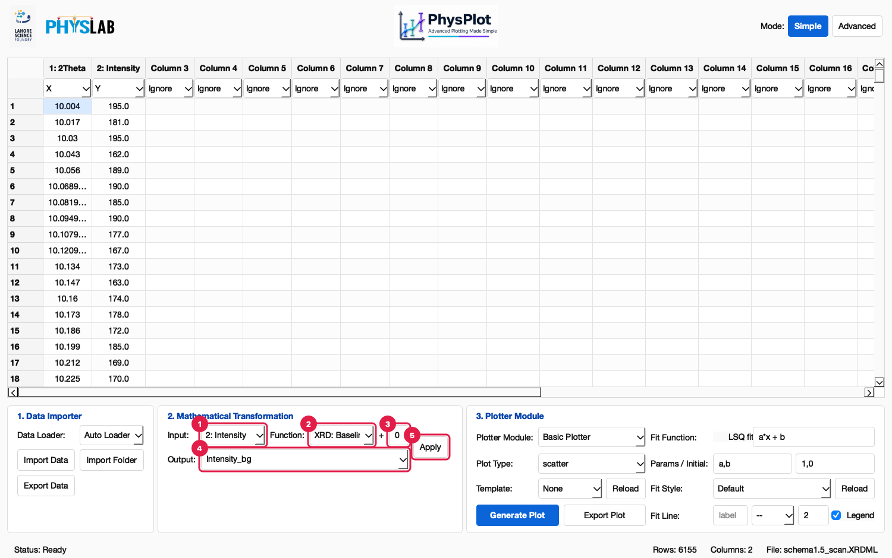
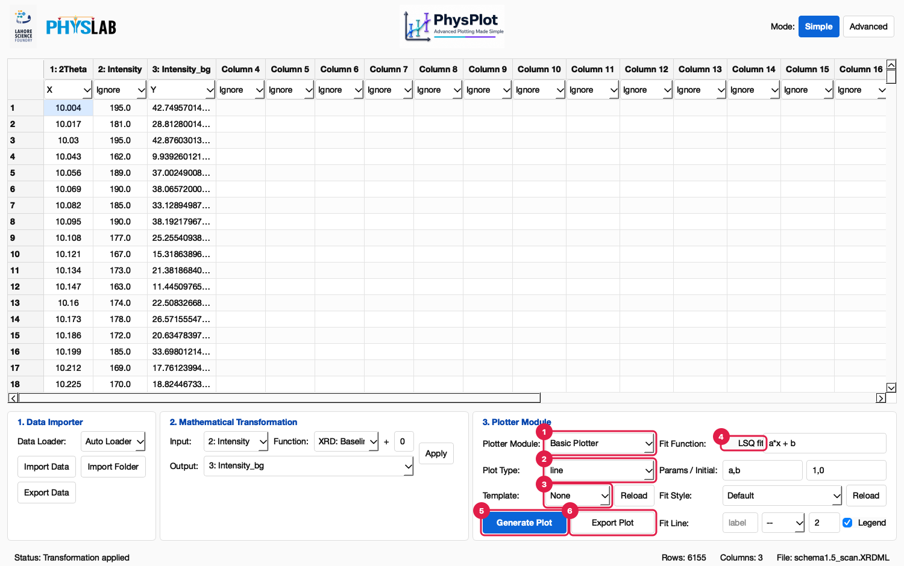
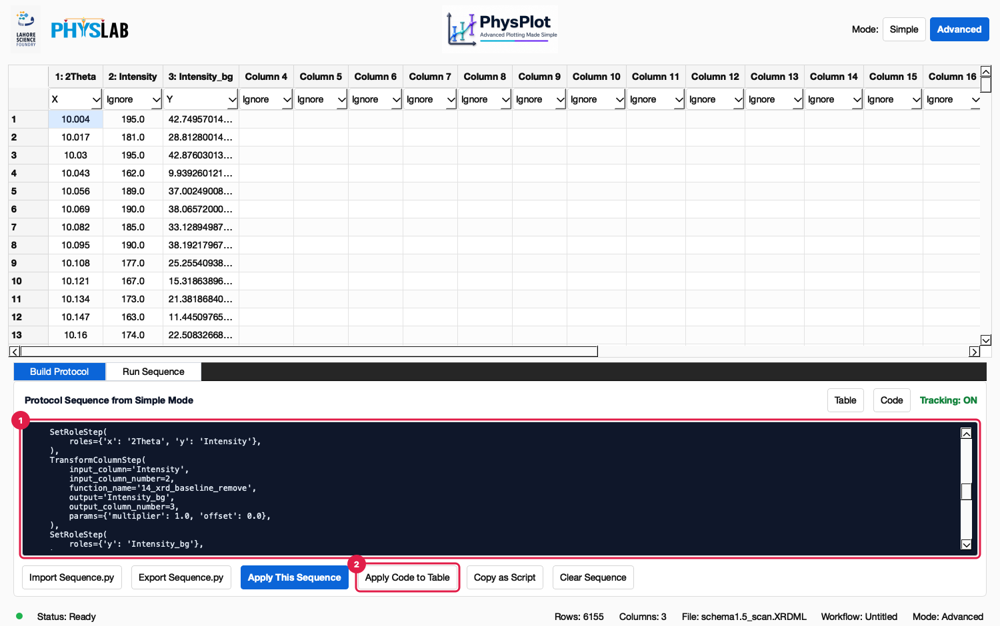
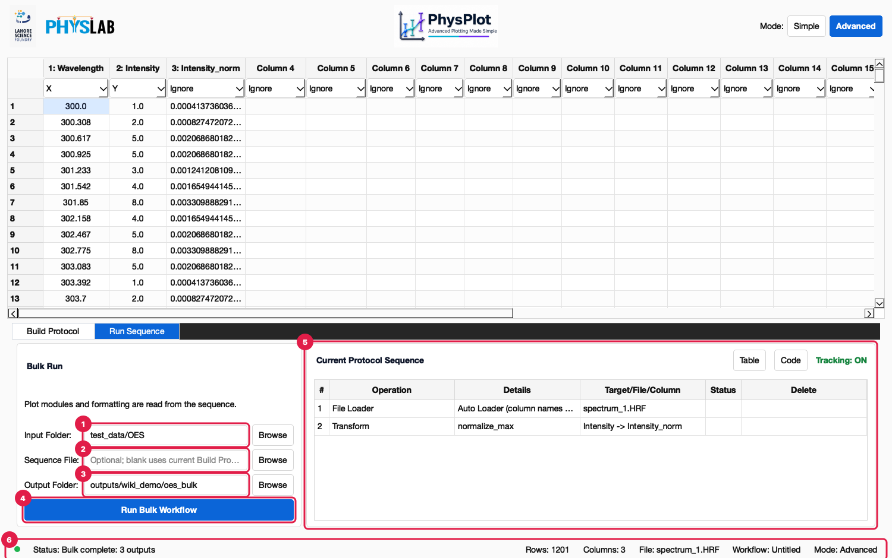
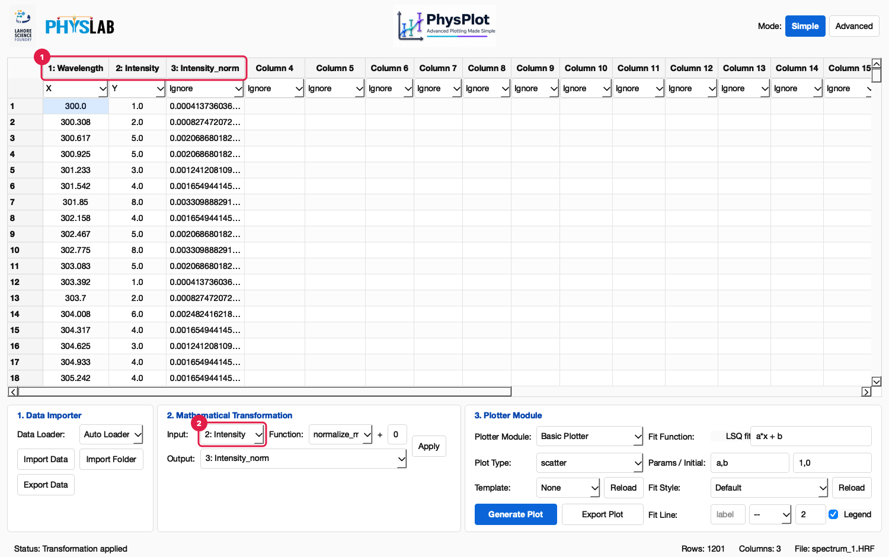

PhysPlot GUI Walkthrough
========================

PhysPlot is a table-first scientific plotting and workflow application. You
import data into the central table, assign column roles, transform columns,
and plot through plotter modules. Every step is recorded in a protocol that can
be replayed, exported as Python, and run over whole folders of files.

This walkthrough uses the sample files in the repository's ``test_data/``
folder, so you can follow it exactly. Numbered red markers in the screenshots
match the numbered notes under each figure.

1. Main window overview
2. Importing data
3. Choosing column roles
4. Transforming a column
5. Generating, editing, and templating a plot
6. Adding fit functions
7. Building and replaying the protocol sequence
8. File loaders for instrument formats
9. Exporting processed data

.. _gui-main-window-overview:

1. Main Window Overview
-----------------------

.. image:: _static/gui_walkthrough/walk_01_overview.png
   :alt: PhysPlot main window with numbered regions
   :width: 900px

**Figure 1. The main window with an XRD scan loaded** (``test_data/XRD/schema1.5_scan.XRDML``).

1. **Mode switcher.** **Simple** shows the three everyday panels. **Advanced**
   shows the protocol builder (**Build Protocol**) and bulk runs (**Run Sequence**).
2. **Column headers.** Each shows the column number and name. Double-click a
   header to rename the column. Right-click it to rename, copy, paste, or
   delete the column.
3. **Role row.** Each column's dropdown sets its role: **Ignore**, **X**,
   **Y**, **X Error**, **Y Error**, **Group**, **Label**, **Batch Key**, or
   **Fit Weight**. Loaders suggest roles.
4. **Data cells.** Edit, paste, or clear values. Right-click a row number to
   copy, paste, or delete rows. Every edit is recorded in the protocol.
5. **1. Data Importer.** Choose a loader and import or export data.
6. **2. Mathematical Transformation.** Create a new column from an existing one.
7. **3. Plotter Module.** Choose a plotter, plot type, template, and optional
   least-squares fit, then generate the plot.
8. **Status bar.** The last action or error (hover for the full text), row and
   column counts, and the file name.

The native menu bar has **File**, **Protocol**, **View**, **Plot**, and **Help**
menus. **File > Open Config Folder** opens ``Documents/PhysPlot/config/``, and
**File > Reload Config Modules** re-scans it without restarting. **Help** links
to this documentation, the repository, the issue tracker, and the About dialog.

When the window is narrower than the three Simple Mode panels, the panel row
scrolls sideways, so PhysPlot fits laptop screens.

.. _gui-importing-data:

2. Importing Data
-----------------

.. image:: _static/gui_walkthrough/walk_02_data_loader_menu.png
   :alt: Data Loader menu
   :width: 900px

**Figure 2. The Data Loader menu.**

1. In **1. Data Importer**, keep **Auto Loader** selected. It picks the loader
   from the file extension: CSV, TXT/DAT/TSV/MSA, Excel, XRDML, and any format
   a loader plugin declares (for example OES ``.HRF``).
2. Click **Import Data** and choose the file.

Instrument exports load directly, even when they have metadata above the data,
tab-separated values in a ``.csv``, or spectra stored as rows. See
:doc:`user_guide/data_import` for every format.

.. _gui-choosing-axis-roles:

3. Choosing Column Roles
------------------------

.. image:: _static/gui_walkthrough/data_04_panalytical_csv.png
   :alt: Column headers and role dropdowns
   :width: 900px

**Figure 3. A Panalytical CSV export with suggested roles.**

1. **Headers** come from the file. The instrument's ``[Measurement conditions]``
   block above the data is skipped and kept in the dataset metadata.
2. **Roles** are suggested (``Angle`` → **X**, ``Intensity`` → **Y**). Change
   them with the dropdowns: one **X**, one **Y**, optional **X Error** /
   **Y Error**, and **Ignore** for unused columns.

.. _gui-custom-mathematical-function-system:

4. Transforming a Column
------------------------

.. image:: _static/gui_walkthrough/walk_03_function_menu.png
   :alt: Function menu
   :width: 900px

**Figure 4. The Function menu.** Built-in transforms come first, followed by
every plugin in ``config/transformations/``. Hover over an entry for a
description. ``subtract first value`` subtracts one constant and is not a
background fit; ``XRD: Baseline Remove`` fits and removes a smooth background.

**Figure 5. Removing the background of an XRD scan.**

1. **Input** is set to the **Y** column whenever new data loads.
2. **Function**: ``XRD: Baseline Remove``.
3. **+ offset** is added to the result (``transform(values) × multiplier + offset``).
4. **Output**: a new column name, or an existing column to overwrite.
5. **Apply** runs the transformation and records it in the protocol.

.. image:: _static/gui_walkthrough/walk_05_transform_applied.png
   :alt: New baseline-removed column
   :width: 900px

**Figure 6. The result.** (1) The new column ``Intensity_bg`` appears; (2) its
values sit near zero between the peaks.

.. _gui-generating-and-formatting-plot:

5. Generating, Editing, and Templating a Plot
---------------------------------------------

**Figure 7. Plotter Module controls.**

1. **Plotter Module**: Basic, Histogram, Scatter, Line, Error Bar, Overlay,
   Subplot Grid, Nanoindentation, Oliver-Pharr, and modules from
   ``config/plotter_modules/``.
2. **Plot Type**: for Basic Plotter, ``scatter``, ``line``, or ``scatter_line``.
3. **Template**: a saved appearance from ``config/templates/``. **Reload**
   re-reads the folder.
4. **LSQ fit**: overlay a least-squares fit, with **Fit Function** (for example
   ``a*x + b``), **Params / Initial**, **Fit Style**, and **Fit Line** options.
5. **Generate Plot** renders the plot and opens it in the Figure Editor.
6. **Export Plot** saves the figure to an image file.

.. image:: _static/gui_walkthrough/walk_10_figure_editor.png
   :alt: Figure Editor
   :width: 900px

**Figure 8. The Figure Editor (FigureForge).** **Figure Explorer** lists the
figure's parts. **Property Inspector** edits titles, labels, legends, axes,
spines, markers, lines, and fonts. Save the styling with
**Figure Editor > PhysPlot > Save as Template**, then choose it in Simple Mode's
**Template** dropdown for the next plot. Edits made in the Figure Editor are not
recorded in the protocol; templates are the way to reuse a style in replays and
bulk runs.

.. _gui-curve-fitting-and-fit-labels:

6. Adding Fit Functions
-----------------------

For a quick fit, tick **LSQ fit** in the Plotter Module (Figure 7, marker 4).
The fit is stored in the protocol's plot step and replayed with it.

For interactive fitting in the Figure Editor, select an axes, line, or scatter
series and choose **Figure Editor > Fitting > Add Fit Function**. The dialog
accepts expressions such as ``a*x + b``, ``a*x**2 + b*x + c``, or
``a*np.exp(b*x) + c`` with parameter names and initial guesses. The fitted
curve is added as a Matplotlib line that can be styled and saved into a
template. See :doc:`user_guide/curve_fitting`.

.. _gui-protocol-sequences:

7. Building and Replaying the Protocol Sequence
-----------------------------------------------

.. image:: _static/gui_walkthrough/walk_07_build_protocol.png
   :alt: Build Protocol table
   :width: 900px

**Figure 9. Advanced Mode > Build Protocol.**

1. **Protocol table**: one row per recorded step (File Loader, Transform, role
   changes, Generate Plot). **Status** fills in when the protocol runs.
   **Delete** removes a step and replays the rest. Right-click a row and choose
   **Rerun from this step** to resume there.
2. **Table** shows the rows.
3. **Code** shows the same protocol as editable Python.
4. **Import Sequence.py**, **Export Sequence.py**, **Apply This Sequence**,
   **Copy as Script**, and **Clear Sequence**.

**Figure 10. The protocol as Python.** (1) ``WORKFLOW_STEPS`` lists the steps,
for example ``TransformColumnStep(function_name='14_xrd_baseline_remove', ...)``.
(2) **Apply Code to Table** rebuilds the rows from your edits. Invalid code is
reported with its line number, and the protocol is left unchanged.

.. image:: _static/gui_walkthrough/walk_09_apply_sequence.png
   :alt: Status column after replay
   :width: 900px

**Figure 11. Protocol > Apply This Sequence (Ctrl+R).** (1) Every row reports
**OK**, **Failed**, or **Skipped**. After a failure the later rows are skipped,
the table keeps the state reached before it, and the row's tooltip explains the
error.

**Figure 12. Advanced Mode > Run Sequence.**

1. **Input Folder**: the files to process.
2. **Sequence File**: optional; leave blank to use the current protocol.
3. **Output Folder**: one subfolder per input file.
4. **Run Bulk Workflow** starts the run.
5. The protocol that will run.
6. The status bar reports ``Bulk complete: N outputs``, or names the file that
   failed.

See :doc:`user_guide/protocol_sequences` for details, and
:doc:`extensions/functions` for how plugin transformations replay headlessly.

.. _gui-custom-file-loader-system:

8. File Loaders for Instrument Formats
--------------------------------------

**Figure 13. An OES ``.HRF`` spectrum opened with Auto Loader.**

1. The **OES HRF Loader** plugin declares ``FILE_EXTENSIONS = [".hrf"]``, so
   Auto Loader uses it. ``Wavelength`` becomes **X** and ``Intensity`` becomes **Y**.
   ``Intensity_norm`` is a ``normalize_max`` transformation added afterwards.
2. **Input** is set to ``Intensity``, the **Y** column.

Loader plugins live in ``config/data_importers/``. Each defines ``title`` and
``load_data(file_path)``, and optionally ``COLUMN_NAMES``,
``DEFAULT_COLUMN_ROLES``, and ``FILE_EXTENSIONS``. Add a file there, choose
**File > Reload Config Modules**, and pick the loader in **Data Importer** (or
let Auto Loader choose it by extension). See :doc:`extensions/fileloading`.

.. _gui-exporting-processed-data:

9. Exporting Processed Data
---------------------------

Click **Export Data** in **1. Data Importer** and choose a folder. PhysPlot
writes:

- ``data.csv``: the current table.
- ``columns.csv``: column metadata and provenance.
- ``workflow.py``: the protocol that produced the table.
- ``plot.png`` and ``fit.json``: when a plot or fit exists.

To save only the protocol, use **Protocol > Export Sequence.py…**. To save the
figure, use **Export Plot** or the Figure Editor.

Complete GUI Workflow Summary
-----------------------------

1. Launch PhysPlot.
2. Import a file with **Auto Loader**, or enter data in the table.
3. Check the suggested **X** and **Y** roles.
4. Apply transformations (the input defaults to the **Y** column).
5. Choose a plotter, plot type, and template, then **Generate Plot**.
6. Style the figure in the Figure Editor and save it as a template.
7. Review and replay the protocol in **Advanced > Build Protocol**.
8. Export the protocol as ``Sequence.py``, or run it over a folder with
   **Run Sequence**.
9. Export the processed data and the figure.

Notes for Extending PhysPlot
----------------------------

Reusable modules live in ``config/``; copies in ``Documents/PhysPlot/config/``
override the bundled ones:

- ``config/data_importers/``: file loaders (``FILE_EXTENSIONS`` for Auto Loader)
- ``config/transformations/``: Mathematical Transformation functions
- ``config/fit_functions/``: curve-fit models
- ``config/templates/``: plot style templates
- ``config/plotter_modules/`` and ``config/plot_types/``: plotters and plot-type presets
- ``config/protocol_modules/``, ``config/sequences/``, ``config/pipelines/``: reusable protocol pieces

See :doc:`extensions/modularity` for the full map.
