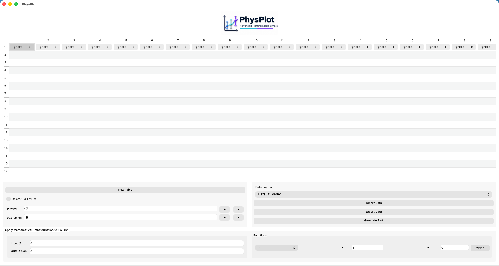
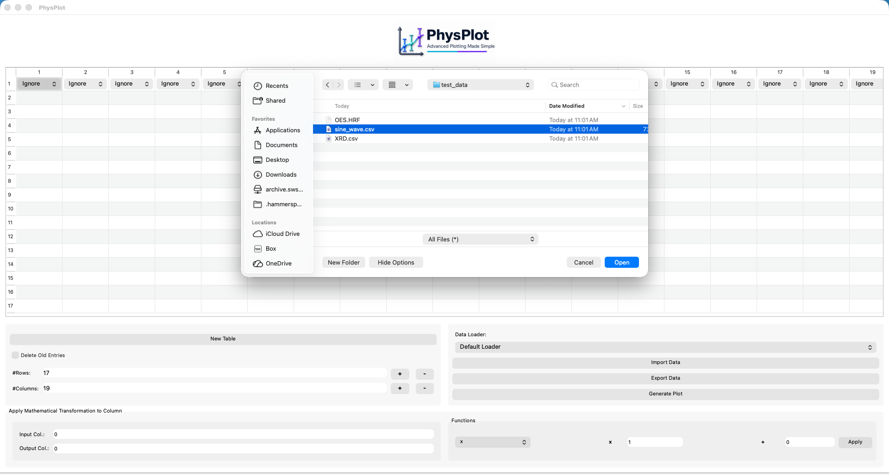
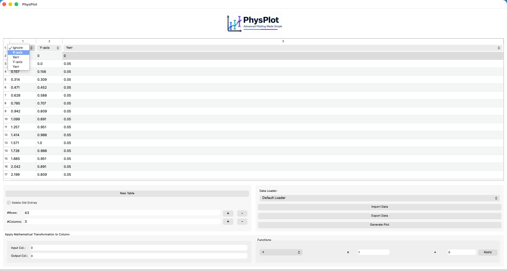
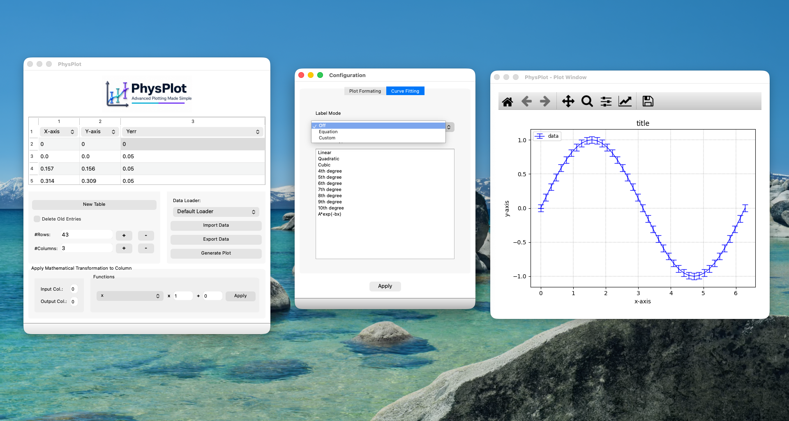
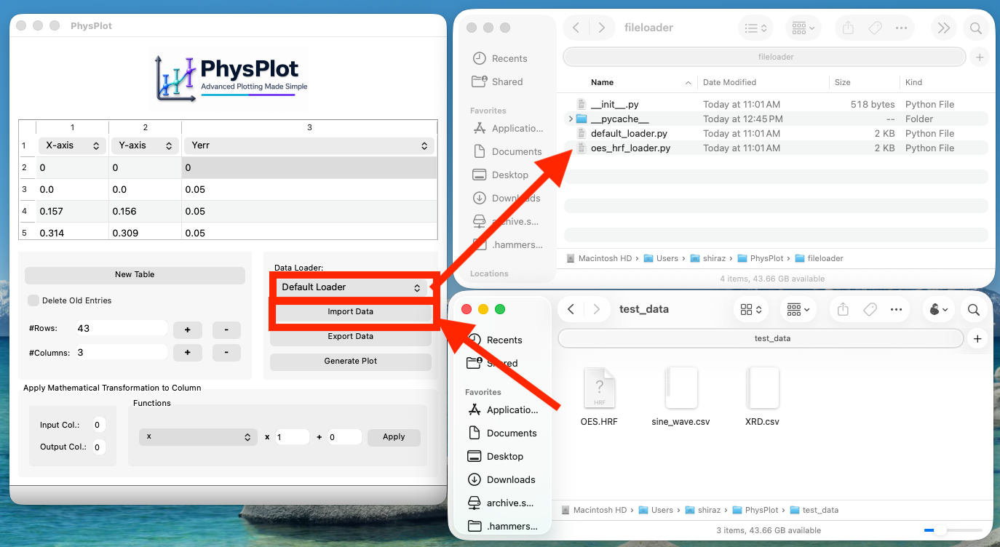
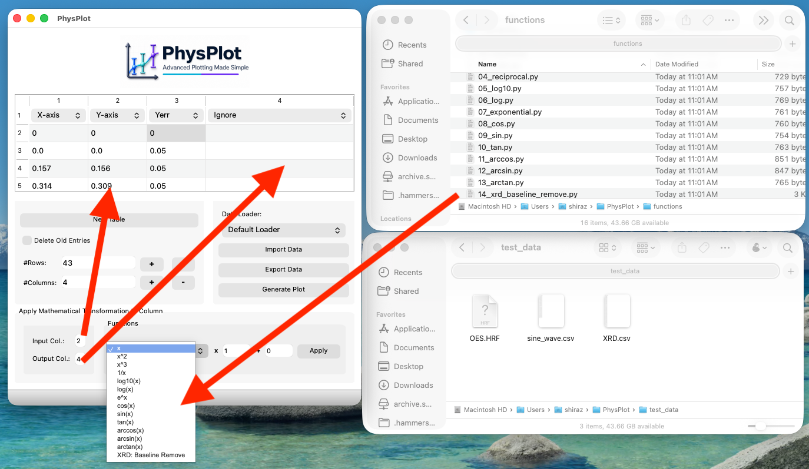
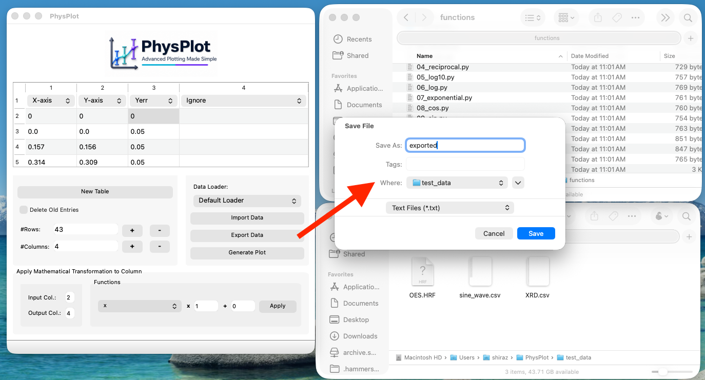

PhysPlot GUI Walkthrough
========================

PhysPlot is a graphical scientific plotting and workflow automation application
designed for publication-ready 2D plotting. It supports data import, manual
data entry, mathematical data manipulation, plotting, fitting, figure export,
text-format data export, saved Python protocol sequences, and bulk replay.
It supports text, CSV, Excel, nanoindentation, and DataFrame inputs through
built-in and user-provided loaders.

See the project repository for full project context: `PhysPlot on GitHub <https://github.com/MShirazAhmad/PhysPlot>`_.

This walkthrough follows the main GUI workflow:

1. Main window overview
2. Importing data
3. Choosing axis roles
4. Generating, editing, and templating a plot
5. Adding fit functions in the Figure Editor
6. Building and running protocol sequences
7. Custom file-loader system
8. Custom mathematical function system
9. Exporting processed data

.. _gui-main-window-overview:

1. Main Window Overview
-----------------------

**Figure 1. PhysPlot main window overview.**

The PhysPlot main window provides a spreadsheet-style data table, column-role
selectors, file import/export tools, plot generation controls, mathematical
transformation options, and protocol-sequence controls in one interface.

When PhysPlot is launched, the main window opens with a spreadsheet-style table
for entering or importing data. Each column has a dropdown menu above the table
to assign a role such as **X**, **Y**, **X Error**, **Y Error**, **Group**,
**Label**, or **Ignore**.

The header places the LSF and PhysLab logos at the far left, keeps the
PhysPlot logo centered, and keeps the Simple/Advanced switcher on the right.
The native menu bar provides **File**, **Protocol**, **View**, **Plot**, and
**Help** menus. Use **Help > About PhysPlot** for documentation, repository,
and issue-reporting links.

Simple Mode has exactly three panels below the table:

1. **Data Importer**
2. **Apply Mathematical Transformation**
3. **Plotter Module**

Advanced Mode contains **Build Protocol** and **Run Sequence** tabs.

.. _gui-importing-data:

2. Importing Data
-----------------

**Figure 2. Selecting a data file for import.**

To import data:

1. Select the required loader from Simple Mode's **Data Importer** panel.
2. For standard tabular files, keep **Auto Loader** selected.
3. Click **Import Data**.
4. Choose the data file in the file-selection dialog.
5. Click **Open**.

In this example, ``sine_wave.csv`` is selected from ``test_data``. PhysPlot then loads the data into the table.

.. _gui-choosing-axis-roles:

3. Choosing Axis Roles
----------------------

**Figure 3. Choosing column roles for plotting.**

After import, assign each column role from the dropdown above the table.
At minimum, set one **X** column and one **Y** column.

1. Open the dropdown above the independent-variable column.
2. Select **X**.
3. Open the dropdown above the dependent-variable column.
4. Select **Y**.
5. Optionally assign uncertainty columns as **X Error** or **Y Error**.
6. Keep unused columns as **Ignore**.

.. _gui-generating-and-formatting-plot:

4. Generating, Editing, and Templating a Plot
---------------------------------------------

**Figure 4. Generated plot with figure-editing controls.**

After assigning column roles, choose a plotter, plot type, and optional
**Template** in Simple Mode. To add a fitted line immediately, enable **LSQ
fit** in the **Plotter Module** panel, enter a function such as ``a*x + b``,
parameter names such as ``a,b``, and matching initial guesses such as ``1,0``.
Then click **Generate Plot**. For Basic Plotter output, PhysPlot opens the
Figure Editor.

Use the Figure Editor **Property Inspector** to edit titles, labels, legends, axes, spines, markers, lines, annotations, and other Matplotlib artists. To reuse the final appearance, choose **Figure Editor > PhysPlot > Save as Template**. Back in PhysPlot, click **Reload** next to **Template** and select the saved template before generating future plots.

.. _gui-curve-fitting-and-fit-labels:

5. Adding Fit Functions in the Figure Editor
--------------------------------------------

**Figure 5. Curve fitting options and label mode selection.**

Open the generated plot in the Figure Editor, select an axes, line, or scatter series, and choose **Figure Editor > Fitting > Add Fit Function**.

The fit dialog accepts expressions such as ``a*x + b``, ``a*x**2 + b*x + c``, or ``a*np.exp(b*x) + c`` along with parameter names and initial guesses. The fitted curve is added as a Matplotlib line that can be styled and saved into a template.

.. _gui-protocol-sequences:

6. Building and Running Protocol Sequences
------------------------------------------

Every reproducible GUI action is recorded as a workflow step when it changes
the dataset or plotting protocol. Open **Advanced Mode** to inspect and edit
the sequence.

Use **Build Protocol** to:

1. Review the current sequence as a table.
2. Switch to code view and edit generated Python.
3. Import or export ``Sequence.py`` files.
4. Apply the edited sequence back to the table.

Use **Run Sequence** to apply an existing sequence to a folder. Plot type and
plot configuration come from ``PlotModuleStep`` entries inside the sequence,
not from separate bulk-run plot controls.

.. _gui-custom-file-loader-system:

7. Custom File-Loader System
----------------------------

**Figure 6. Custom file-loader system.**

PhysPlot supports modular file loading via ``fileloader/``. Each loader is a separate ``.py`` module for a specific file structure.

To use a custom loader:

1. Add/copy the loader module to ``fileloader/``.
2. Restart PhysPlot if needed.
3. Select the loader from **Data Importer**.
4. Click **Import Data**.
5. Select the matching file.

.. _gui-custom-mathematical-function-system:

8. Custom Mathematical Function System
--------------------------------------

**Figure 7. Custom mathematical transformation system.**

PhysPlot applies mathematical transformations to selected columns.

General workflow:

1. Select **Input Col.**.
2. Select **Output Col.**.
3. Choose a function from **Functions**.
4. Optionally adjust the offset.
5. Click **Apply**.
6. The transformed data appear in the selected output column.

The **Functions** dropdown is generated from modules in ``functions/``, making the system extensible for custom scientific workflows.

.. _gui-exporting-processed-data:

9. Exporting Processed Data
---------------------------

**Figure 8. Exporting processed data.**

To export current table data:

1. Click **Export Data**.
2. Choose destination folder.
3. Enter a filename.
4. Keep **Text Files (*.txt)**.
5. Click **Save**.

This completes the core GUI workflow: import data, process data, plot data, customize and fit the plot, and export processed results.

Complete GUI Workflow Summary
-----------------------------

1. Launch PhysPlot.
2. Enter data manually or import a data file.
3. Select the appropriate file loader if using a custom structure.
4. Assign column roles such as **X**, **Y**, **X Error**, and **Y Error**.
5. Apply mathematical transformations if needed.
6. Generate the plot.
7. Customize plot formatting in the Figure Editor.
8. Add custom fit functions if required.
9. Save reusable appearance settings with **Figure Editor > PhysPlot > Save as Template**.
10. Export or edit the generated protocol sequence.
11. Export processed data.
12. Export the final figure from the Figure Editor.

Notes for Extending PhysPlot
----------------------------

PhysPlot supports a modular extension workflow with these key locations:

- ``fileloader/`` for custom file import structures
- ``functions/`` for custom mathematical transformations
- Figure Editor fitting tools for custom expression-based fits

This design helps users extend workflows for different instruments, data structures, and analysis routines without repeated edits to the main GUI.
