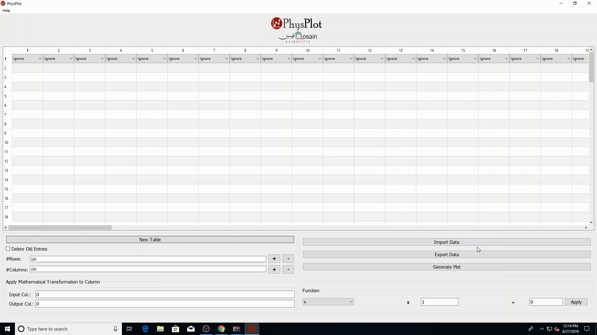

Getting Started
===============

Main window preview
-------------------

Quick workflow
--------------

1. Launch PhysPlot.
2. Import data or enter values manually in the table.
3. Assign each relevant column role (X-axis, Y-axis, Xerr, Yerr) using the top-row dropdowns.
4. Click **Generate Plot**.
5. Configure plot style/fit options in the config window and inspect the generated plot window.
