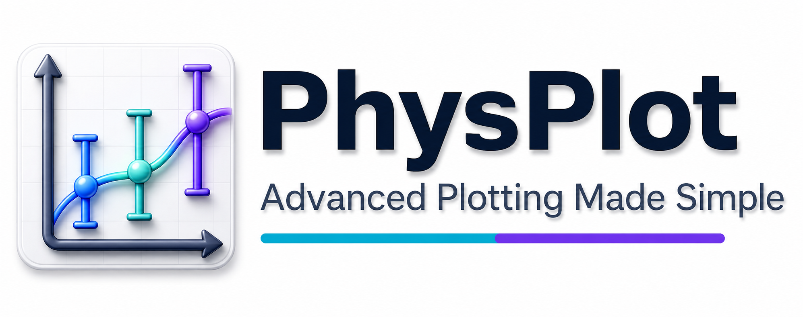

PhysPlot: Advanced Plotting Made Simple
=======================================

PhysPlot is a scientific plotting and workflow automation application with a
spreadsheet-first PyQt6 graphical interface. It supports importing,
transforming, plotting, fitting, templating figure appearance, exporting
datasets, and replaying saved protocol sequences in headless workflows.

Install on macOS with one command (details in :doc:`installation`):

.. code-block:: bash

   curl -fsSL https://raw.githubusercontent.com/MShirazAhmad/PhysPlot/main/scripts/install_macos.sh | bash

Video tutorials
---------------

Short live recordings, one per feature, are on YouTube in two playlists:
`PhysPlot Basics <https://www.youtube.com/playlist?list=PLPkYnHekjU24>`_ (Simple Mode)
and `PhysPlot Advanced <https://www.youtube.com/playlist?list=PLelbbYnCXEdU>`_
(protocols, bulk runs, writing file loaders and plotter modules). Every video is
listed in :doc:`ui/videos`.

.. youtube:: PLPkYnHekjU24
   :playlist:
   :title: PhysPlot Basics playlist

Main Features
-------------

- Spreadsheet-first data entry and import with explicit column-role dropdowns.
- Instrument exports load directly: Malvern Panalytical ``.xrdml`` and CSV,
  EDAX EDS maps and SmartQuant tables, EMSA ``.msa`` spectra, PHI XPS scans,
  Rigaku ``.ras`` scans, TA Instruments TGA/DSC exports, JCAMP-DX spectra, and plain
  CSV/TXT/Excel tables.
- Replayable protocol sequences: every import, transformation (including plugin
  functions such as ``XRD: Baseline Remove``), role change, and plot is recorded
  and can be replayed, exported as Python, and run over whole folders.
- Simple Mode panels for importing data, transforming columns, and generating plots.
- Advanced Mode tabs for building and editing the protocol (**Build Protocol**)
  and running it across folders (**Run Sequence**).
- Figure Editor-based editing for Basic Plotter output.
- Reusable figure templates saved from **Figure Editor > PhysPlot > Save as Template**
  and selected from Simple Mode's **Template** dropdown.
- Custom fit functions through **Figure Editor > Fitting > Add Fit Function**, or a
  least-squares fit from the Plotter Module.
- Backend API and ``physplot`` command line for headless use, notebooks, and bulk workflows.
- Native **Help** menu links for documentation, GitHub, issue reporting, and
  the About dialog.

Build Modules with an AI Assistant
----------------------------------

PhysPlot is extended with small files: a loader for a new instrument, a
transformation, a plotter, a sequence, a figure template and more. You do not need
to write them yourself. Every kind of module has a guide file written for AI
assistants: attach it with a sample of your data to ChatGPT, Claude, Gemini or
Copilot, describe what you need, and save the finished file in
``Documents/PhysPlot/config/<folder>/`` (**File → Open Config Folder**), then choose
**File → Reload Config Modules**.

- :doc:`extensions/ai_assistant`: the steps, which guide to use, and an example
  request for every kind of module.
- :doc:`extensions/ai_examples`: the tested example of every kind, with sample data
  and the resulting plots.
- :doc:`extensions/index`: each kind of module explained, for writing one by hand.

Project links
-------------

- `PhysPlot documentation home <https://physplot.readthedocs.io/>`_
- `PhysPlot repository <https://github.com/MShirazAhmad/PhysPlot>`_
- `Feature requests and bug reports <https://github.com/MShirazAhmad/PhysPlot/issues>`_

.. toctree::
   :maxdepth: 2
   :caption: Contents

   installation
   getting_started
   ui/videos
   ui/sequence_walkthrough
   ui/index
   user_guide/data_entry
   user_guide/data_import
   user_guide/data_manipulation
   user_guide/protocol_sequences
   user_guide/plot_generation
   user_guide/curve_fitting
   user_guide/plot_customization
   user_guide/data_export

.. toctree::
   :maxdepth: 1
   :caption: Build Modules with AI

   extensions/ai_assistant
   extensions/ai_examples

.. toctree::
   :maxdepth: 2
   :caption: Extend and Reference

   extensions/index
   api/index
   reference/classes
   CODEX_PROJECT_GUIDE
