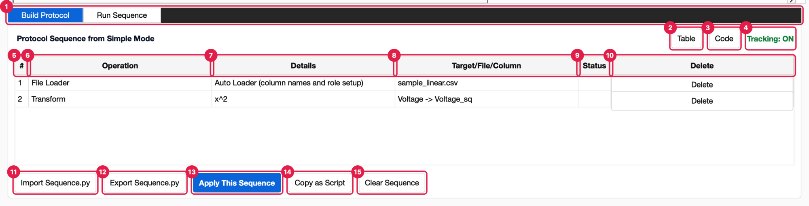
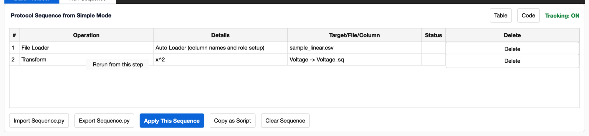
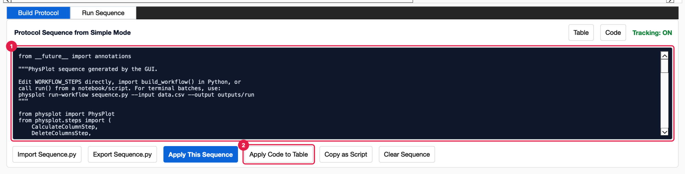

<!-- Generated from wiki/UI-Build-Protocol.md by scripts/sync_wiki_to_docs.py. Edit the wiki page. -->

# Build Protocol

[UI Reference](index.md) › Advanced Mode › Build Protocol

**Build Protocol** is the first Advanced Mode tab. It shows the *protocol*: the list of
steps PhysPlot recorded while you worked, from the file import to the last plot. The
protocol is the single source of truth for replays, exported `Sequence.py` files and
bulk runs. You can review, delete, rerun and edit its steps here.



1. **Mode tabs.** **Build Protocol** (this tab) and [Run Sequence](run_sequence.md).
2. **Table.** Shows the protocol as rows (the default view).
3. **Code.** Shows the same protocol as editable Python (see [Code view](#code-view)).
4. **Tracking: ON.** Recording is always on: every import, role change, edit, rename,
   deletion, transformation and plot is added as you work.
5. **#.** The row number, which status messages refer to (*"Row 3 failed…"*).
6. **Operation.** The kind of step (see [Row types](#row-types)).
7. **Details.** What the step does, for example `XRD: Baseline Remove` or
   `Create basic scatter`.
8. **Target/File/Column.** What the step works on: a file name, `Intensity -> Intensity_bg`,
   `Table`, `Plotter Module`.
9. **Status.** The result of the last run (see [Status column](#status-column)).
10. **Delete.** Removes the step and replays the rest (see [Deleting a step](#deleting-a-step)).
11. **Import Sequence.py.** Loads a saved protocol (same as **Protocol → Import Sequence.py…**).
12. **Export Sequence.py.** Saves the protocol as a runnable Python file (same as
    **Protocol → Export Sequence.py…**, Ctrl+S).
13. **Apply This Sequence.** Replays every step from the start (Ctrl+R).
14. **Copy as Script.** Copies the Python code to the clipboard.
15. **Clear Sequence.** Empties the protocol. The table is not changed.

## Row types

| Operation | Recorded when you… | Details / Target |
| --- | --- | --- |
| **File Loader** | Import a file | Loader name and *"(column names and role setup)"* / file name. Replaying reloads the file with the same loader (or loader plugin) and restores names and roles. |
| **Set X**, **Set Y**, **Set Group**, … | Change a column's role (to anything but *Ignore*) | *Set column as X* / column name |
| **Set Roles** | Import or apply code with a `SetRoleStep` that sets several roles at once | `X: Time, Y: Voltage` / `Table` |
| **Transform** | Press **Apply** in Mathematical Transformation | Function (plugin label, e.g. `XRD: Baseline Remove`) / `input -> output`. A built-in function with a non-zero offset adds a second *Transform* step (`add`). |
| **Generate Plot** | Press **Generate Plot** (panel or **Plot** menu) | `Create <plotter> <plot type>`, plus `with LSQ fit` when a fit is on / `Plotter Module`. Stores the plotter, plot type and LSQ fit settings. |
| **Rename Column** | Rename a column | `old -> new` / new name |
| **Edit Cell** | Type, paste or clear a cell | `Row N, column` / new value |
| **Delete Rows** | Delete table rows | `Rows 3, 4` / `Table` |
| **Delete Columns** | Delete table columns | Column names / `Table` |

Rows read the same whether they were recorded live, imported from a `Sequence.py`, rebuilt
by **Apply Code to Table** or added by **Protocol → Insert Protocol Module**. Some
rows are notes only and never run, for example the one added by **Plot → Update
Integrated Preview**; their Status stays blank.

> **Not recorded:** the Template choice and anything you do in the Figure Editor.
> Replays, `Sequence.py` files and bulk runs draw plots with the plotter's own look,
> plus the recorded LSQ fit.

## Status column

After **Apply This Sequence**, **Rerun from this step** or a deletion, each row shows:

| Status | Colour | Meaning (hover for details) |
| --- | --- | --- |
| **OK** | green | The step ran. Tooltip: *Completed in N ms*. |
| **Failed** | bold red | The step raised an error. Tooltip: the error message. The table shows the data as it was just before this step. |
| **Skipped** | grey | Not run because an earlier row failed. Tooltip: *Not run because row N failed.* |
| *(blank)* | — | The row has not run since it was recorded or edited. |

A failure also appears in the status bar as *"Row N failed (StepName): error"*.
**Apply This Sequence** additionally opens an *Apply sequence failed* dialog.


## Deleting a step

**Delete** removes that row's steps from the protocol and immediately replays the
rest, so the table always matches the remaining protocol. The status bar shows
*"Sequence updated"*. Deleting the last row shows *"Sequence cleared"*.

If the shortened protocol fails, for example because a later step used a column the
deleted step created, the failing row turns **Failed** and the status bar explains
why. No dialog opens, so you can keep editing: delete or fix that row too.

## Rerun from this step

Right-click a row and choose **Rerun from this step**:



PhysPlot restores the data as it was just before that step and runs it and every
later step. Earlier rows are not replayed, so the file is not reloaded. Use this after
fixing a later step, or to retry a failed step without repeating slow earlier ones.
The status bar shows *"Reran from row N"*. A row without a replayable step shows
*"Row N has no replayable step"*.

Rerun needs the saved state from the last full run. If there is none (the protocol
has not been applied yet, or rows above were changed since), a *Rerun failed* dialog
says *"No saved state before step N. Run the whole sequence first, or the steps
before it have changed since the last run."* Choose **Apply This Sequence** once, then
rerun.

## Code view

Click **Code** to see the protocol as Python:



1. **Code editor.** The protocol as ordinary Python: imports followed by
   `WORKFLOW_STEPS = [ ... ]`, one step object per entry. For example, a baseline
   removal is:

   ```python
   TransformColumnStep(
       input_column='Intensity',
       input_column_number=None,
       function_name='14_xrd_baseline_remove',
       output='Intensity_bg',
       output_column_number=None,
       params={'multiplier': 1.0, 'offset': 0.0},
   )
   ```

   Edit any value: a factor, an offset, a column name, a file path, a plot type.
   You can also delete, reorder or add steps.
2. **Apply Code to Table.** Shown only in the Code view. It replaces the protocol with
   your edited code and rebuilds the rows. The status bar shows *"Sequence code
   applied"*. Choose **Apply This Sequence** to run it.

Switching back to **Table** with unapplied edits applies them first.

If the code has an error, an *Apply code to table failed* dialog names the line and
the problem, and selects that line. The protocol and table are left unchanged, and you
stay in the Code view to fix it:


The same code is what **Export Sequence.py** saves and **Copy as Script** copies. It
runs unchanged in a notebook or from the command line. See
[Bulk Runs and Headless Use](../user_guide/protocol_sequences.rst).

## Import and export

| Button | Dialog | Default location | Result |
| --- | --- | --- | --- |
| **Import Sequence.py** | *Load Sequence.py* (Python files) | `Documents/PhysPlot/config/sequences/` | Replaces the protocol with the file's `WORKFLOW_STEPS` (or `build_workflow()`). The status bar shows *"Sequence loaded"*, and the status bar's **Workflow** field shows the file name. Nothing runs until **Apply This Sequence**. |
| **Export Sequence.py** | *Save Sequence.py* | `…/config/sequences/sequence.py` | Writes the protocol as a runnable script. The status bar shows *"Sequence saved"*. |

**Apply This Sequence** with an empty protocol shows *Apply sequence failed: Build or
import a protocol sequence first.*
