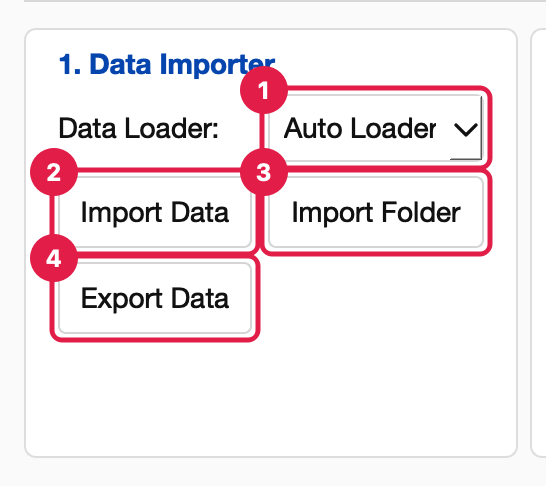

<!-- Generated from wiki/UI-Data-Importer.md by scripts/sync_wiki_to_docs.py. Edit the wiki page. -->

# Data Importer

[UI Reference](index.md) › Simple Mode › 1. Data Importer

The first Simple Mode panel brings data into the table and saves it out again.

1. **Data Loader.** Chooses how the next **Import Data** reads a file. Keep **Auto
   Loader** unless you need a specific loader (see [Loaders](#loaders)).
2. **Import Data.** Opens a file dialog, reads the chosen file with the selected loader
   into the table, and sets suggested roles. It records a *File Loader* row, which
   includes the role setup, as the first step of the protocol. On success the status
   bar shows *"Ready"* and the **File** field shows the file name. A problem opens an
   *Import failed* dialog explaining it.
3. **Import Folder.** Opens a folder dialog and shows *"Folder selected: <name>"*.
   It does not load files. To process every file in a folder, use
   [Run Sequence](run_sequence.md).
4. **Export Data.** Asks for a folder and writes the current data there (see
   [Export Data](#export-data)).

## Loaders

| Entry | Reads | Notes |
| --- | --- | --- |
| **Auto Loader** | Everything below, chosen by file extension | Recommended. It also uses any loader plugin that declares the file's extension, for example `.ras`. |
| **CSV Loader** | `.csv` | Finds the numeric table in instrument exports: it skips metadata blocks, detects tabs and semicolons, handles quoted numbers, and turns spectra stored as rows into columns. |
| **TXT Loader** | `.txt`, `.dat`, `.tsv`, `.msa` | Detects the separator. Handles the same instrument layouts as the CSV loader. |
| **Excel Loader** | `.xls`, `.xlsx` | Reads the first sheet. |
| **Nanoindentation Loader** | `.csv`, `.txt`, `.dat`, `.xls`, `.xlsx` | Marks the dataset as nanoindentation data, enabling the Nanoindentation and Oliver-Pharr plotters. |
| **XRDML Loader (Panalytical XRD)** | `.xrdml` | `2Theta` and `Intensity` (scans summed), plus `Intensity 1…N` for repeated scans. The measurement details go into the dataset metadata. |
| **DataFrame Loader** | — | Greyed out; used by the Python API only. |
| **Default Loader** *(plugin)* | Excel, CSV, TSV, TXT, delimited numbers | From `config/data_importers/default_loader.py`. |
| **Rigaku RAS Loader (XRD)** *(plugin)* | Rigaku SmartLab `.ras` scans | `2Theta` (X) and `Intensity` (Y), corrected for the attenuator. Used automatically by Auto Loader. |
| **TA Instruments TGA/DSC Loader** *(plugin)* | TA Universal Analysis `.txt` exports | Columns named from the file, plus `Weight (%)` for TGA. Temperature (X), Weight (%) or heat flow (Y). Choose it in the menu: `.txt` otherwise goes to the TXT Loader. |
| **JCAMP-DX Spectrum Loader** *(plugin)* | `.jdx`, `.dx` spectra (FTIR, Raman, UV-Vis) | X and Y named from the file's units, for example `Wavenumber (1/cm)` and `Transmittance`. Used automatically by Auto Loader. |

Plugins come from `config/data_importers/`, with your own copies in
`Documents/PhysPlot/config/data_importers/` taking precedence. After adding one,
choose **File → Reload Config Modules**. A plugin may also add its own plotters to the
Plotter Module menu while its data is loaded. See [Extending PhysPlot](../extensions/index.rst). Worked examples, from the raw
file to the loader code to the result in the table, are on the
[File-Loader Plugins](https://physplot.readthedocs.io/en/latest/extensions/fileloading.html) page.

The file dialog lists *Data Files* by default: the built-in types (`.csv`, `.txt`,
`.dat`, `.tsv`, `.msa`, `.xls`, `.xlsx`, `.xrdml`) plus every extension a loader plugin
declares in `FILE_EXTENSIONS` (for example `.ras` and `.jdx`). Switch to *All Files* for
anything else.

## What an import does

1. **Reads the file** with the chosen loader, then fills the table, giving each
   column its name from the file.
2. **Sets suggested roles**, from the loader plugin's defaults or from column names
   (for example `Angle`, `2Theta` and `Wavelength` → X; `Intensity` and `Voltage` → Y).
3. **Starts the protocol** with a *File Loader* row. That row records the file path,
   the loader (or plugin file) and the roles, so **Apply This Sequence** can reload
   the same file and Run Sequence can load other files the same way.
4. **Resets the Transformation panel's Input** to the new Y column.

## Export Data

**Export Data** asks for a folder and writes:

| File | Contents |
| --- | --- |
| `data.csv` | The current table (the filled block, see [Data Table](data_table.md#what-counts-as-the-data)). |
| `columns.csv` | One row per column: number, name, role, data type, unit, whether a transformation created it (`derived`), the role the loader suggested, and the original label from the file. |
| `workflow.py` | The protocol as a runnable `Sequence.py`. |
| `fit.json` | The latest fit result, when there is one. |
| `plot.png` | The latest plot, when there is one. |

The status bar shows *"Exported"*. A problem opens an *Export failed* dialog.
