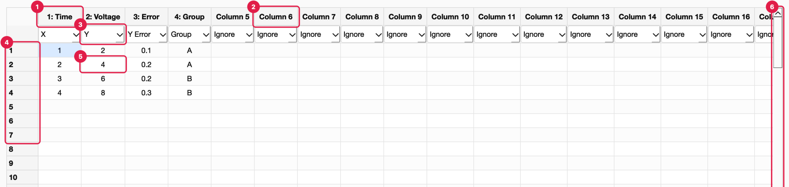
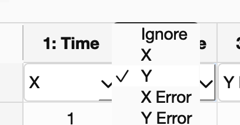
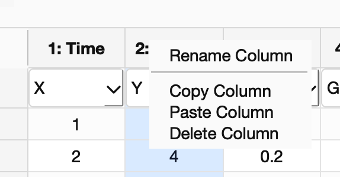
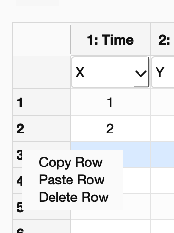
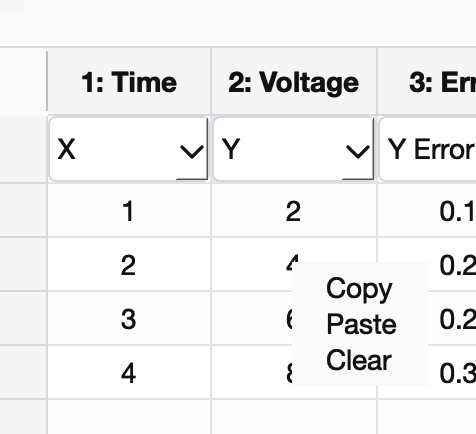
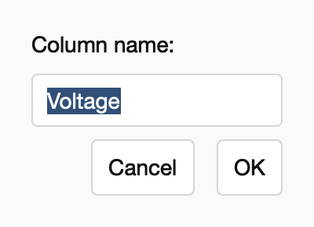

<!-- Generated from wiki/UI-Data-Table.md by scripts/sync_wiki_to_docs.py. Edit the wiki page. -->

# Data Table

[UI Reference](index.md) › Data Table

The spreadsheet in the middle of the window holds the current data. Every panel reads
from it and writes to it. Every edit you make here is also recorded in the protocol
(see [Build Protocol](build_protocol.md)).

1. **Named column header.** A column with a real name shows its number and name,
   for example `1: Time`. The number is the column's position, which protocols use
   as a fallback when a name is missing.
2. **Default column header.** An unnamed column shows `Column N`. Columns widen
   automatically to fit their header and never shrink below a width you set by hand.
3. **Role dropdown.** The first row holds one dropdown per column that says how the
   column is used (see [Column roles](#column-roles)).
4. **Row numbers.** Data rows are numbered from 1. Right-click a number for the
   [row menu](#row-menu).
5. **Data cell.** Type to replace the value, or double-click to edit it. Numbers and
   text are both allowed.
6. **Scrollbars.** The table always has at least 100 data rows and 26 columns. It
   adds rows and columns as you scroll or type near the edge, so there is always room.

## Column roles

| Role | Meaning |
| --- | --- |
| **Ignore** | Not used for plotting (the default). |
| **X** | Horizontal axis. Only one column can be X; choosing X for another column moves it. |
| **Y** | Vertical axis, and the default **Input** of the Mathematical Transformation panel. Only one column can be Y. |
| **X Error** / **Y Error** | Error-bar sizes, used by the Error Bar Plotter. One column each. |
| **Group** | Splits rows into series by value, used by the Overlay and Subplot Grid plotters. |
| **Label** | Splits rows into series like **Group** when no Group column is set. |
| **Batch Key** | Stored with the data for batch workflows. No built-in plotter uses it yet. |
| **Fit Weight** | Stored with the data for weighted fitting. The built-in LSQ fit does not use it yet. One column only. |

- **Suggested roles.** Loaders suggest roles when a file is imported. For example,
  `Time`/`Angle`/`2Theta`/`Wavelength` become X and `Intensity`/`Voltage` become Y,
  and loader plugins can preset roles.
- **Recorded.** Changing a role to anything other than **Ignore** records a *Set <role>*
  step.

## Editing values

| Action | How | What is recorded |
| --- | --- | --- |
| Edit a cell | Select it and type, or double-click it | One *Edit Cell* step per changed cell |
| Copy | ⌘C / Ctrl+C, or right-click → **Copy** | Nothing; the selection goes to the clipboard as tab-separated text |
| Paste | ⌘V / Ctrl+V, or right-click → **Paste** | One *Edit Cell* step per pasted cell. Pasting starts at the current cell and adds rows and columns if needed. Tab-separated text from Excel or Numbers pastes cell by cell. |
| Clear | Right-click → **Clear** | One *Edit Cell* step per cleared cell |

The role row (row 0) is never copied, pasted over or cleared.

## Context menus

### Column menu

Right-click a column header. The column is selected first.

- **Rename Column:** opens the Rename Column dialog (the same as double-clicking the header).
- **Copy Column** / **Paste Column:** copy or paste the selected column's cells.
- **Delete Column:** removes the column. The remaining columns shift left, and a
  *Delete Columns* step is recorded.

### Row menu

Right-click a row number. The row is selected first.

- **Copy Row** / **Paste Row:** copy or paste the row's cells.
- **Delete Row:** removes the row. Rows below move up, and a *Delete Rows* step is recorded.

### Cell menu

Right-click any cell.

- **Copy**, **Paste**, **Clear**, as described under [Editing values](#editing-values).

## Renaming a column

Double-click a column header, or right-click it → **Rename Column**:

Type the new name and press **OK**. An empty name or a name another column already
uses is rejected with a *Rename Column* warning. A successful rename records a
*Rename Column* step. The protocol keeps the old name and the column number, so
replays find the column even when a later file uses the old name.

## What counts as "the data"

When PhysPlot reads the table (for transformations, plots, exports or protocol
replays), it uses the block from the top-left cell to the last row and column that
contain a value. A column with a role counts even when it is empty. Columns whose
filled cells are all numbers are treated as numbers; any text makes the whole column
text.
