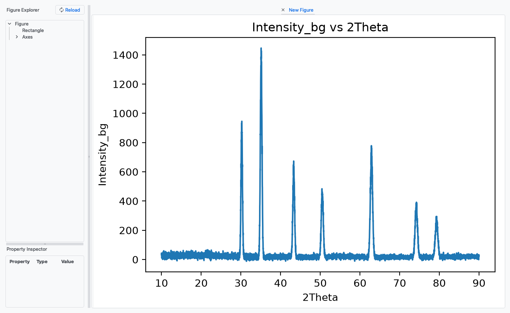

<!-- Generated from wiki/UI-Figure-Editor.md by scripts/sync_wiki_to_docs.py. Edit the wiki page. -->

# Figure Editor and Plot Windows

[UI Reference](index.md) › Figure Editor and Plot Windows

**Generate Plot** opens the figure in one of two kinds of window:

- **Basic Plotter** plots (including **Plot → Generate Plot**, Ctrl+G) open in the
  **Figure Editor**, where you can restyle every part of the figure.
- **Every other plotter** opens a **plot window** with the standard Matplotlib toolbar.

Both windows show a *copy* of the figure. Nothing you change in them is recorded in
the protocol, and they do not change the table.

## Figure Editor

The Figure Editor is [FigureForge](https://github.com/nogula/FigureForge),
which PhysPlot starts as a separate program with the PhysPlot icon. Closing it never
affects the main window, and you can have several editors open at once.

| Area | Use |
| --- | --- |
| **Figure canvas** (centre) | The live figure. It redraws as you change properties. |
| **Figure Explorer** (left) | A tree of the figure's parts: Figure → Axes → lines, scatter collections, texts, legend, spines, ticks. Select a part to edit it. |
| **Property Inspector** (below the explorer) | The selected part's properties: text, font family and size, colours, line style and width, marker and size, limits, scale, visibility. Edits apply immediately. |

### Menus

| Menu | Items |
| --- | --- |
| **File** | **New** (Ctrl+N), **Open…** (Ctrl+O), **Open Recent**, **Save** (Ctrl+S) and **Save As…** (Ctrl+Shift+S) as an editable figure file (`.pkl`, reopenable in the editor). **Export** (Ctrl+E) writes an image (PNG, PDF, SVG, …) with a DPI you choose. **Quit** (Ctrl+Q). |
| **Edit** | **Open in Matplotlib**, **Copy Figure** (Ctrl+C, as an image), **Delete Item** (Del, removes the selected part), **Preferences**. |
| **Figure Editor** | PhysPlot's tools: **Fitting ▸ Add Fit Function** and **PhysPlot ▸ Save as Template** (below), plus FigureForge's **Open Plugins Folder…**, **Reload Plugins**, **Plugins Documentation** and **New Plugin**. |
| **Help** | FigureForge's **About**, **Help** and **Report Bug**. |

To keep an edited figure, use **File → Export** (image) or **File → Save** (editable)
here. The main window's **Export Plot** saves PhysPlot's own copy, without your
editor changes.

### Save as Template

**Figure Editor → PhysPlot → Save as Template** turns the current look of the figure
into a reusable template.

1. Select the Figure (or any part of it) in the Figure Explorer.
2. Choose **Save as Template**. The dialog shows:
   - **Name:** the name shown in the **Template** menu (default *Publication Style*).
   - **Saved as:** the file it will be written to, updated as you type, for example
     `Documents/PhysPlot/config/templates/My_Lab_Style.json`.
3. Press **OK**. A *PhysPlot Template* message confirms the path.
4. In the main window, press **Reload** next to **Template** and choose the new
   template.

A template stores **how the figure looks**, not what it shows:

- the figure size, DPI and background
- the fonts and colours of the title and axis labels
- the axis scales, grid, spines and tick labels
- the line and marker styles, scatter colours and legend settings

It does not store data, axis limits, or title and label text.

Things to know:

- **Saving over the bundled template.** Saving with the default name *Publication
  Style* writes `Publication_Style.json` in your config folder, which then replaces
  the bundled template of that name.
- **Names that map to the same file.** Names differing only in punctuation, such as
  *My Style* and *My_Style*, save to the same file. The existing file is replaced
  without asking.
- **Matching by position.** Styles are matched by position: the first axes, first
  line and first scatter series of the template style the first ones in the new plot.
- **Annotations** and **inset axes** are not captured.
- **Not replayed.** A template applies when you press Generate Plot in the GUI. It is
  **not** recorded in the protocol, so Apply This Sequence, `Sequence.py` scripts and
  bulk runs do not apply it.

If nothing is selected, a warning asks you to select the Figure, an Axes or an artist
first. If the file cannot be written, *Could not save template* explains why.

### Add Fit Function

**Figure Editor → Fitting → Add Fit Function** fits a curve to data in the editor,
independently of PhysPlot's LSQ fit. Select an axes, line or scatter series first.

| Field | Meaning |
| --- | --- |
| **Data** | Which line or scatter series to fit (with its point count). |
| **f(x)** | The model, for example `a*x + b`. |
| **Parameters** | Comma-separated names (`a,b`). |
| **Initial guesses** | One number per parameter (`1,0`). |
| **Curve label** | Legend text. Leave it empty for an automatic label with the fitted values. |
| **Line style** | `-`, `--`, `-.`, `:`. |
| **Line width** | In points (default 2). |
| **Show legend** | Yes / No. |

The fitted curve is added to the figure in the editor only. It is not recorded in the
protocol, and **Export Data** does not write it to `fit.json`. For a fit that replays
and is exported, use the **LSQ fit** fields in the [Plotter Module](plotter_module.md).

### When the Figure Editor is missing

If FigureForge is not installed, Basic Plotter plots fail with *Plot failed: Figure
Editor is not installed. Install it with `python -m pip install FigureForge`.*
Install it into PhysPlot's environment, or use another plotter (for example the
Scatter or Line Plotter), which opens a plot window instead.

## Plot windows

Every plotter except the Basic Plotter opens its figure in a window titled
**PhysPlot - <plotter>: <plot type>** (820 × 620 pixels, resizable), for example
*PhysPlot - overlay: overlay_by_group*.

The toolbar above the figure is Matplotlib's standard toolbar:

| Button | Use |
| --- | --- |
| **Home** / **Back** / **Forward** | Reset the view, or step through earlier zoom and pan views. |
| **Pan** | Drag to move; right-drag to zoom along an axis. |
| **Zoom** | Drag a rectangle to zoom in. |
| **Subplots** | Adjust margins and spacing. |
| **Customize** | Edit axis limits, labels, scales and line styles (when available). |
| **Save** | Save the figure as it looks now, including zoom and changes made with the toolbar. |

Each Generate Plot opens a new window. The windows are independent of each other, and
closing them loses nothing.
