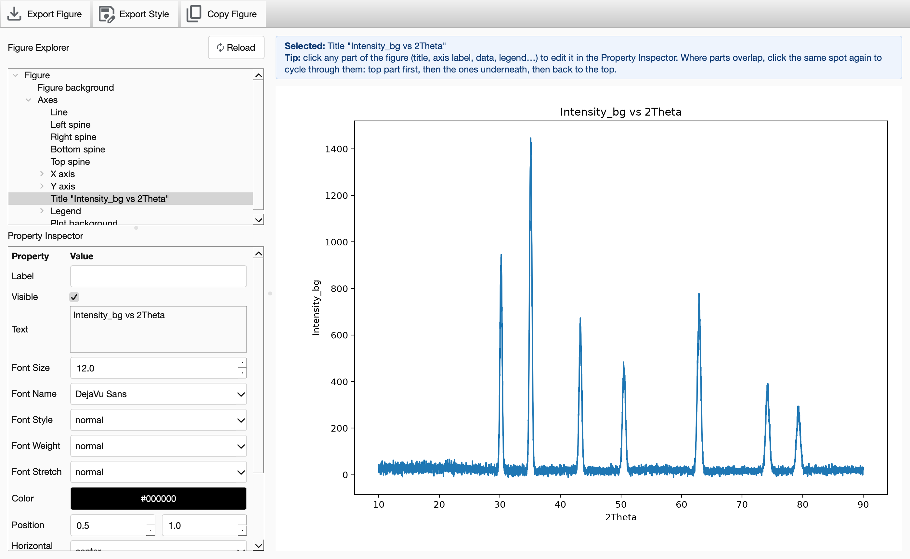

<!-- Generated from wiki/UI-Figure-Editor.md by scripts/sync_wiki_to_docs.py. Edit the wiki page. -->

# Figure Editor and Plot Windows

[UI Reference](index.md) › Figure Editor and Plot Windows

**Generate Plot** (and **Plot → Generate Plot**, Ctrl+G, and opening a file with
*Open With → PhysPlot*) opens every plot in a **plot window** with the standard
Matplotlib toolbar. Click **Advanced Styling…** at the right of its toolbar to open the
same figure in the **Figure Editor**, where you can restyle every part of it. To skip the
plot window, tick **Advanced Figure Editor** under **Generate Plot** in the
[Plotter Module](plotter_module.md): plots then open straight in the Figure Editor.
PhysPlot remembers the choice.

Nothing you change in either window is recorded in the protocol, and neither changes
the table.

## Figure Editor

The Figure Editor is built into PhysPlot (it started from the MIT-licensed
FigureForge project). It edits
the plot window's figure itself, not a copy:

- Every change you make in the editor shows in the plot window straight away.
- Closing the editor keeps your changes in the plot window, so you can then save it
  with the plot window's save button. The editor does not ask to save.
- Clicking **Advanced Styling…** again brings the open editor to the front. Each
  plot window has its own editor, so several can be open at once.

| Area | Use |
| --- | --- |
| **Figure canvas** (centre) | The live figure. It redraws as you change properties. |
| **Figure Explorer** (left) | A tree of the figure's parts: Figure → Axes → lines, scatter collections, texts, legend, spines, ticks. Select a part to edit it. |
| **Toolbar** | **Export Figure** (PNG, PDF, SVG, EPS, TIFF or JPEG; DPI, size, transparent background; formatting *As shown* or any PhysPlot template, applied to the exported copy only; live preview), **Export Style** (saves only the formatting as a PhysPlot template, which then appears under **Template**) and **Copy Figure**. |
| **Property Inspector** (below the explorer) | The selected part's properties: text, font family and size, colours, line style and width, marker and size, limits, scale, visibility. Edits apply immediately. |

A blue guide strip above the figure explains clicking: before you click it shows a tip,
and after each click it names the selected part and, where parts overlap, where you are
in the cycle.

**Click any part of the figure** (left or right button) to open its properties: click
the title to edit the title, an axis label to edit that label, the data to edit the line
or markers. The Property Inspector shows that part at once, and it is highlighted in the
Figure Explorer. Where parts overlap, the one on top opens first (the title, not the
axes behind it; a fit line, not the data under it). **Click the same spot again** to
move to the next part there, for example from the fit line to the raw data and then to
the axes; after the last one it starts again. The status bar at the bottom of the editor
names what is selected, for example *Line2D - fit (1 of 3, click again for the next)*.

### Menus

| Menu | Items |
| --- | --- |
| **File** | **New** (Ctrl+N), **Open…** (Ctrl+O), **Open Recent**, **Save** (Ctrl+S) and **Save As…** (Ctrl+Shift+S) as an editable figure file (`.pkl`, reopenable in the editor). **Export Figure…** (Ctrl+E) and **Export Style…** (Ctrl+Shift+E), described under the toolbar above. **Quit** (Ctrl+Q). |
| **Edit** | **Open in Matplotlib**, **Copy Figure** (Ctrl+C, as an image), **Delete Item** (Del, removes the selected part), **Preferences**. |
| **Figure Editor** | PhysPlot's tools: **Fitting ▸ Add Fit Function** and **PhysPlot ▸ Save as Template** (below), plus **Open Plugins Folder…**, **Reload Plugins**, **Plugins Documentation** (PhysPlot docs) and **New Plugin**. |
| **Help** | **PhysPlot Documentation** and **Report an Issue** (PhysPlot's GitHub issues). |

To keep an edited figure, use **File → Export** (image) or **File → Save** (editable)
here. The main window's **Export Plot** saves PhysPlot's own copy, without your
editor changes.

### Save as Template

**Figure Editor → PhysPlot → Save as Template** turns the current look of the figure
into a reusable template.

1. Select the Figure (or any part of it) in the Figure Explorer.
2. Choose **Save as Template**. The dialog shows:
   - **Name:** the name shown in the **Template** menu (default *Publication Style*).
   - **Saved as:** the file it will be written to, updated as you type, for example
     `Documents/PhysPlot/config/templates/My_Lab_Style.json`.
3. Press **OK**. A *PhysPlot Template* message confirms the path.
4. In the main window, press **Reload** next to **Template** and choose the new
   template.

A template stores **how the figure looks**, not what it shows:

- the figure size, DPI and background
- the fonts and colours of the title and axis labels
- the axis scales, grid, spines and tick labels
- the line and marker styles, scatter colours and legend settings

It does not store data, axis limits, or title and label text.

Things to know:

- **Saving over the bundled template.** Saving with the default name *Publication
  Style* writes `Publication_Style.json` in your config folder, which then replaces
  the bundled template of that name.
- **Names that map to the same file.** Names differing only in punctuation, such as
  *My Style* and *My_Style*, save to the same file. The existing file is replaced
  without asking.
- **Matching by position.** Styles are matched by position: the first axes, first
  line and first scatter series of the template style the first ones in the new plot.
- **Annotations** and **inset axes** are not captured.
- **Not replayed.** A template applies when you press Generate Plot in the GUI. It is
  **not** recorded in the protocol, so Apply This Sequence, `Sequence.py` scripts and
  bulk runs do not apply it.

If nothing is selected, a warning asks you to select the Figure, an Axes or an artist
first. If the file cannot be written, *Could not save template* explains why.

### Add Fit Function

**Figure Editor → Fitting → Add Fit Function** fits a curve to data in the editor,
independently of PhysPlot's LSQ fit. Select an axes, line or scatter series first.

| Field | Meaning |
| --- | --- |
| **Data** | Which line or scatter series to fit (with its point count). |
| **f(x)** | The model, for example `a*x + b`. |
| **Parameters** | Comma-separated names (`a,b`). |
| **Initial guesses** | One number per parameter (`1,0`). |
| **Curve label** | Legend text. Leave it empty for an automatic label with the fitted values. |
| **Line style** | `-`, `--`, `-.`, `:`. |
| **Line width** | In points (default 2). |
| **Show legend** | Yes / No. |

The fitted curve is added to the figure in the editor only. It is not recorded in the
protocol, and **Export Data** does not write it to `fit.json`. For a fit that replays
and is exported, use the **LSQ fit** fields in the [Plotter Module](plotter_module.md).

## Plot windows

Every plotter except the Basic Plotter opens its figure in a window titled
**PhysPlot - <plotter>: <plot type>** (820 × 620 pixels, resizable), for example
*PhysPlot - overlay: overlay_by_group*.

The toolbar above the figure is Matplotlib's standard toolbar:

| Button | Use |
| --- | --- |
| **Home** / **Back** / **Forward** | Reset the view, or step through earlier zoom and pan views. |
| **Pan** | Drag to move; right-drag to zoom along an axis. |
| **Zoom** | Drag a rectangle to zoom in. |
| **Subplots** | Adjust margins and spacing. |
| **Customize** | Edit axis limits, labels, scales and line styles (when available). |
| **Save** | Save the figure as it looks now, including zoom and changes made with the toolbar. |

Each Generate Plot opens a new window. The windows are independent of each other, and
closing them loses nothing.
