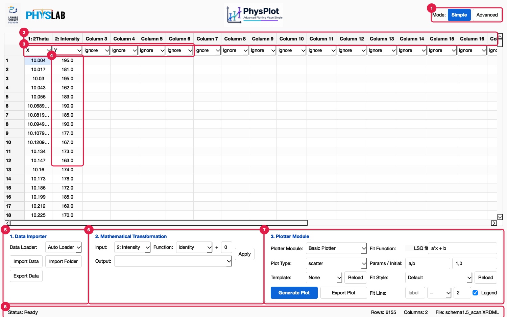

<!-- Generated from wiki/UI-Reference.md by scripts/sync_wiki_to_docs.py. Edit the wiki page. -->

# UI Reference

This reference documents every part of the PhysPlot window: each panel, control,
menu item, context menu, dialog and message. Numbered red markers in the
screenshots match the numbered notes on each page. For a guided first session, see
the [GUI Walkthrough](../getting_started.rst); for saving and bulk-running a protocol, see the
[Sequence Walkthrough](sequence_walkthrough.md).



| Marker | Area | Reference page |
| --- | --- | --- |
| 1 | Header and mode switcher | [Main Window, Menus and Status Bar](main_window.md) |
| 2–4 | Column headers, role row, data cells | [Data Table](data_table.md) |
| 5 | **1. Data Importer** panel (Simple Mode) | [Data Importer](data_importer.md) |
| 6 | **2. Mathematical Transformation** panel (Simple Mode) | [Mathematical Transformation](transformation.md) |
| 7 | **3. Plotter Module** panel (Simple Mode) | [Plotter Module](plotter_module.md) |
| 8 | Status bar | [Main Window, Menus and Status Bar](main_window.md#status-bar) |
| – | **Build Protocol** tab (Advanced Mode) | [Build Protocol](build_protocol.md) |
| – | **Run Sequence** tab (Advanced Mode) | [Run Sequence](run_sequence.md) |
| – | Figure Editor window and plot windows | [Figure Editor and Plot Windows](figure_editor.md) |
| – | Every dialog, error and status message | [Dialogs and Messages](dialogs_and_messages.md) |

## How the window is organised

```text
┌──────────────────────────────────────────────────────────────────────┐
│ [LSF][PhysLab]            [PhysPlot logo]        Mode: [Simple][Advanced] │  header
├──────────────────────────────────────────────────────────────────────┤
│      1: Time │ 2: Voltage │ Column 3 │ …                              │  column headers
│      [X ▾]   │ [Y ▾]      │ [Ignore ▾] │ …                            │  role row
│  1   0.0     │ 1.0        │           │                               │
│  2   …       │ …          │           │                               │  data cells
├──────────────────────────────────────────────────────────────────────┤
│ Simple:   [1. Data Importer] [2. Mathematical Transformation] [3. Plotter Module] │
│ Advanced: [Build Protocol | Run Sequence] tabs                        │  mode panel
├──────────────────────────────────────────────────────────────────────┤
│ Status: …                        Rows: n  Columns: n  File: name      │  status bar
└──────────────────────────────────────────────────────────────────────┘
```

- **Table first.** The spreadsheet is always visible. Every panel works on it, and
  every change you make is recorded in the protocol.
- **Two modes, one table.** **Simple** shows the three everyday panels. **Advanced**
  shows the recorded protocol and bulk runs. Switching modes never changes your data.
- **Everything is replayable.** Imports, role changes, cell edits, renames, deletions,
  transformations and plots each become a step in **Build Protocol**. The protocol can
  be replayed, edited as Python, exported as `Sequence.py` and run over folders.

## Keyboard shortcuts

On macOS, **Ctrl** in these shortcuts is the **⌘ Command** key.

| Shortcut | Action |
| --- | --- |
| Ctrl+O | File → Import Data… (Auto Loader) |
| Ctrl+E | File → Export Data… |
| Ctrl+Shift+R | File → Reload Config Modules |
| Ctrl+S | Protocol → Export Sequence.py… |
| Ctrl+R | Protocol → Apply This Sequence |
| Ctrl+1 / Ctrl+2 | View → Simple Mode / Advanced Mode |
| Ctrl+G | Plot → Generate Plot |
| Ctrl+C / Ctrl+V | Copy / paste table cells (tab-separated, works with Excel) |
| Double-click a header | Rename the column |

```{toctree}
:maxdepth: 1

main_window
data_table
data_importer
transformation
plotter_module
build_protocol
run_sequence
figure_editor
dialogs_and_messages
```
