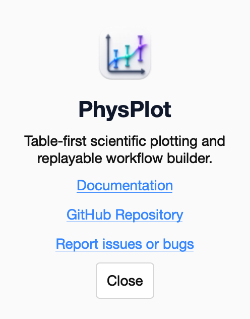

<!-- Generated from wiki/UI-Main-Window.md by scripts/sync_wiki_to_docs.py. Edit the wiki page. -->

# Main Window, Menus and Status Bar

[UI Reference](index.md) › Main Window

## Header

1. **Institution logos.** Lahore Science Foundry (LSF) and PhysLab. Display only.
2. **PhysPlot logo.** Display only, always centred.
3. **Simple.** Shows the three Simple Mode panels (Data Importer, Mathematical
   Transformation, Plotter Module) below the table. Same as **View → Simple Mode**
   (Ctrl+1). The active mode is highlighted in blue.
4. **Advanced.** Shows the **Build Protocol** and **Run Sequence** tabs below the table.
   Same as **View → Advanced Mode** (Ctrl+2).

Switching modes only changes the lower panel. The table, its roles and the recorded
protocol stay as they are.

## Menus

PhysPlot uses the native menu bar: at the top of the screen on macOS, and at the top
of the window on Windows and Linux.

### File

| Item | Shortcut | What it does |
| --- | --- | --- |
| **Import Data…** | Ctrl+O | Opens a file dialog and imports the chosen file with **Auto Loader**. It records a *File Loader* row (plus the suggested roles) in the protocol. To choose a specific loader, use the **Data Loader** menu in the [Data Importer](data_importer.md) panel instead. |
| **Import Folder…** | — | Opens a folder dialog and shows *"Folder selected: <name>"* in the status bar. It does not load files. To process every file in a folder, use [Run Sequence](run_sequence.md). |
| **Export Data…** | Ctrl+E | Asks for a folder and writes `data.csv`, `columns.csv`, `workflow.py`, plus `fit.json` and `plot.png` when a fit or figure exists. The status bar shows *"Exported"*. |
| **Open Config Folder** | — | Opens `Documents/PhysPlot/config/` in Finder or Explorer, creating it if needed. Files you put here (loaders, transformations, templates, plotter modules, …) override the bundled ones with the same name. |
| **Reload Config Modules** | Ctrl+Shift+R | Re-scans every `config/` folder without restarting, then refreshes the Data Loader, Function, Plotter Module and Fit Style menus and the *Insert Protocol Module* submenu. Templates have their own **Reload** button in the Plotter Module panel. The status bar shows where it loaded from. |

### Protocol

| Item | Shortcut | What it does |
| --- | --- | --- |
| **Import Sequence.py…** | — | Loads a saved protocol (`WORKFLOW_STEPS` or `build_workflow()`) from a Python file. The file dialog starts in `Documents/PhysPlot/config/sequences/`. The protocol replaces the current one, and **Build Protocol** shows its rows. It does not run yet; use **Apply This Sequence** for that. |
| **Export Sequence.py…** | Ctrl+S | Saves the protocol as a runnable Python file (default `config/sequences/sequence.py`). See [Bulk Runs and Headless Use](../user_guide/protocol_sequences.rst). |
| **Apply This Sequence** | Ctrl+R | Replays every step from the start and shows **OK / Failed / Skipped** for each row in **Build Protocol**. If a step fails, a dialog names the row and the error. |
| **Copy Sequence Code** | — | Copies the protocol's Python code to the clipboard (*"Sequence script copied"*). |
| **Clear Sequence** | — | Empties the protocol. The table is not changed. |
| **Insert Protocol Module ▸** | — | Lists the reusable protocol files in `config/protocol_modules/`. Choosing one appends its steps to the protocol. |

### View

| Item | Shortcut | What it does |
| --- | --- | --- |
| **Simple Mode** | Ctrl+1 | Shows the three Simple Mode panels. |
| **Advanced Mode** | Ctrl+2 | Shows Build Protocol and Run Sequence. |

### Plot

| Item | Shortcut | What it does |
| --- | --- | --- |
| **Generate Plot** | Ctrl+G | Plots the **X** and **Y** columns with the Basic Plotter as a scatter plot, applies the selected Template, and opens the result in the [Figure Editor](figure_editor.md). It records a *Generate Plot* step. For another plotter or plot type, use the [Plotter Module](plotter_module.md) panel. |
| **Update Integrated Preview** | — | Refreshes the Plotter Module and plot-type lists for the current data and adds a note row to the protocol table. It does not create a replayable step. |

### Help

| Item | What it does |
| --- | --- |
| **Documentation** | Opens <https://physplot.readthedocs.io/en/latest/>. |
| **GitHub Repository** | Opens <https://github.com/MShirazAhmad/PhysPlot>. |
| **Report Issues or Bugs** | Opens the GitHub issue tracker. |
| **About PhysPlot** | Shows the About dialog (below). On macOS, Qt moves this item into the application menu (the first menu after the Apple menu). |

The About dialog shows the PhysPlot icon and a one-line description, with links to
the documentation, the repository and the issue tracker. **Close** dismisses it.

## Status bar

In Simple Mode:

1. **Status message.** The result of the last action, for example *"Ready"*,
   *"Transformation applied"*, *"Plot generated"* or *"Bulk complete: 3 outputs"*.
   When a step fails, the message names the row and the error. Long messages end in
   **…**; hover for the full text. Long messages never widen the window.
2. **Rows / Columns / File.** The size of the current data (trailing empty rows and
   columns are not counted) and the name of the last imported file.

In Advanced Mode it shows more:

1. **Ready dot.** Shown in Advanced Mode only.
2. **Status message.** As above.
3. **Rows / Columns / File.** As above.
4. **Workflow.** The name of the last imported or exported `Sequence.py`, or
   *Untitled*.
5. **Mode.** The current mode.

## Window size

- The window can be as narrow as about 910 px.
- When it is narrower than the three Simple Mode panels, the panel row gets a
  horizontal scrollbar instead of pushing the window off-screen.
- The lower panel always takes exactly the height its controls need; the table gets
  the rest.
- The window, the macOS Dock and the Figure Editor all use the PhysPlot icon.
