<!-- Generated from wiki/Sequence-Walkthrough.md by scripts/sync_wiki_to_docs.py. Edit the wiki page. -->

# Sequence Walkthrough: Record, Save, Reuse and Bulk-Run

This walkthrough follows a protocol through its whole life:

1. Record it on one file.
2. Save it as `Sequence.py`.
3. Open it again in a later session and replay it.
4. Point it at a different file.
5. Run it over a whole folder.
6. Handle a file that fails.
7. Run the same file from the command line.

It uses the three XRD scans in `test_data/XRD/anneal_series/`: TiO₂ annealed at 400,
600 and 800 °C, recorded on a Rigaku SmartLab (`.ras` files). Each scan gets its
background removed, is normalised to its strongest peak and plotted, so the three
results can be compared directly: anatase turns into rutile as the annealing
temperature rises. Numbered red markers in the screenshots match the notes under each
one.

> **Protocol or sequence?** They are the same thing. PhysPlot records a *protocol*
> while you work (shown in **Build Protocol**). Saved to a file, it is a
> *sequence* (`Sequence.py`).

---

## 1. Import the first scan

In **1. Data Importer**, keep **Auto Loader**, click **Import Data** and choose
`test_data/XRD/anneal_series/tio2_400C.ras`.

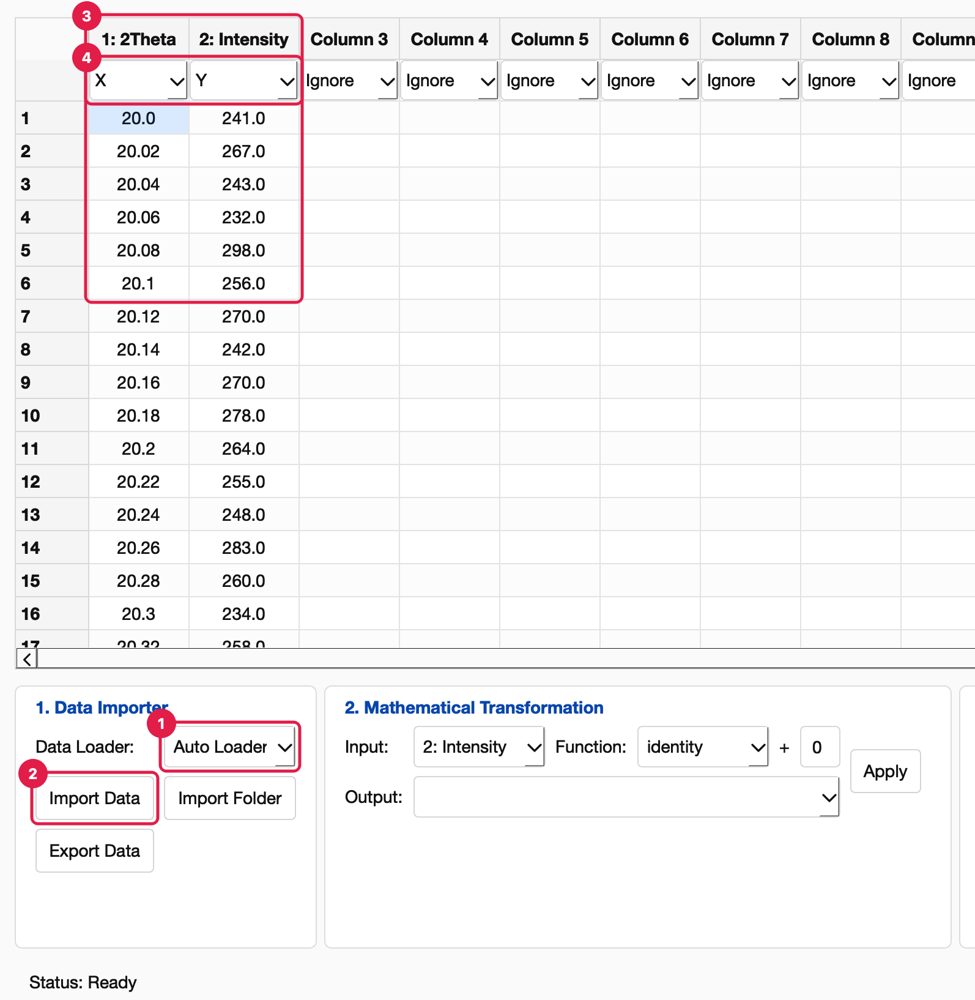

1. **Data Loader: Auto Loader.** It picks the **Rigaku RAS Loader (XRD)** plugin,
   because that plugin declares the `.ras` extension.
2. **Import Data.** This first import is also the first protocol step. It records
   which file was read, with which loader, and the column names and roles.
3. **Columns** `2Theta` and `Intensity`, 2501 points from 20° to 70°.
4. **Roles** suggested by the loader: `2Theta` is **X**, `Intensity` is **Y**.

The status bar's **File** field (bottom right) names the scan you are working on.

## 2. Remove the background

In **2. Mathematical Transformation**:

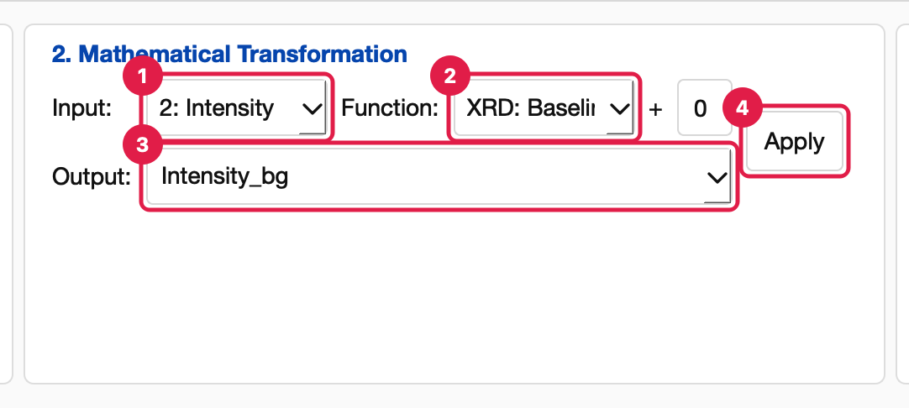

1. **Input:** `2: Intensity`. Input switches to the Y column when new data loads.
2. **Function:** `XRD: Baseline Remove`. This plugin fits a smooth background under
   the peaks and subtracts it.
3. **Output:** type `Intensity_bg` to keep the raw column and add a new one.
4. **Apply.** The column appears and a *Transform* step is recorded.

## 3. Normalise and choose what to plot

Apply a second transformation: **Input** `Intensity_bg`, **Function** `normalize_max`,
**Output** `Intensity_norm`. Then set the new column's role to **Y**:

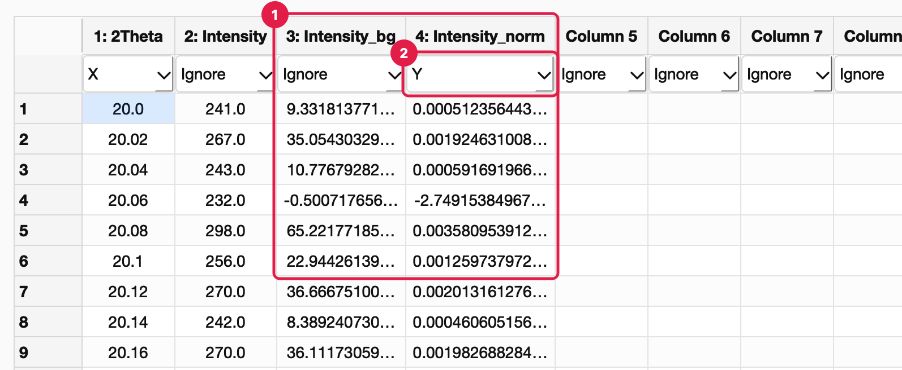

1. **The two new columns.** `Intensity_bg` is the background-free scan, and
   `Intensity_norm` is scaled so the strongest peak is 1. Scans measured with
   different counting times can then be compared directly.
2. **Y role on `Intensity_norm`.** Only one column can be Y, so `Intensity` goes back
   to *Ignore*. This change is recorded too (*Set Y*).

## 4. Plot

In **3. Plotter Module**, choose **Plotter Module** `Line Plotter` and **Plot Type**
`line`, then click **Generate Plot**:

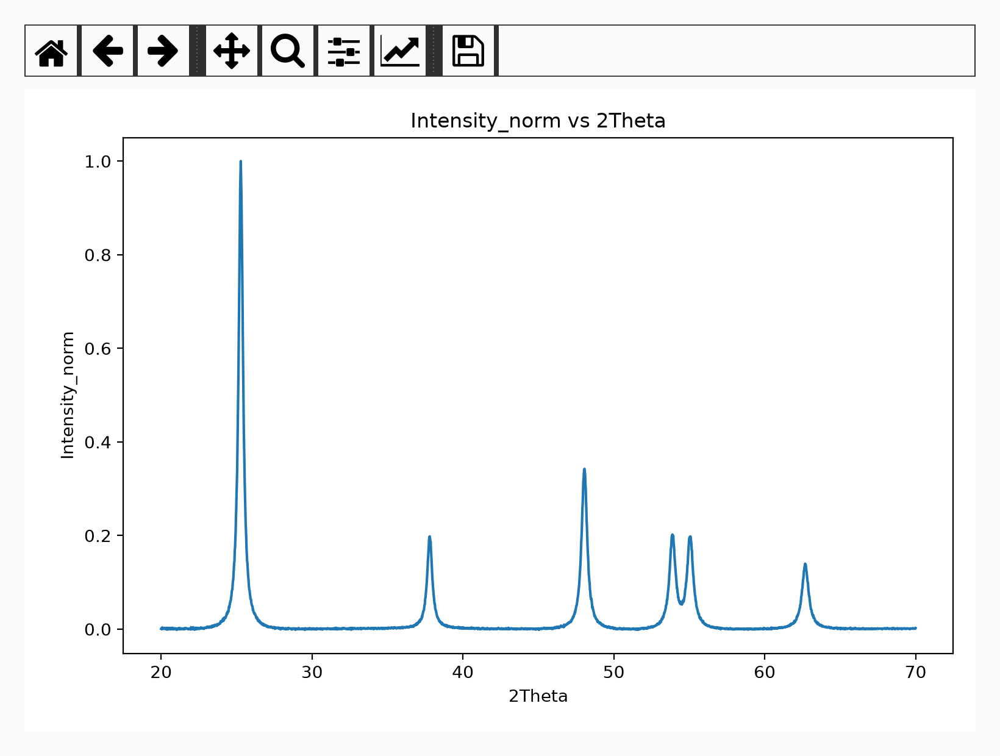

At 400 °C only anatase is present, with its (101) peak at 25.3°. The plot opens in
its own window with the Matplotlib toolbar (zoom, pan, save).

A *Generate Plot* step is recorded, holding the plotter, plot type and any LSQ fit
settings. Every bulk output will get this same plot.

> The **Basic Plotter** would open the plot in the Figure Editor instead. Neither
> Figure Editor edits nor the **Template** choice are recorded, so they don't appear
> in replays or bulk outputs. See [Figure Editor](figure_editor.md).

## 5. Review the protocol

Click **Advanced** (top right). **Build Protocol** shows the five recorded steps:

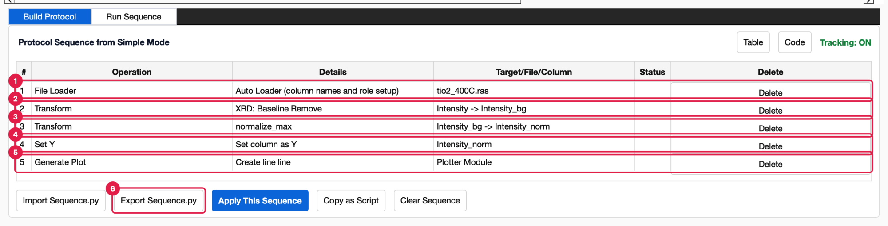

1. **File Loader:** `Auto Loader (column names and role setup)` for `tio2_400C.ras`.
2. **Transform:** `XRD: Baseline Remove`, `Intensity -> Intensity_bg`.
3. **Transform:** `normalize_max`, `Intensity_bg -> Intensity_norm`.
4. **Set Y:** `Intensity_norm`.
5. **Generate Plot:** `Create line line` (plotter `line`, plot type `line`).
6. **Export Sequence.py.** Saves these steps to a file (next section).

A mistake is easy to fix here: **Delete** a row and the rest replays at once. See
[Build Protocol](build_protocol.md) for every control on this tab.

## 6. Save the sequence

Click **Export Sequence.py** (or **Protocol → Export Sequence.py…**, Ctrl+S). The
dialog starts in `Documents/PhysPlot/config/sequences/`. Name the file
`xrd_normalized.py`:

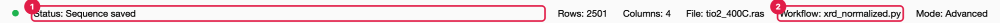

1. **Status:** *Sequence saved*.
2. **Workflow:** the file the protocol now belongs to.

The file is ordinary Python. This is the part that matters:

```python
WORKFLOW_STEPS = [
    LoadDataStep(
        path='test_data/XRD/anneal_series/tio2_400C.ras',
        loader='auto',
        dataset_name='tio2_400C',
        loader_plugin=None,
    ),
    SetRoleStep(
        roles={'x': '2Theta', 'y': 'Intensity'},
    ),
    TransformColumnStep(
        input_column='Intensity',
        input_column_number=2,
        function_name='14_xrd_baseline_remove',
        output='Intensity_bg',
        output_column_number=3,
        params={'multiplier': 1.0, 'offset': 0.0},
    ),
    TransformColumnStep(
        input_column='Intensity_bg',
        input_column_number=3,
        function_name='normalize_max',
        output='Intensity_norm',
        output_column_number=4,
        params={},
    ),
    SetRoleStep(
        roles={'y': 'Intensity_norm'},
    ),
    PlotModuleStep(
        plotter_id='line',
        plot_type='line',
        config={},
    )
]
```

Around it, the file has imports, `build_workflow()` and a `run()` function, so it
also works in a notebook or from the command line (section 12). Things to notice:

- **Plugins by file name.** The plugin transformation is saved by its file name
  (`14_xrd_baseline_remove`). The `.ras` files are opened through the Rigaku plugin
  again because Auto Loader matches the extension. Anyone with the same plugin files
  can replay the sequence.
- **Column numbers.** Each step stores the column numbers as well as the names. When a
  later file names its columns differently, the column number is used instead.

## 7. Open it again later

In a new session (or after **Clear Sequence**), go to **Advanced → Build Protocol**
and click **Import Sequence.py**. Choose `xrd_normalized.py`:

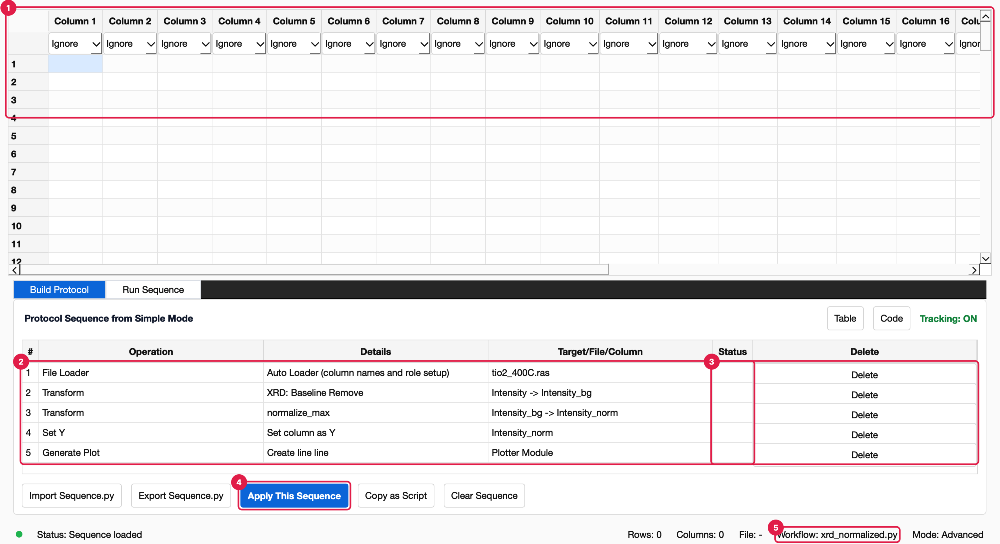

1. **The table is still empty.** Importing only loads the steps; nothing runs yet.
2. **The same five rows** as when they were recorded.
3. **Status is blank:** these rows have not run in this session.
4. **Apply This Sequence** runs them (next section).
5. **Workflow** names the imported file.

## 8. Replay it

Click **Apply This Sequence** (Ctrl+R):

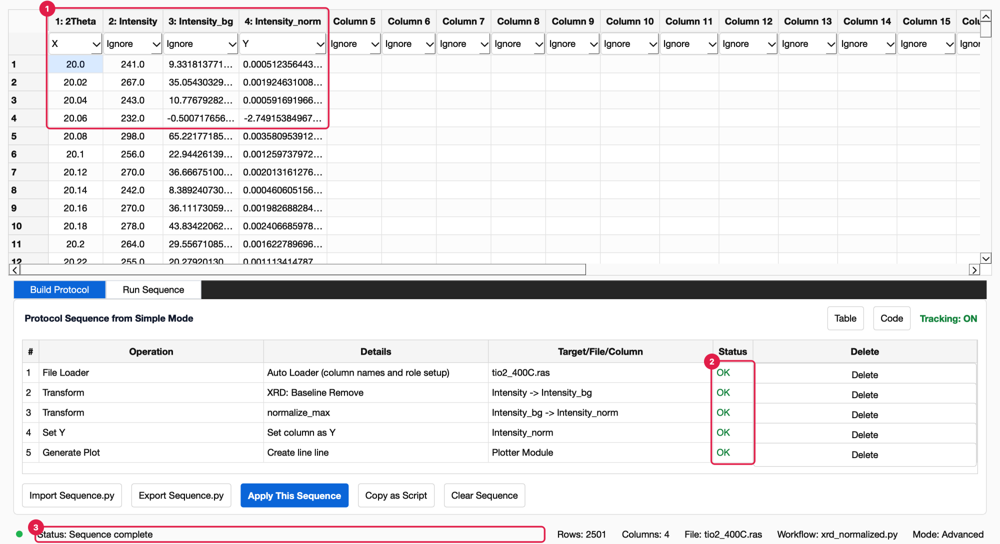

1. **The table is rebuilt.** The scan is reloaded and every transformation
   re-applied. The results match the original session exactly.
2. **Status: OK** for every row. Hover a cell to see how long its step took. A failing
   row would show **Failed** in red, and the rows after it **Skipped**.
3. **Status bar:** *Sequence complete*. **File** names the reloaded scan.

The plot step replays too, so **Export Plot** and **Export Data** work straight away.

## 9. Use it on a different file

To process one other file, edit the path in the Code view. Click **Code**, then change
`tio2_400C.ras` to `tio2_600C.ras`:

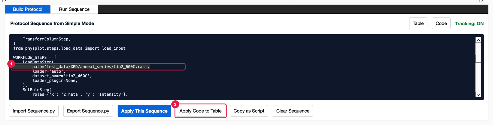

1. **The edited line.** Any value can be changed here: the file, a column name, a
   function's parameters, the plot type. Steps can also be deleted or reordered.
2. **Apply Code to Table.** Rebuilds the rows from your edit (the status bar shows
   *Sequence code applied*). Then click **Apply This Sequence** to run it on the new
   scan.

If the code has a mistake, a dialog names the line and nothing changes. To keep the
edited version, **Export Sequence.py** again.

For many files, don't edit the path: use Run Sequence.

## 10. Run it over a folder

Open the **Run Sequence** tab and fill in:

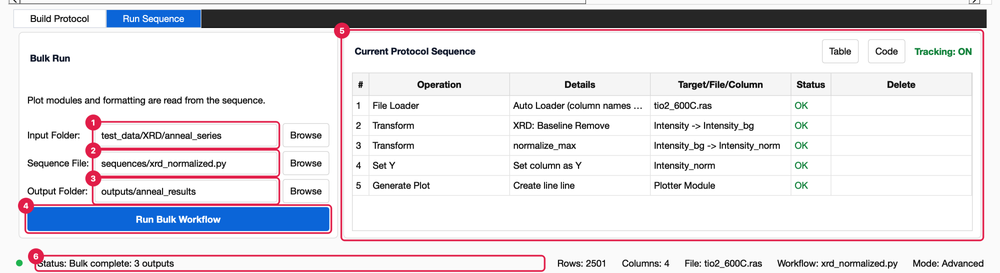

1. **Input Folder:** `test_data/XRD/anneal_series`, the folder with the scans.
2. **Sequence File:** `xrd_normalized.py`. Leave it blank to use the protocol
   currently in Build Protocol.
3. **Output Folder:** `outputs/anneal_results`. It is created if needed.
4. **Run Bulk Workflow.** Each file is loaded the same way as the recorded one (here,
   with the Rigaku RAS Loader), then the rest of the protocol runs on it.
5. **Current Protocol Sequence:** a read-only view of the protocol in Build Protocol.
6. **Status:** *Bulk complete: 3 outputs*.

Because the protocol was recorded on a `.ras` file read by a loader plugin, only
`.ras` files in the folder are processed. A protocol recorded on a CSV, TXT, Excel or
XRDML file processes all of those formats. See
[Run Sequence](run_sequence.md#which-files-are-processed) for the full rules.

Each file gets its own folder of results:

```text
outputs/anneal_results/
├── tio2_400C/
│   ├── columns.csv    column numbers, names, roles, types and units
│   ├── data.csv       2Theta, Intensity, Intensity_bg, Intensity_norm
│   ├── plot.png       the line plot
│   └── workflow.py    the protocol that produced these files
├── tio2_600C/
│   └── …
└── tio2_800C/
    └── …
```

`outputs/anneal_results/tio2_800C/plot.png`:

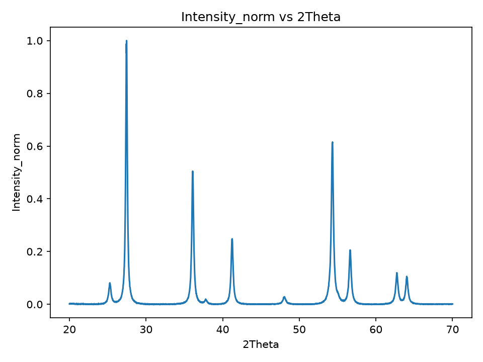

At 800 °C the rutile (110) peak at 27.4° dominates, and only a trace of anatase is
left at 25.3°. That comparison is what the sequence was built for.

## 11. When a file fails

The run stops at the first file that fails. Here a folder also contains
`tio2_600C_incomplete.ras`, a scan that was aborted after the header was written:

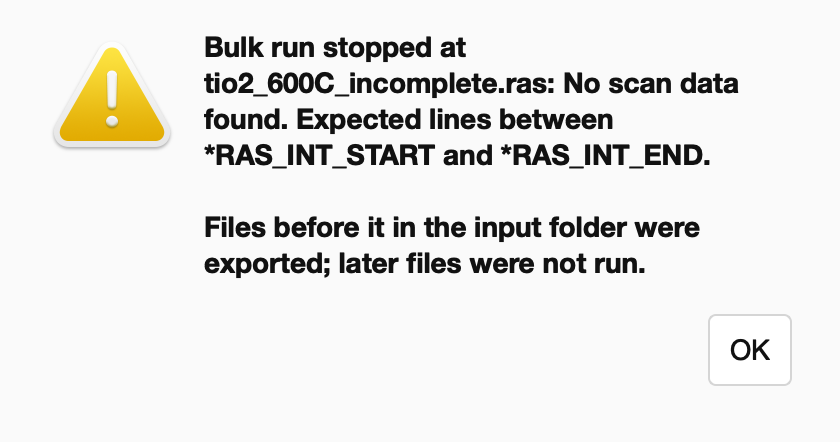

The message comes from the loader: the file has no data between `*RAS_INT_START` and
`*RAS_INT_END`.

- **Already exported.** Files before it (alphabetically) are already exported:
  `tio2_400C` and `tio2_600C`.
- **Not run.** Files after it (`tio2_800C`) are not run.

Fix or remove the named file and click **Run Bulk Workflow** again. Existing results
are overwritten.

## 12. Run it without the GUI

The saved sequence runs the same way from a terminal:

```bash
# Every .ras file in a folder, like Run Sequence
physplot run-bulk xrd_normalized.py --input-folder test_data/XRD/anneal_series --output-folder outputs/cli_results
# Bulk workflow wrote 3 outputs to outputs/cli_results

# One file
physplot run-workflow xrd_normalized.py --input test_data/XRD/anneal_series/tio2_800C.ras --output outputs/tio2_800C
# Workflow output written to outputs/tio2_800C
```

Or from Python and notebooks:

```python
import runpy

sequence = runpy.run_path("xrd_normalized.py")
pp = sequence["run"](input_path="test_data/XRD/anneal_series/tio2_800C.ras", output_dir="outputs/tio2_800C")
pp.dataset.dataframe.head()
```

See [Bulk Runs and Headless Use](../user_guide/protocol_sequences.rst) for all options.

---

## Quick reference

| I want to… | Do this |
| --- | --- |
| See what has been recorded | **Advanced → Build Protocol** |
| Undo a step | **Delete** on its row. The rest replays immediately. |
| Re-run only the last steps | Right-click a row → **Rerun from this step** |
| Save the protocol | **Export Sequence.py** (Ctrl+S) |
| Reuse a saved protocol | **Import Sequence.py**, then **Apply This Sequence** (Ctrl+R) |
| Change a parameter or the file | **Code** → edit → **Apply Code to Table** |
| Process a folder | **Run Sequence** → Input Folder, Sequence File, Output Folder → **Run Bulk Workflow** |
| Add saved steps to the current protocol | **Protocol → Insert Protocol Module** (files in `config/protocol_modules/`) |
| Run without the GUI | `physplot run-bulk …` / `physplot run-workflow …` |

**What is recorded:**

- imports, with their roles
- role changes, cell edits, renames, and row and column deletions
- transformations
- plots, with their LSQ fit settings

**What is not:**

- the Template choice and Figure Editor edits
- **Import Folder**, which only selects a folder
- zooming or saving from a plot window
