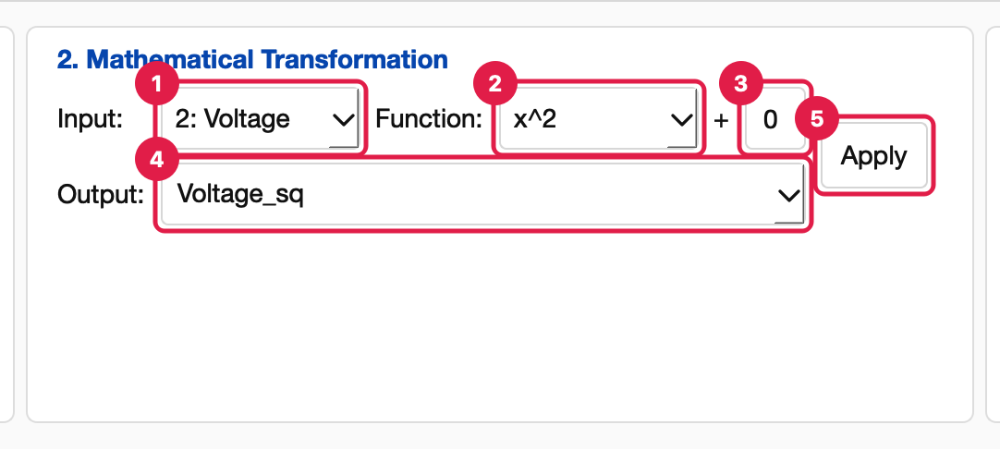
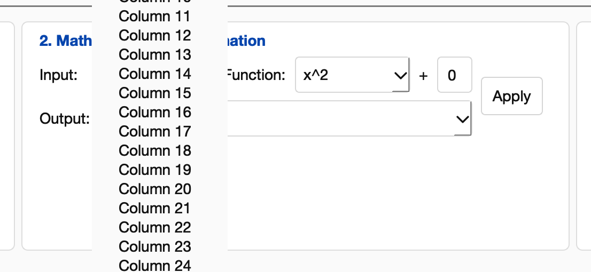
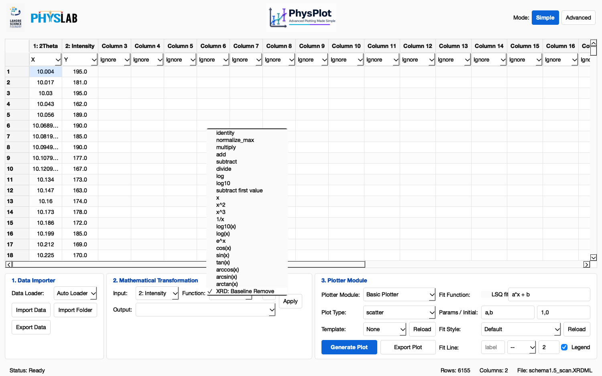

<!-- Generated from wiki/UI-Mathematical-Transformation.md by scripts/sync_wiki_to_docs.py. Edit the wiki page. -->

# Mathematical Transformation

[UI Reference](index.md) › Simple Mode › 2. Mathematical Transformation

The second Simple Mode panel computes a new column from an existing one, or
overwrites a column in place. Every transformation is recorded in the protocol and
replays everywhere: Apply This Sequence, exported `Sequence.py` files, the command line
and bulk runs.

1. **Input.** The column to transform, shown as `N: name` (or `Column N` for an
   unnamed column).
   - When new data loads, Input switches to the **Y** column, because that is what is
     usually transformed.
   - Once you choose a column yourself, the choice is kept while you work, including
     after new output columns appear.
2. **Function.** The transformation to apply (see [Functions](#functions)). Hover over
   an entry to read its description.
3. **+ offset.** A number added to the result: the column becomes
   `transform(values) × multiplier + offset`. Leave `0` for no offset. Text that isn't a
   number counts as `0`.
4. **Output.** Where the result goes.
   - **Type a new name** (for example `Intensity_bg`) to add a new column.
   - **Pick an existing column** to overwrite it; picking the Input column transforms
     it in place.
   - **Leave it empty** to create a new column named `<input>_<function>`, for
     example `Intensity_log10`.
5. **Apply.** Runs the transformation. The table updates, the status bar shows
   *"Transformation applied"*, and a *Transform* row is added to Build Protocol.

The Input menu lists every column, including empty default columns:

## Functions

Built-in functions come first. In the protocol, the recorded name is shown in
`code font`.

| Menu label | Recorded as | Result |
| --- | --- | --- |
| identity | `multiply` (factor 1) | Copies the column, plus the offset. |
| normalize_max | `normalize_max` | Divides by the column's largest absolute value (the result lies in −1…1). |
| multiply | `multiply` | Multiplies by a factor. Simple Mode uses factor 1; change `factor` in the Code view. |
| add | `add` | Adds the offset. |
| subtract | `subtract` | Subtracts the offset. |
| divide | `divide` | Divides by a factor. Simple Mode uses 1; change `divisor` in the Code view. |
| log | `log` | Natural logarithm (ln). |
| log10 | `log10` | Base-10 logarithm. |
| subtract first value | `baseline_subtract` | Subtracts the column's first value, a single constant. **Not** a background fit. |

Plugin functions follow, from `config/transformations/`. The recorded name is the file
name.

| Menu label | Recorded as | Result |
| --- | --- | --- |
| x | `01_identity` | Unchanged values. |
| x^2, x^3 | `02_square`, `03_cube` | Powers. |
| 1/x | `04_reciprocal` | Reciprocal. |
| log10(x), log(x) | `05_log10`, `06_log` | Logarithms. |
| e^x | `07_exponential` | Exponential. |
| cos(x), sin(x), tan(x) | `08_cos`, `09_sin`, `10_tan` | Trigonometric (radians). |
| arccos(x), arcsin(x), arctan(x) | `11_arccos`, `12_arcsin`, `13_arctan` | Inverse trigonometric. |
| XRD: Baseline Remove | `14_xrd_baseline_remove` | Fits a smooth background under the peaks (asymmetric least squares) and subtracts it. Works on any spectrum. |

For plugin functions, the offset is applied as `transform(values) × multiplier +
offset`, with multiplier 1 in Simple Mode. For built-in functions other than
add/subtract, a non-zero offset is recorded as a separate *add* step.

Your own functions from `Documents/PhysPlot/config/transformations/` appear here after
**File → Reload Config Modules**. See [Extending PhysPlot](../extensions/index.rst).

## Things to know

- **Blank and text cells** in the Input are treated as missing values: the result has
  a blank there, never a made-up number.
- **An Input with no numbers at all** gives the message *"Column '…' does not contain
  numeric values for transformation."* and records nothing.
- **An empty table:** pressing Apply only shows *"Enter or import data before applying
  a transformation"* in the status bar.
- **A plugin error** opens a *Transformation failed* dialog that names the plugin file.
  Nothing is recorded.
- **Undo** a transformation by deleting its row in [Build Protocol](build_protocol.md).
  The rest of the protocol replays without it.
