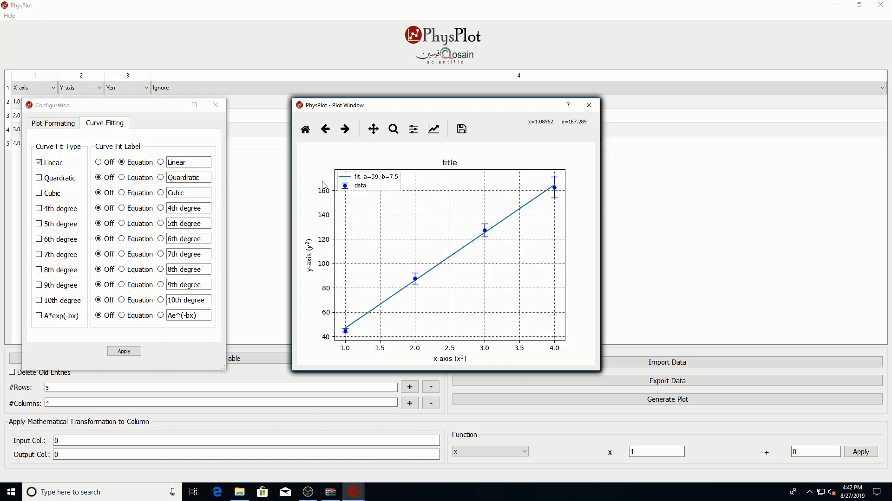

Data Entry
==========

Manual table entry
------------------

You can type values directly into the table cells (rows below the header row).

Managing dimensions
-------------------

- Use the row ``+`` / ``-`` buttons to add or remove rows.
- Use the column ``+`` / ``-`` buttons to add or remove columns.
- Use **New Table** to reinitialize table structure based on row/column inputs.

Delete old entries
------------------

When **Delete Old Entries** is checked, old cell contents are cleared while rebuilding the table.

