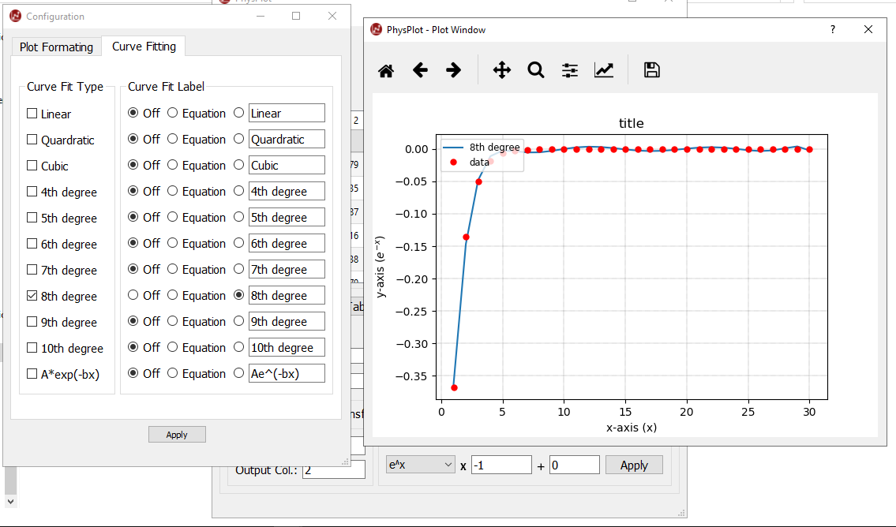

Data Export
===========

Export behavior
---------------

Click **Export Data** to save the current table output.

- Output format: text file (tab-delimited)
- Numeric formatting: rounded and written to 3 decimal places

Workflow
--------

1. Click **Export Data**.
2. Choose destination path and filename.
3. Confirm save.

