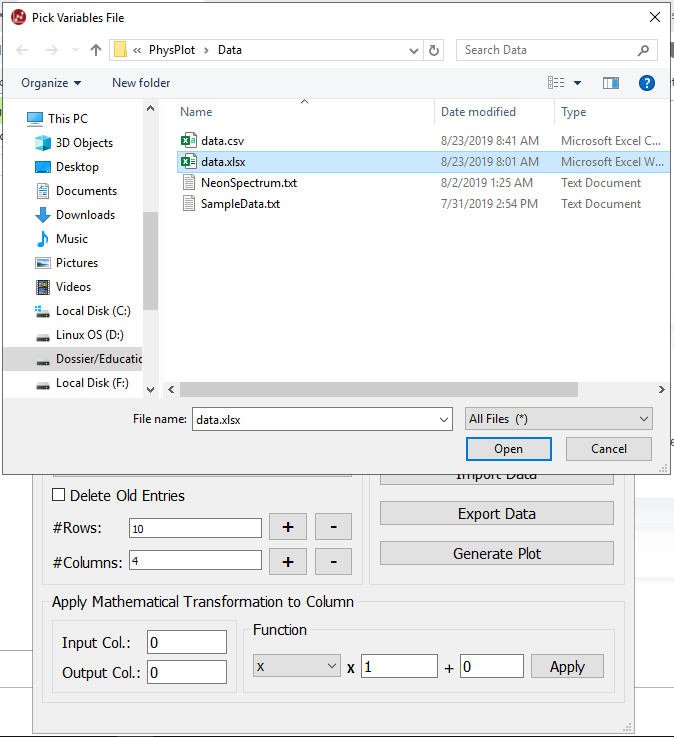

Data Import
===========

Supported formats
-----------------

- ``.txt``
- ``.csv``
- ``.tsv``
- ``.xlsx``

Loader selection
----------------

PhysPlot uses plugin-based file loaders. You can choose the active loader from:

- **Settings > File Loader**
- The **Data Loader** dropdown above **Import Data**

Loader plugins are auto-discovered at startup from the ``fileloader/`` folder.
The built-in default loader keeps standard CSV/XLSX/TXT/TSV import support.

Import steps
------------

1. Click **Import Data**.
2. Select a supported file.
3. PhysPlot loads values into the table and creates top-row dropdowns.

Column assignment
-----------------

Use the dropdown at row 0 for each column and choose one of:

- Ignore
- X-axis
- Xerr
- Y-axis
- Yerr

