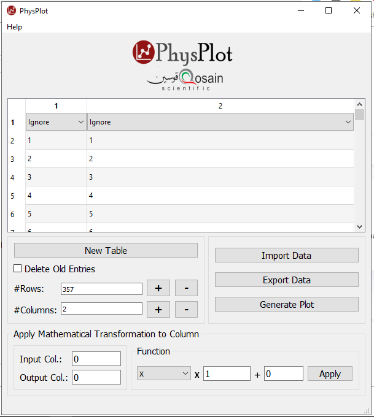

Data Manipulation
=================

Transformation panel
--------------------

Use **Apply Mathematical Transformation to Column** to compute values from one column and write to another.

Inputs
------

- **Input Col.**: source column
- **Output Col.**: destination column
- **Function**: selected transformation
- Scalar and offset controls: ``x`` multiplier and ``+`` offset

Supported functions
-------------------

- ``x``
- ``x^2``
- ``x^3``
- ``1/x``
- ``log10(x)``
- ``log(x)``
- ``e^x``
- ``cos(x)``, ``sin(x)``, ``tan(x)``
- ``arccos(x)``, ``arsin(x)``, ``artan(x)``

