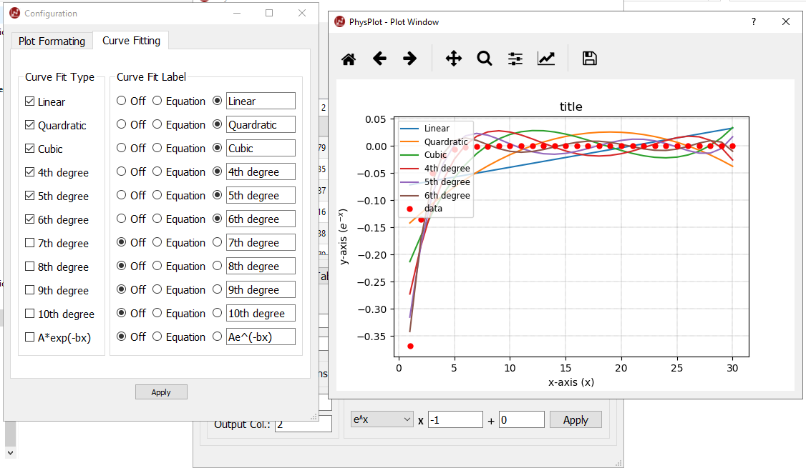

Plot Customization
==================

Configuration window options
----------------------------

PhysPlot's plot configuration window lets you control:

- Grid: style, width, color
- Marker: style, size, color
- Line: style, width, color
- Plot labels: title, x-label, y-label, legend label

Marker style options
--------------------

Point, Pixel, Circle, Triangle-Down, Triangle-Up, Triangle-Left, Triangle-Right,
Tri-Down, Tri-Up, Tri-Left, Tri-Right, Octagon, Square, Pentagon, Star,
Hexagon1, Hexagon2, Plus, x, Diamond, Thin-Diamond, V-Line, H-Line, Draw Nothing.

Line style options
------------------

Solid Line, Dashed Line, Dash-Dotted Line, Dotted Line, Draw Nothing.

Color options
-------------

Blue, Green, Red, Cyan, Magenta, Yellow, Black, White.

