# AI Module Examples

Every example on this page is the worked example from one of the
[AI guides](Build-Modules-with-AI), written to the guide's rules and then tested in
PhysPlot: loaded through the same code the window uses, run on the sample data, replayed
headlessly where that applies, and drawn. Use them to see what a finished module looks
like, to learn how the code works, or as a starting point for your own.

Each example ships with PhysPlot but is switched off: the files sit in an `examples/`
folder, which PhysPlot does not scan. The sample data is in
[`test_data/AI_Examples/`](https://github.com/MShirazAhmad/PhysPlot/tree/indevelopment/test_data/AI_Examples).

**To try one:** copy the example file from `config/<folder>/examples/` into
`Documents/PhysPlot/config/<folder>/` (**File → Open Config Folder**), choose
**File → Reload Config Modules**, and use it on the sample data. Delete the copy to
switch it off again.

| Example | Kind | Files |
| --- | --- | --- |
| [UV-Vis export loader](#uv-vis-export-loader) | Data importer | [loader][ex-loader] · [data][d-uvs] · [guide][g-importers] |
| [Wavenumber to wavelength](#wavenumber-to-wavelength) | Transformation | [module][ex-transform] · [data][d-ftir] · [guide][g-transformations] |
| [Capacitor discharge fit](#capacitor-discharge-fit) | Curve fit | [model][ex-fit] · [data][d-capacitor] · [guide][g-fit-functions] |
| [Derivative plotter](#derivative-plotter) | Plotter module | [module][ex-plotter] · [data][d-anneal] · [guide][g-plotters] |
| [Calibration and I–V presets](#calibration-and-iv-presets) | Plot-type presets | [preset][ex-cal] · [list][ex-iv] · [guide][g-plot-types] |
| [UV-Vis normalize sequence](#uv-vis-normalize-sequence) | Protocol sequence | [sequence][ex-sequence] · [data][d-uvvis] · [guide][g-sequences] |
| [Resistance vs temperature in kelvin](#resistance-vs-temperature-in-kelvin) | Protocol module | [module][ex-module] · [data][d-films] · [guide][g-protocol-modules] |
| [UV-Vis clean-up pipeline](#uv-vis-clean-up-pipeline) | Pipeline | [pipeline][ex-pipeline] · [script][ex-apply] · [guide][g-pipelines] |
| [Journal single-column template](#journal-single-column-template) | Figure template | [template][ex-template] · [data][d-voltage] · [guide][g-templates] |
| [Thin dashed fit](#thin-dashed-fit) | Fit-style preset | [preset][ex-fit-style] · [guide][g-fit-styles] |
| [Journal ticks](#journal-ticks) | Figure Editor plugin | [plugin][ex-plugin] · [guide][g-plugins] |

## UV-Vis export loader

`acme_uvvis_loader.py` reads a (fictional) Acme UV-1900 export: a header block, then a
`[Data]` table with tab separators and decimal commas. It returns wavelength, absorbance
and its standard deviation with the roles X, Y and Y Error, sorts the rows, accepts
single-scan files without the SD column, and claims the `.uvs` extension so **Auto
Loader** uses it. Try it on `methylene_blue.uvs` and `methylene_blue_single_scan.uvs`.

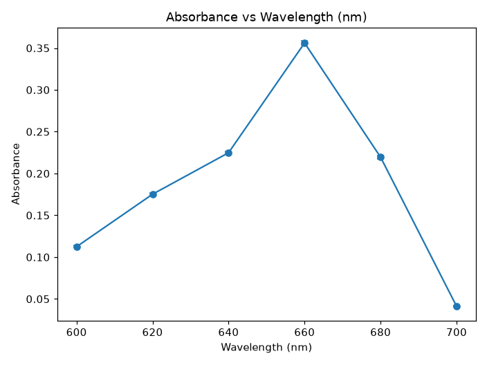

## Wavenumber to wavelength

`20_wavenumber_to_wavelength.py` adds **cm^-1 to nm** to the **Function** list:
`10^7 / wavenumber`. Zero, negative and blank cells become empty cells, and a column
with no positive value stops with a clear message. On `ftir_wavenumber.csv`, 4000,
2000 and 1000 cm⁻¹ become 2500, 5000 and 10000 nm.

## Capacitor discharge fit

The curve-fit guide turns a model into **LSQ fit** entries: **Fit Function**
`A*exp(-x/tau) + C`, **Params** `A,tau,C`, **Initial** `5,2,0.1`. On
`capacitor_discharge.csv` (made with A = 5 V, τ = 2 s, C = 0.1 V plus noise) the fit
returns A = 5.01, τ = 2.02 s and C = 0.08 V. The example also contains the legacy
fit-model file `20_exp_decay_offset.py`.

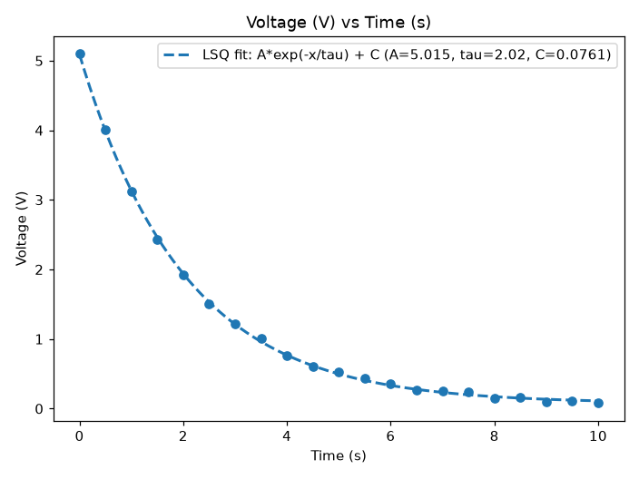

## Derivative plotter

`derivative_plotter.py` is a plotter module with two plot types for the X and Y role
columns: **normalized** (Y divided by its largest value) and **derivative** (dY/dX, with
the unit built from the column names, for example K/s). It skips text cells, averages
repeated X values and replays in sequences through `PlotModuleStep(plotter_id="derivative")`.
The data is `anneal_01.csv`, a heating ramp.

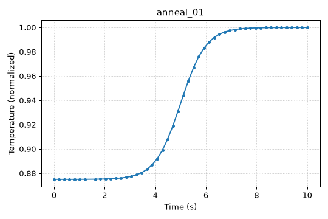
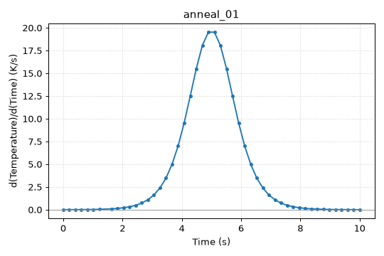

## Calibration and I–V presets

`calibration_curve.json` adds a **calibration_curve** entry to the Example XY Plotter's
**Plot Type** menu, with fixed axis labels, legend text and a 5 × 4 inch figure.
`iv_presets.json` shows the list form: two presets in one file, one of them only a lab
name for a Basic Plotter type (built-in plotters read no preset options).

## UV-Vis normalize sequence

`uvvis_normalize_sequence.py` sets the roles, subtracts a blank level of 0.02, scales the
strongest peak to 1 and plots the result as a line. Run it on one file with **Protocol →
Import Sequence.py** and **Apply This Sequence**, on the whole `uvvis_spectra/` folder
with **Run Sequence**, or in a terminal:

```bash
physplot run-workflow config/sequences/examples/uvvis_normalize_sequence.py --input test_data/AI_Examples/uvvis_spectra/sample_A.csv --output out
```

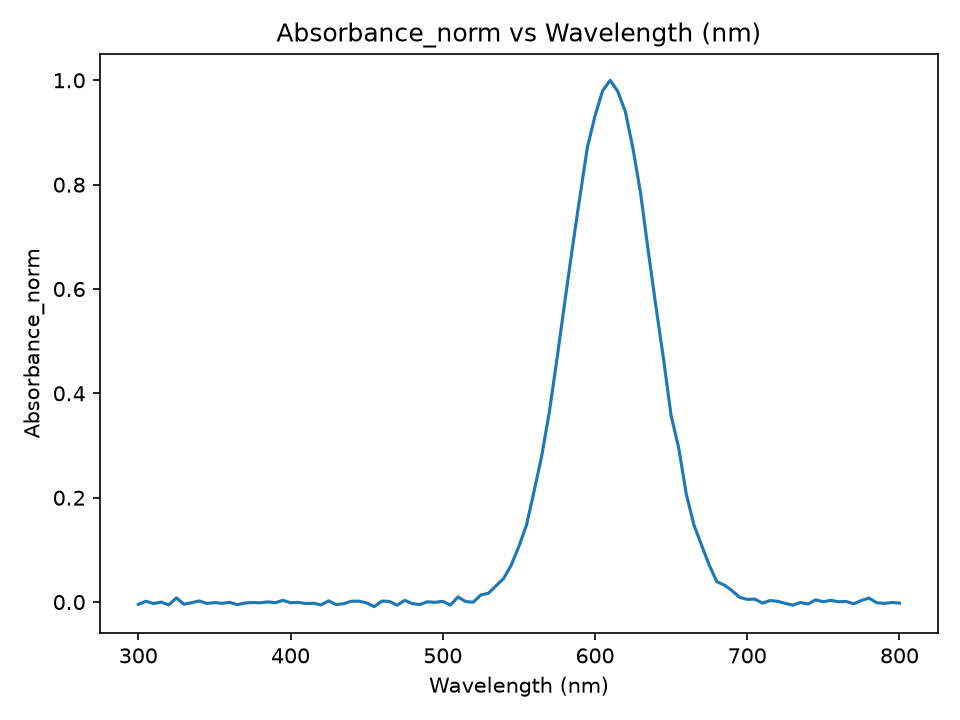

The sequence guide's step reference also shows a `PlotModuleStep` with an LSQ fit; run on
the raw spectrum it fits a Gaussian peak:

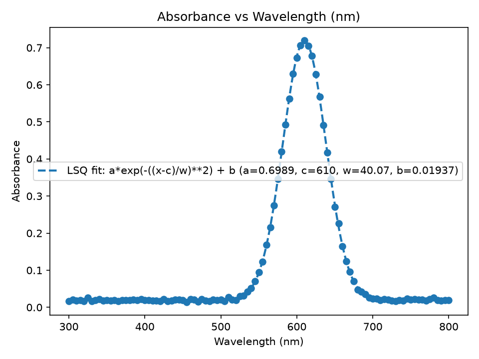

## Resistance vs temperature in kelvin

`kelvin_axis_plot.py` is a protocol module. Under **Protocol → Insert Protocol Module**
it appears as **Resistance vs Temperature (K)** and adds three steps: a `Temperature_K`
column (`Temperature_C` + 273.15), the X and Y roles, and a plot with lines and
markers. Try it on `resistance_films/film_01.csv`.

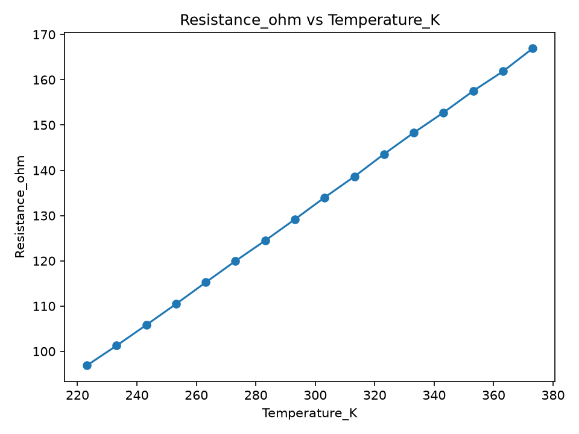

## UV-Vis clean-up pipeline

`uvvis_cleanup.json` subtracts 0.02 from `Absorbance` into `Absorbance_corr`, then scales
the strongest peak to 1 into `Absorbance_norm`. PhysPlot has no menu item for pipelines:
`apply_pipeline.py` applies one to a data file and saves it as a sequence for **Run
Sequence**.

## Journal single-column template

`journal_single_column.json` restyles a Basic Plotter scatter plot with an LSQ fit for a
single-column journal figure: 3.35 × 2.6 inches, 9 pt labels and 8 pt tick labels, thin
black axes on all sides, open black circles, a red fit line and a legend without a frame. Choose it in **Template**
(after **Reload**) and click **Generate Plot** on `voltage_ramp.csv`. Before and after:

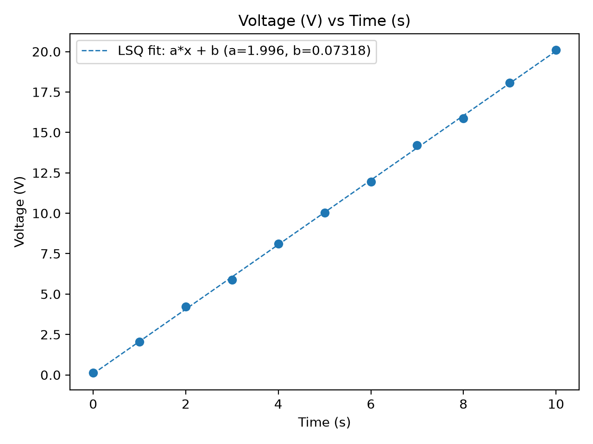
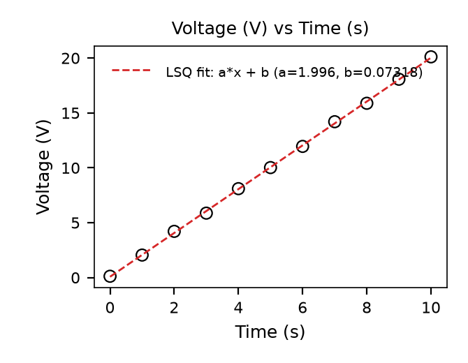

## Thin dashed fit

`thin_dashed_fit.json` is a **Fit Style** preset: a dashed fit line 1 pt wide, labelled
*Linear fit*, with the legend shown. Here it is combined with the journal template, which
colours the fit line red:

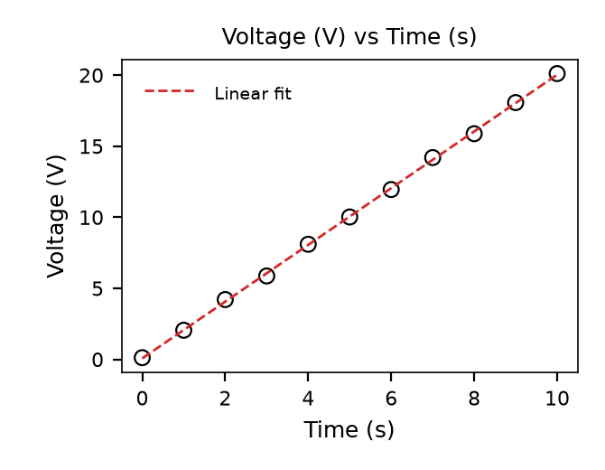

## Journal ticks

`journal_ticks.py` is a Figure Editor plugin. It adds **Ticks → Journal Ticks** to the
Figure Editor: with the figure or an axes selected, it asks for the tick direction and
puts ticks on all four sides, something neither a template nor the Property Inspector
can do.

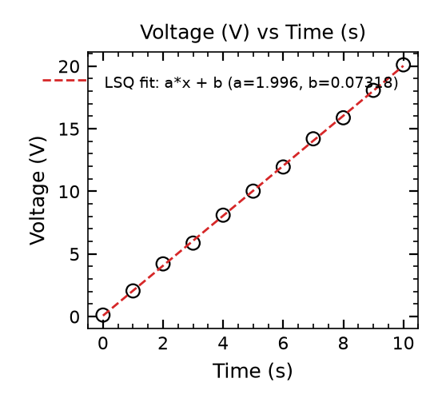

[ex-loader]: https://github.com/MShirazAhmad/PhysPlot/blob/indevelopment/config/data_importers/examples/acme_uvvis_loader.py
[ex-transform]: https://github.com/MShirazAhmad/PhysPlot/blob/indevelopment/config/transformations/examples/20_wavenumber_to_wavelength.py
[ex-fit]: https://github.com/MShirazAhmad/PhysPlot/blob/indevelopment/config/fit_functions/examples/20_exp_decay_offset.py
[ex-plotter]: https://github.com/MShirazAhmad/PhysPlot/blob/indevelopment/config/plotter_modules/examples/derivative_plotter.py
[ex-cal]: https://github.com/MShirazAhmad/PhysPlot/blob/indevelopment/config/plot_types/examples/calibration_curve.json
[ex-iv]: https://github.com/MShirazAhmad/PhysPlot/blob/indevelopment/config/plot_types/examples/iv_presets.json
[ex-sequence]: https://github.com/MShirazAhmad/PhysPlot/blob/indevelopment/config/sequences/examples/uvvis_normalize_sequence.py
[ex-module]: https://github.com/MShirazAhmad/PhysPlot/blob/indevelopment/config/protocol_modules/examples/kelvin_axis_plot.py
[ex-pipeline]: https://github.com/MShirazAhmad/PhysPlot/blob/indevelopment/config/pipelines/examples/uvvis_cleanup.json
[ex-apply]: https://github.com/MShirazAhmad/PhysPlot/blob/indevelopment/config/pipelines/examples/apply_pipeline.py
[ex-template]: https://github.com/MShirazAhmad/PhysPlot/blob/indevelopment/config/templates/examples/journal_single_column.json
[ex-fit-style]: https://github.com/MShirazAhmad/PhysPlot/blob/indevelopment/config/figureforge_fit_styles/examples/thin_dashed_fit.json
[ex-plugin]: https://github.com/MShirazAhmad/PhysPlot/blob/indevelopment/config/figureforge_plugins/examples/journal_ticks.py
[d-uvs]: https://github.com/MShirazAhmad/PhysPlot/blob/indevelopment/test_data/AI_Examples/methylene_blue.uvs
[d-ftir]: https://github.com/MShirazAhmad/PhysPlot/blob/indevelopment/test_data/AI_Examples/ftir_wavenumber.csv
[d-capacitor]: https://github.com/MShirazAhmad/PhysPlot/blob/indevelopment/test_data/AI_Examples/capacitor_discharge.csv
[d-anneal]: https://github.com/MShirazAhmad/PhysPlot/blob/indevelopment/test_data/AI_Examples/anneal_01.csv
[d-uvvis]: https://github.com/MShirazAhmad/PhysPlot/tree/indevelopment/test_data/AI_Examples/uvvis_spectra
[d-films]: https://github.com/MShirazAhmad/PhysPlot/tree/indevelopment/test_data/AI_Examples/resistance_films
[d-voltage]: https://github.com/MShirazAhmad/PhysPlot/blob/indevelopment/test_data/AI_Examples/voltage_ramp.csv
[g-importers]: https://github.com/MShirazAhmad/PhysPlot/blob/indevelopment/config/data_importers/AI_GUIDE.md
[g-transformations]: https://github.com/MShirazAhmad/PhysPlot/blob/indevelopment/config/transformations/AI_GUIDE.md
[g-fit-functions]: https://github.com/MShirazAhmad/PhysPlot/blob/indevelopment/config/fit_functions/AI_GUIDE.md
[g-plotters]: https://github.com/MShirazAhmad/PhysPlot/blob/indevelopment/config/plotter_modules/AI_GUIDE.md
[g-plot-types]: https://github.com/MShirazAhmad/PhysPlot/blob/indevelopment/config/plot_types/AI_GUIDE.md
[g-sequences]: https://github.com/MShirazAhmad/PhysPlot/blob/indevelopment/config/sequences/AI_GUIDE.md
[g-protocol-modules]: https://github.com/MShirazAhmad/PhysPlot/blob/indevelopment/config/protocol_modules/AI_GUIDE.md
[g-pipelines]: https://github.com/MShirazAhmad/PhysPlot/blob/indevelopment/config/pipelines/AI_GUIDE.md
[g-templates]: https://github.com/MShirazAhmad/PhysPlot/blob/indevelopment/config/templates/AI_GUIDE.md
[g-fit-styles]: https://github.com/MShirazAhmad/PhysPlot/blob/indevelopment/config/figureforge_fit_styles/AI_GUIDE.md
[g-plugins]: https://github.com/MShirazAhmad/PhysPlot/blob/indevelopment/config/figureforge_plugins/AI_GUIDE.md
