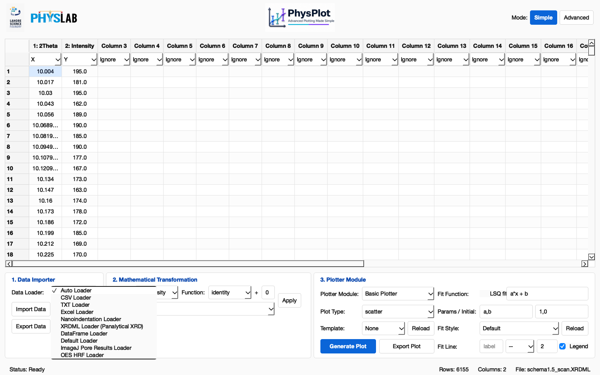
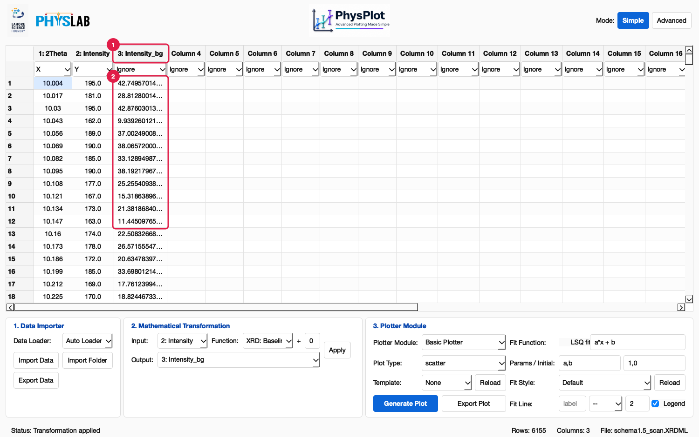
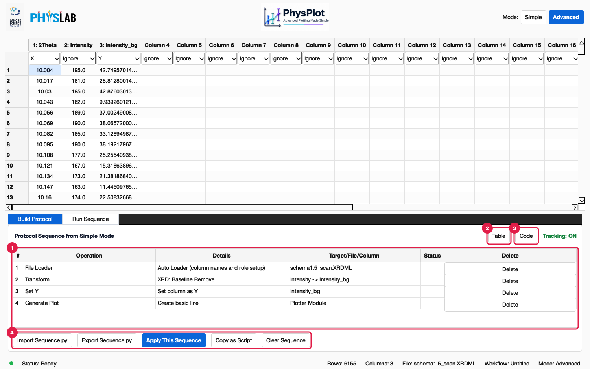
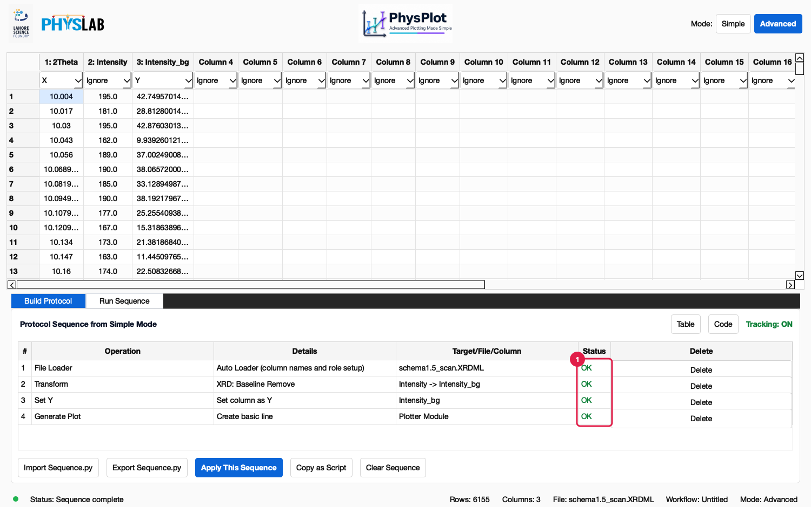

# GUI Walkthrough

This page follows one complete session:

1. Import an XRD scan.
2. Remove its background.
3. Plot it.
4. Look at the protocol PhysPlot recorded.
5. Replay the protocol.

Everything uses `test_data/XRD/schema1.5_scan.XRDML`, so you can repeat it exactly.
Numbered red markers in the screenshots match the numbered notes under each one.

---

## 1. Choose a loader

In **1. Data Importer**, open **Data Loader**. **Auto Loader** picks a loader from the
file extension and handles everything in this list, so keep it unless you need a
specific one.

- **Built-in loaders:** CSV, TXT, Excel, Nanoindentation, XRDML (Panalytical XRD).
  The DataFrame loader is disabled; it is used by the API only.
- **Loader plugins** from `config/data_importers/`: Default Loader, ImageJ Pore Results Loader,
  OES HRF Loader. Auto Loader also uses a plugin when the plugin declares the file's
  extension (see [Instrument Data](Instrument-Data)).

Click **Import Data** and choose the file.

## 2. Check the table and roles

1. **Mode switcher.** Stay in **Simple** for now.
2. **Headers.** The XRDML loader names the columns `2Theta` and `Intensity`.
3. **Roles.** They are set for you: `2Theta` is **X** and `Intensity` is **Y**.
   Change a role with its dropdown at any time.
4. **Values.** 6155 points, counts summed over the file's scans.
5. **Data Importer**, 6. **Mathematical Transformation**, 7. **Plotter Module**:
   the three steps of a session, left to right.
8. **Status bar:** `Rows: 6155  Columns: 2  File: schema1.5_scan.XRDML`.

## 3. Transform a column

Open **Function** to see what is available. Built-in transforms come first
(`identity`, `normalize_max`, `multiply`, …, `subtract first value`), followed by
every plugin in `config/transformations/` (`x`, `x^2`, …, `XRD: Baseline Remove`).
Hover over an entry for a description. For example, `subtract first value` explains
that it removes one constant and is not a background fit.

Configure the transformation:

1. **Input.** Set automatically to the **Y** column (`2: Intensity`) whenever new data
   loads. Choose another column if needed; your choice is kept while you work.
2. **Function.** `XRD: Baseline Remove` fits a smooth background under the peaks
   (asymmetric least squares) and subtracts it. It works on any spectrum.
3. **+ offset.** Added to the result (`transform(values) × multiplier + offset`).
   Leave `0` here.
4. **Output.** Type a new column name (`Intensity_bg`) or pick an existing column to
   overwrite.
5. **Apply.** Runs the transformation and records it as a protocol step.

1. **The new column** `3: Intensity_bg` appears next to the data.
2. **Its values** sit near zero between peaks: the background is gone.

## 4. Plot

Set the `Intensity_bg` role to **Y** (and `Intensity` to **Ignore**), then configure
**3. Plotter Module**:

1. **Plotter Module.** `Basic Plotter` here. Others include Histogram, Error Bar,
   Overlay, Subplot Grid, Nanoindentation, Oliver-Pharr and your own modules from
   `config/plotter_modules/`.
2. **Plot Type.** `line` for a diffractogram (`scatter`, `line` or `scatter_line` for
   Basic Plotter).
3. **Template.** Applies a saved style (fonts, sizes, colours). **Reload** re-reads
   `config/templates/`.
4. **LSQ fit.** Tick to overlay a least-squares fit. Enter **Fit Function** (for example
   `a*x + b`), **Params / Initial** guesses, **Fit Style** and **Fit Line** (label, line
   style, width, legend).
5. **Generate Plot.** Renders the plot and opens it in the Figure Editor.
6. **Export Plot.** Saves the current figure to an image file.

The **Figure Editor** (FigureForge) opens in its own window:

- **Figure Explorer** (left) lists the figure's parts: Figure, Axes, lines, labels.
- **Property Inspector** (below it) edits the selected part: text, fonts, colours,
  line widths, marker sizes.
- The **Figure Editor** menu has PhysPlot actions. **Save as Template** stores the
  current styling as a template you can pick in **Template** next time.

> Edits made in the Figure Editor are not recorded in the protocol. To reuse a style
> in replays and bulk runs, save it as a template and choose it in **Template**.

## 5. See the recorded protocol

Switch to **Advanced**. **Build Protocol** shows every step PhysPlot recorded:

1. **Protocol table**, one row per step:
   - **File Loader:** the file and loader, plus the role setup.
   - **Transform:** `XRD: Baseline Remove`, `Intensity -> Intensity_bg`.
   - **Set Y:** the role change.
   - **Generate Plot:** `basic line`.

   **Status** fills in when the protocol runs. **Delete** removes a step and replays
   the rest immediately. Right-click a row and choose **Rerun from this step** to resume there without replaying earlier rows.
2. **Table** shows these rows.
3. **Code** shows the same protocol as Python (next screenshot).
4. **Protocol buttons:**
   - **Import Sequence.py** and **Export Sequence.py** load and save the protocol.
   - **Apply This Sequence** replays every row.
   - **Copy as Script** copies the Python to the clipboard.
   - **Clear Sequence** starts over.

1. **Code view.** The protocol is ordinary Python (`WORKFLOW_STEPS = [...]`). The
   baseline removal is `TransformColumnStep(function_name='14_xrd_baseline_remove',
   params={'multiplier': 1.0, 'offset': 0.0})`. You can edit parameters here.
2. **Apply Code to Table** rebuilds the rows from your edits. If the code has an error,
   PhysPlot says which line and leaves the protocol unchanged.

## 6. Replay it

**Protocol → Apply This Sequence** (Ctrl+R) reloads the file and runs every step again:

1. **Status column.** Each row shows **OK**, **Failed** or **Skipped**. When a step
   fails, the steps after it are skipped. The table keeps the state reached before the
   failure, and the row's tooltip gives the reason. See [Troubleshooting](Troubleshooting).

## 7. Save and reuse

- **Protocol → Export Sequence.py…** saves the protocol as a Python file you can
  import later, run from a notebook, or run on other files. See
  [Bulk Runs and Headless Use](Bulk-Runs-and-Headless).
- **Data Importer → Export Data** writes `data.csv`, `columns.csv`, `workflow.py` and
  the plot to a folder.

## Where next

- Load other instruments' files: **[Instrument Data](Instrument-Data)**.
- Run this protocol over a folder of scans: **[Bulk Runs and Headless Use](Bulk-Runs-and-Headless)**.
- Add your own functions or loaders: **[Extending PhysPlot](Extending-PhysPlot)**.
