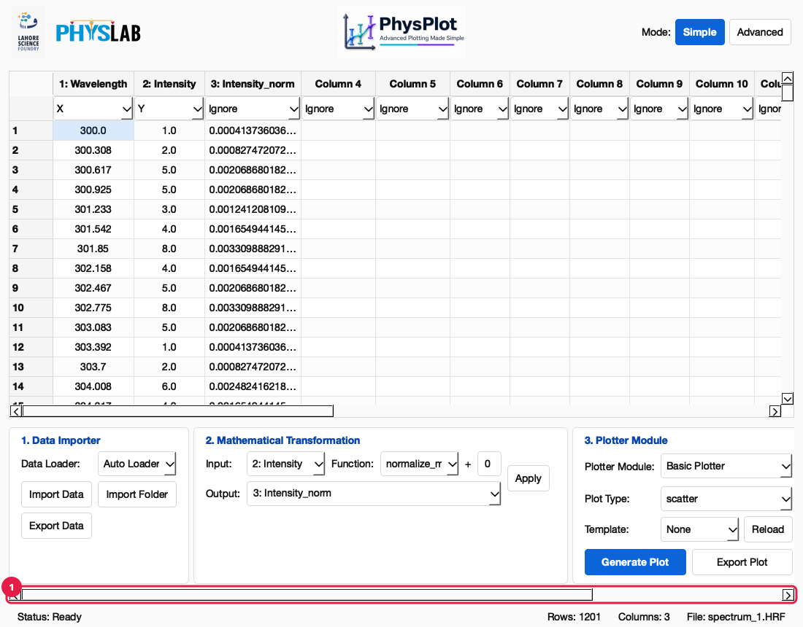

# Getting Started

## Install

### macOS: one command

Open **Terminal** and paste:

```bash
curl -fsSL https://raw.githubusercontent.com/MShirazAhmad/PhysPlot/indevelopment/scripts/install_macos.sh | bash
```

This does three things:

1. **Python.** Finds Python 3.11–3.13 on your Mac. If there is none, it installs
   Python 3.12 with Homebrew; without Homebrew, it asks you to install Python 3.12
   from [python.org](https://www.python.org/downloads/macos/) and run the command again.
2. **PhysPlot.** Downloads PhysPlot and installs it with its dependencies into
   `~/.physplot`. The first install downloads about 1 GB (mostly Qt) and takes a few
   minutes.
3. **App.** Creates **PhysPlot.app** in `~/Applications`, with the PhysPlot icon.

Then open PhysPlot from Spotlight (⌘ Space, type *PhysPlot*), Launchpad or
`~/Applications`.

- **Update:** run the same command again.
- **Uninstall:** `rm -rf ~/.physplot ~/Applications/PhysPlot.app`. Your own files in
  `Documents/PhysPlot/` are kept.
- **Command line:** the install also provides `~/.physplot/venv/bin/physplot` (see
  [Bulk Runs and Headless Use](Bulk-Runs-and-Headless)).
- **A specific version:** put `PHYSPLOT_REF=<branch or tag>` before `bash`, for
  example `… | PHYSPLOT_REF=indevelopment bash`.

### Windows: one command

Open **PowerShell** (Start menu → type *PowerShell*) and paste:

```powershell
irm https://raw.githubusercontent.com/MShirazAhmad/PhysPlot/indevelopment/scripts/install_windows.ps1 | iex
```

This does the same three things as on macOS:

1. **Python.** Finds Python 3.11–3.13 (through the `py` launcher or `PATH`). If there
   is none, it installs Python 3.12 with `winget`; accept its prompts. Without
   `winget`, it asks you to install Python 3.12 from
   [python.org](https://www.python.org/downloads/windows/) (tick *Add python.exe to
   PATH*) and run the command again.
2. **PhysPlot.** Downloads PhysPlot and installs it with its dependencies into
   `%LOCALAPPDATA%\PhysPlot`. The first install takes a few minutes.
3. **Shortcut.** Adds **PhysPlot** to the Start menu, with the PhysPlot icon.

- **Update:** close PhysPlot, then run the same command again.
- **Uninstall:** delete `%LOCALAPPDATA%\PhysPlot` and the PhysPlot Start-menu
  shortcut (the script prints the exact command). Your files in
  `Documents\PhysPlot\` are kept.
- **A specific version:** run `$env:PHYSPLOT_REF = "<branch or tag>"` first.

A classic setup program (`PhysPlot-<version>-Windows-Setup.exe`) can also be built with
`scripts/build_windows_installer.ps1`; it additionally copies the sample data to
`Documents\PhysPlot\test_data`.

### From source (any system)

PhysPlot needs Python 3.11–3.13. The upper limit comes from the Figure Editor
(FigureForge), which also keeps numpy below 2.

```bash
git clone https://github.com/MShirazAhmad/PhysPlot.git
cd PhysPlot
python3.12 -m venv .venv
.venv/bin/python -m pip install -e ".[dev]"
```

Install in editable mode (`-e`) so the bundled `config/` folder (transformations,
loaders, templates) is found. PhysPlot is not yet published on PyPI.

## Launch

Open **PhysPlot.app** (macOS) or the Start-menu shortcut (Windows). From a source
checkout, run `physplot-gui` or `python -m physplot_gui`.

The first start creates your editable settings folder, `Documents/PhysPlot/config/`.
Anything you put there (loaders, transformations, templates, plotter modules) overrides
the bundled copy with the same file name.

## A tour of the window

The window below has an XRD scan loaded (`test_data/XRD/schema1.5_scan.XRDML`).


1. **Mode switcher.** **Simple** shows the three everyday panels. **Advanced** shows
   the protocol builder (**Build Protocol**) and bulk runs (**Run Sequence**).
2. **Column headers.** Each header shows the column number and name (`1: 2Theta`).
   Double-click a header to rename the column. Right-click it to rename, copy,
   paste or delete the column.
3. **Role row.** Each column's dropdown sets its role: `Ignore`, `X`, `Y`,
   `X Error`, `Y Error`, `Group`, `Label`, `Batch Key` or `Fit Weight`. Loaders
   suggest roles. Here `2Theta` is X and `Intensity` is Y.
4. **Data cells.** Values can be edited, pasted (⌘V / Ctrl+V) or cleared.
   Right-click a row number to copy, paste or delete rows. Every edit is recorded
   in the protocol.
5. **1. Data Importer.** Pick a **Data Loader** (keep **Auto Loader** for most files),
   then **Import Data**. **Export Data** saves the table, its column metadata and the
   protocol to a folder.
6. **2. Mathematical Transformation.** Makes a new column from an existing one
   (see the [GUI Walkthrough](GUI-Walkthrough#3-transform-a-column)).
7. **3. Plotter Module.** Chooses the plotter, plot type, style template and an
   optional least-squares fit, then **Generate Plot**.
8. **Status bar.** Shows the last action or error (hover for the full text) and the
   row count, column count and file name.

### Menus

| Menu | Items |
| --- | --- |
| **File** | Import Data…, Import Folder…, Export Data…, Open Config Folder, Reload Config Modules |
| **Protocol** | Import Sequence.py…, Export Sequence.py…, Apply This Sequence (Ctrl+R), Copy Sequence Code, Clear Sequence, Insert Protocol Module |
| **View** | Simple Mode (Ctrl+1), Advanced Mode (Ctrl+2) |
| **Plot** | Generate Plot (Ctrl+G), Update Integrated Preview |
| **Help** | Documentation, GitHub Repository, Report Issues or Bugs, About PhysPlot |

**Reload Config Modules** re-scans `config/` without restarting, so a new loader or
transformation file shows up straight away. **Import Folder…** currently only selects
a folder. To process every file in a folder, use
[Run Sequence](Bulk-Runs-and-Headless).

### Small screens

The window can be as narrow as about 910 px. When it is narrower than the three
Simple Mode panels, the panel row scrolls sideways instead of pushing the window
off-screen:



1. **Scrollbar.** Drag it (or scroll sideways) to reach the Plotter Module controls.

## Next

Follow the **[GUI Walkthrough](GUI-Walkthrough)** for a complete session.
