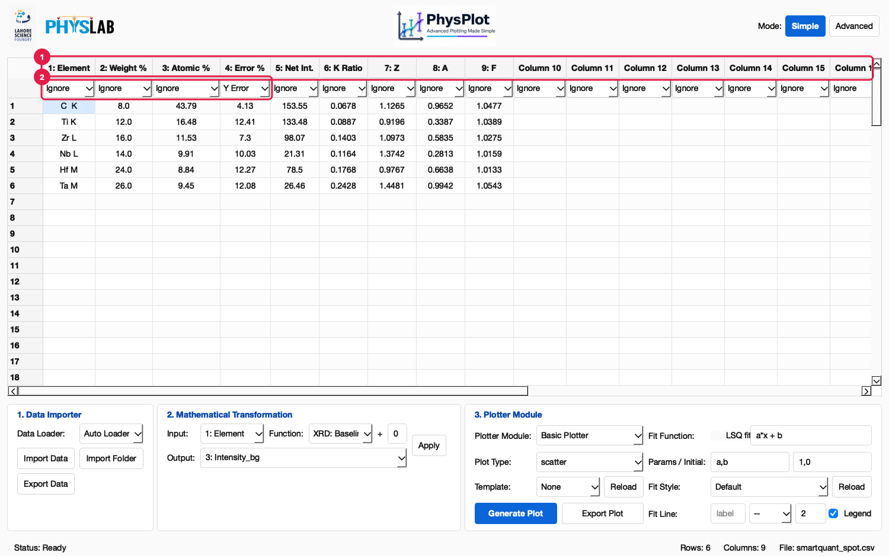
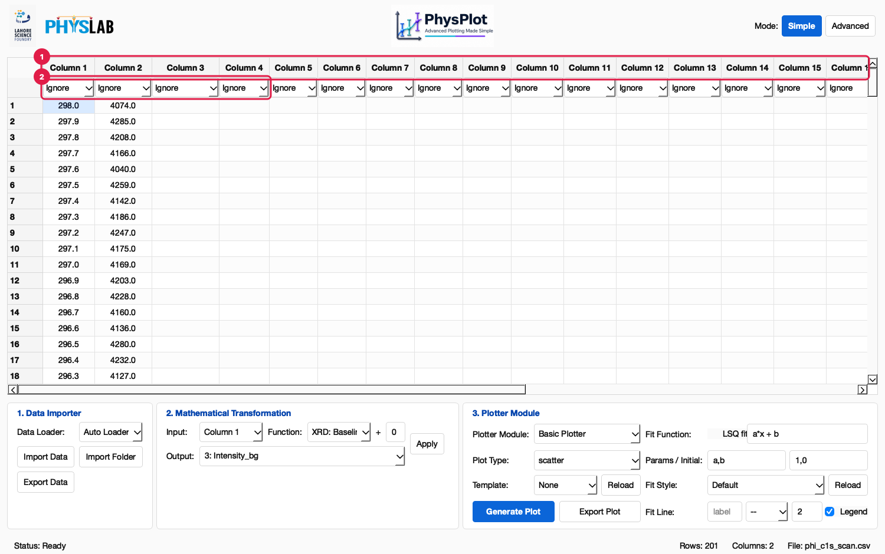
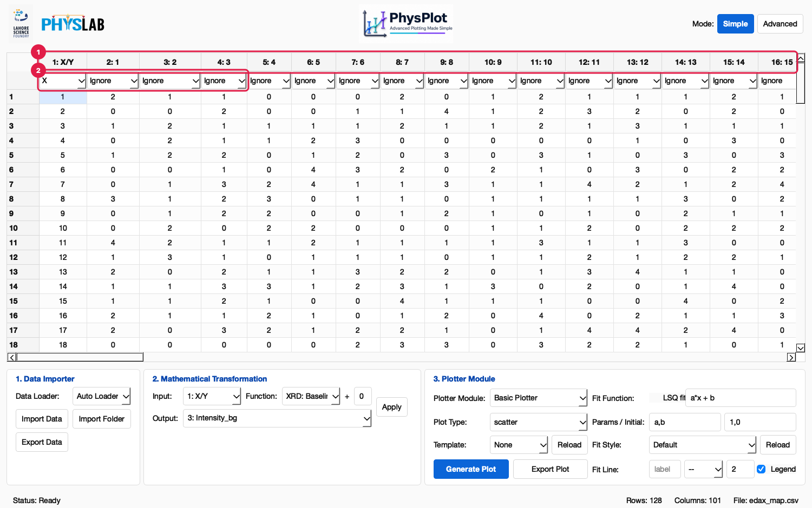
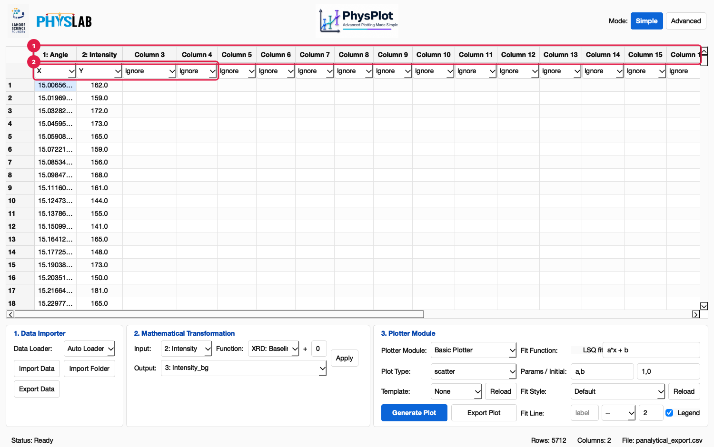
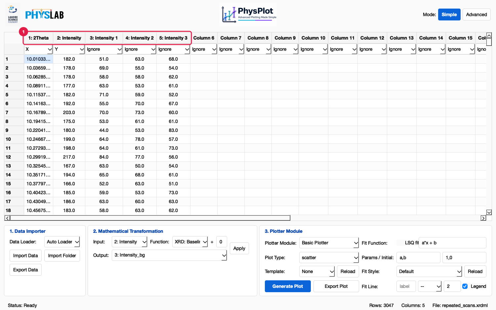

# Instrument Data

With **Auto Loader** selected, PhysPlot opens instrument exports directly. The table
below lists what it reads. Every example is in `test_data/`.

| Format | Extension | Example | Columns you get |
| --- | --- | --- | --- |
| Malvern Panalytical XRD | `.xrdml` (schema 1.5, 1.7) | `XRD/schema1.5_scan.XRDML`, `XRD/repeated_scans.xrdml` | `2Theta` (X), `Intensity` (Y), `Intensity 1…N` per scan |
| Panalytical CSV export | `.csv` | `XRD/panalytical_export.csv` | `Angle` (X), `Intensity` (Y) |
| Origin peak-fit table | `.csv` (tab-separated) | `XRD/origin_peak_fit.csv` | Row label, fit parameters per peak |
| EDAX EDS map | `.csv` | `EDS/edax_map.csv` | `X/Y` row index, one column per map column |
| EDAX eZAF SmartQuant | `.csv` (quoted) | `EDS/smartquant_spot.csv` | `Element`, `Weight %`, `Atomic %`, … |
| EMSA/MAS spectrum | `.msa` | `EDS/eds_spectrum.msa` | Energy, counts |
| PHI XPS scan | `.csv` (spectrum stored as rows) | `XPS/phi_c1s_scan.csv` | Binding energy, counts |
| Rigaku SmartLab XRD | `.ras` | `XRD/smartlab_si_powder.ras`, `XRD/anneal_series/` | `2Theta` (X), `Intensity` (Y), attenuator-corrected |
| JCAMP-DX spectrum (FTIR, Raman, UV-Vis) | `.jdx`, `.dx` | `FTIR/polystyrene_film.jdx` | e.g. `Wavenumber (1/cm)` (X), `Transmittance` (Y) |
| TA Instruments TGA/DSC export | `.txt` (choose **TA Instruments TGA/DSC Loader**) | `Thermal/tga_calcium_oxalate.txt` | Signals named from the file, plus `Weight (%)` |
| Plain tables | `.csv`, `.txt`, `.dat`, `.tsv`, `.xls`, `.xlsx` | `sample_linear.csv` | As in the file |

## How PhysPlot finds the data in a text file

Many exports put metadata above the numbers, use tabs in a `.csv`, or quote every
value. When a plain read does not give at least two numeric columns, PhysPlot finds
the numeric block itself:

- It skips header blocks, such as Panalytical `[Measurement conditions]` or EDAX
  `Path :` / `KV :` lines. The skipped lines are kept in the dataset metadata
  (`header_lines`).
- It detects the separator (comma, tab, semicolon or whitespace) and treats quoted
  numbers such as `"7.74"` as numbers.
- It keeps ragged rows together. Origin, for example, writes fit statistics on the
  first peak only.
- It turns spectra stored as rows (PHI XPS energies and counts) into columns.

Ordinary CSV files load exactly as they always did.

## Examples

### EDAX SmartQuant table

1. **Headers** come from the table's own header row (`Element`, `Weight %`,
   `Atomic %`, `Error %`, `Net Int.`, `K Ratio`, `Z`, `A`, `F`). The metadata above it
   (project, specimen, kV, live time) is skipped.
2. **Roles.** `Element` is text, so give **X** and **Y** to the numeric columns you want
   to compare, for example `Weight %` against `Atomic %`. Set `Element` as **Label**.

### PHI XPS scan

1. **Headers.** The file stores energies and counts as two long rows. PhysPlot turns
   them into `Column 1` (binding energy) and `Column 2` (counts). Rename them by
   double-clicking the headers.
2. **Roles.** Set Column 1 as **X** and Column 2 as **Y**. The energies run from high
   to low, as PHI writes them.

### EDAX EDS map

1. **Headers.** `X/Y` holds the row index, and `1`, `2`, `3`, … are the map's columns
   (128 × 100 values here).
2. **Roles.** A map is a grid, not an X–Y series. Pick one map column as **Y** against
   `X/Y` to plot a line profile.

### Panalytical CSV export

1. **Headers.** `Angle` and `Intensity` from the `[Scan points]` section. The
   `[Measurement conditions]` block above it is skipped.
2. **Roles.** `Angle` is suggested as **X** and `Intensity` as **Y**.

### XRDML with repeated scans

1. **Columns.** `Intensity` is the sum of the three scans' raw counts, the same values
   the instrument software writes to its CSV export. `Intensity 1` to `Intensity 3`
   hold each scan. Attenuation factors are recorded but not applied, which also
   matches that export.

The XRDML loader stores the measurement details in the dataset metadata
(`dataset.metadata["xrdml"]`): wavelengths (Kα1, Kα2, ratio), anode, tube voltage and
current, sample name, 2θ start/end/step, counting time, scan count and start time.

### Rigaku `.ras` scan (loader plugin)

1. **Auto Loader** uses the Rigaku RAS Loader plugin, because that plugin declares
   `FILE_EXTENSIONS = [".ras"]`.
2. **Import Data.**
3. **Columns** `2Theta` and `Intensity`. Each intensity is the recorded counts times the
   attenuator factor stored next to it, so strong peaks keep their true height.
4. **Roles:** `2Theta` is **X**, `Intensity` is **Y**.

The JCAMP-DX loader works the same way for `.jdx` files. TA Instruments exports are
`.txt` files, which the built-in TXT loader also claims, so choose **TA Instruments
TGA/DSC Loader** in **Data Loader** first. All three are explained step by step, from the
raw file to the result in the table, on the
[File-Loader Plugins](https://physplot.readthedocs.io/en/latest/extensions/fileloading.html) page.

## Files PhysPlot cannot read

- **Binary files**, for example raw instrument scans saved in a vendor's binary format, are reported as
  *"… is a binary file, not a text table"*.
- **Unknown extensions** get a message listing the built-in formats and explaining how
  to add one with a loader plugin. See [Troubleshooting](Troubleshooting) and
  [Extending PhysPlot](Extending-PhysPlot#file-loader-plugins).
