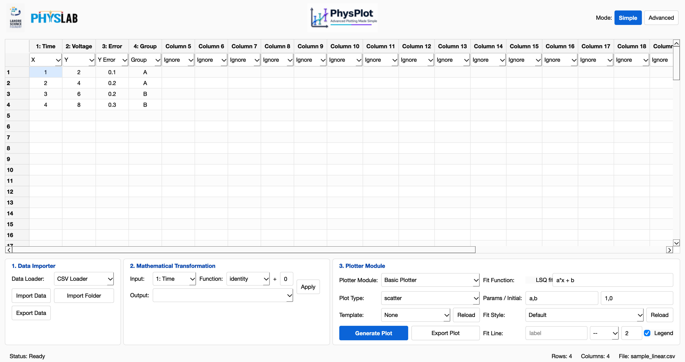
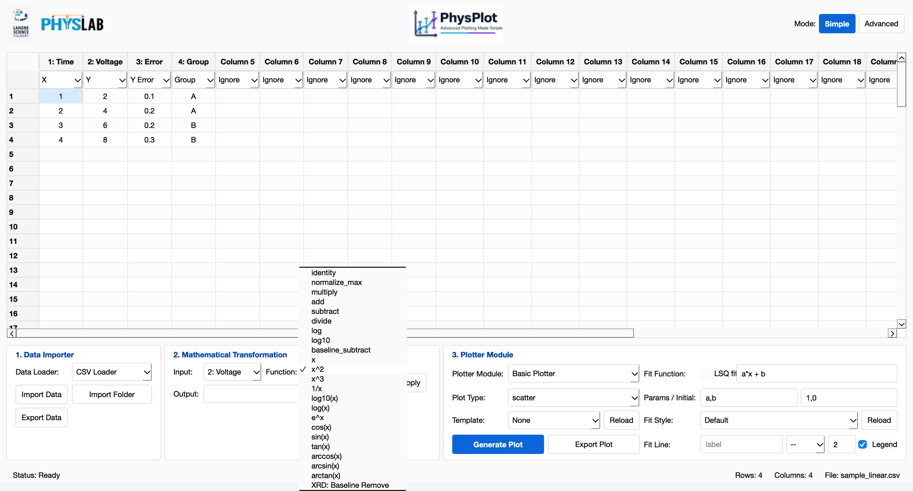
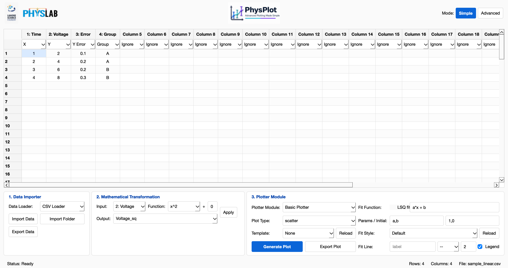
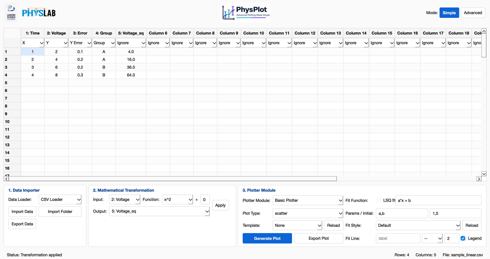
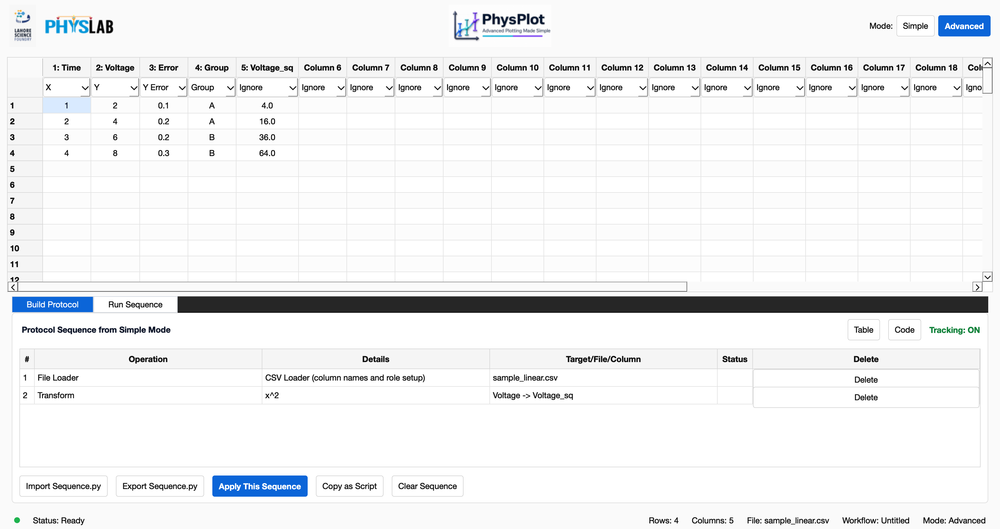
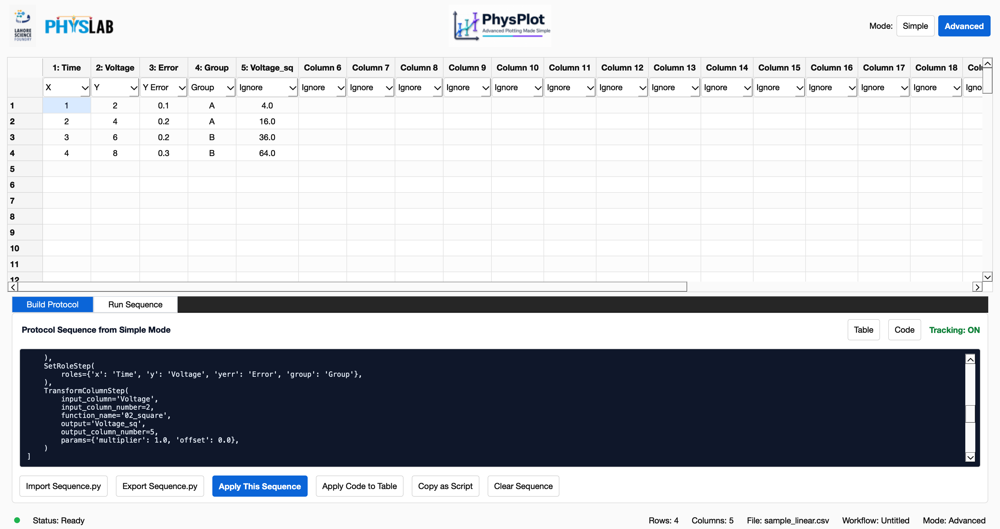
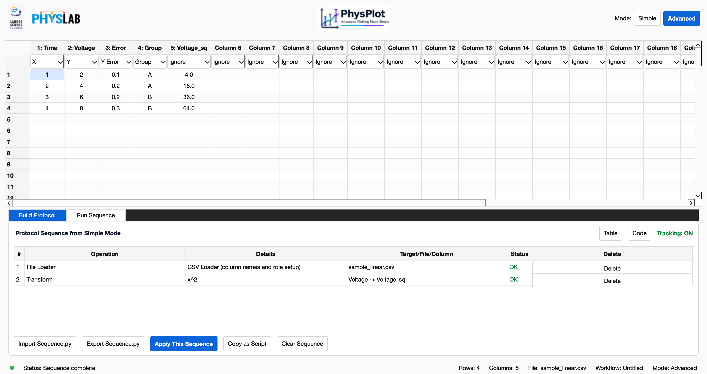
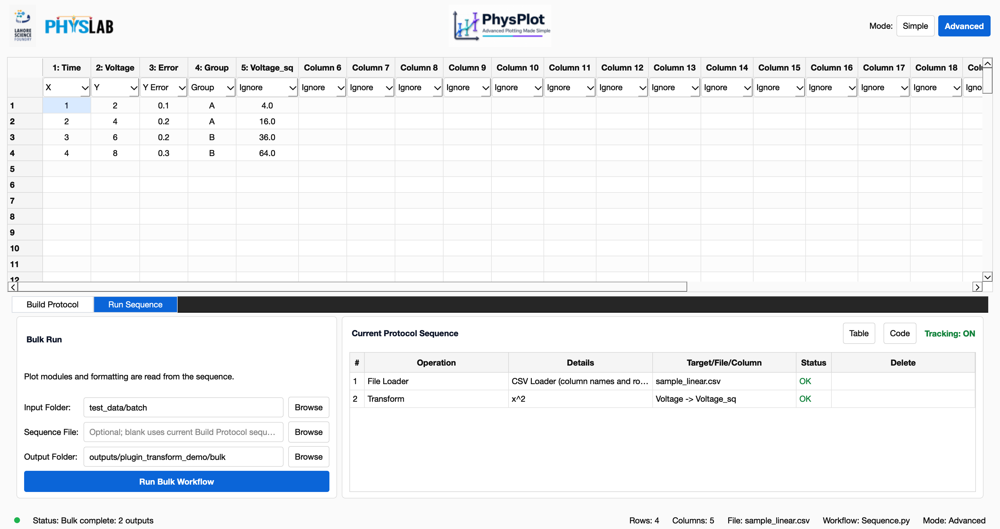
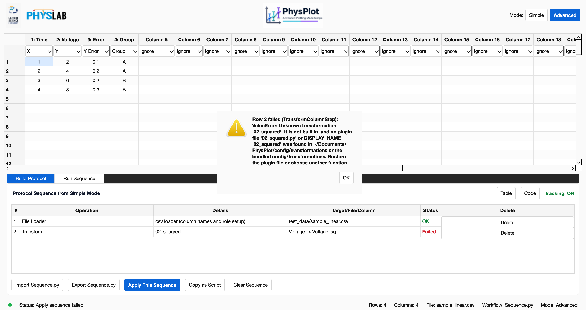
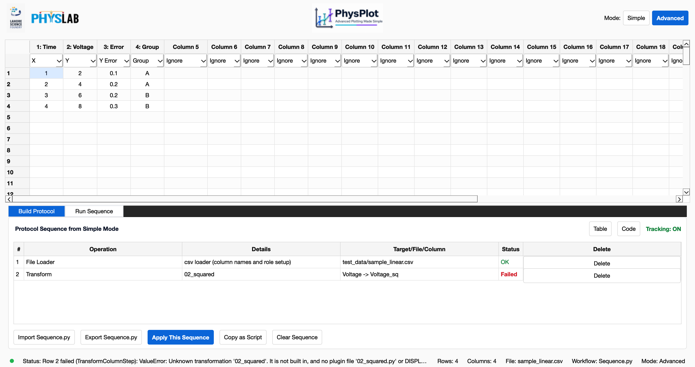

# Replayable Plugin Transformations

Simple Mode's **Mathematical Transformation** functions (`x^2`, `sin(x)`,
`XRD: Baseline Remove`, and any file you add to `config/transformations/`) are
recorded as protocol steps. The same step runs again with **Apply This
Sequence**, from an exported `Sequence.py`, in a notebook, in the `physplot`
command line, and in bulk runs. None of those need the GUI.

> **Before this change:** plugin transformations changed the table but were
> not added to the protocol sequence. Replays, exported sequences, and bulk
> runs skipped them without any warning. Only the built-in transforms
> (`normalize_max`, `multiply`, `add`, `subtract`, `divide`, `log`, `log10`,
> `baseline_subtract`) were replayed.

Every screenshot below comes from a scripted run of the real PhysPlot window
using `test_data/sample_linear.csv` and `test_data/batch/`.

---

## 1. Import data

In Simple Mode choose a **Data Loader** (here `CSV Loader`) and press
**Import Data**. The CSV fills the table and suggested roles are set
(`Time` → X, `Voltage` → Y).



## 2. Pick a plugin transformation

The **Function** menu lists the built-in transforms first, then every plugin
found in `config/transformations/`, labelled by its `DISPLAY_NAME`
(`x`, `x^2`, `x^3`, `1/x`, `log10(x)`, …, `XRD: Baseline Remove`).



## 3. Configure and apply

Set **Input** to `Voltage`, **Function** to `x^2`, the offset (`+`) to `0`, and
type `Voltage_sq` as the **Output** column.



Press **Apply**. The new column `5: Voltage_sq` holds `Voltage²`, and the status
bar reads *Transformation applied*.



## 4. The step is in the protocol

Switch to **Advanced** mode. **Build Protocol** now has a **Transform** row
labelled `x^2`, `Voltage -> Voltage_sq`, after the **File Loader** row.



Press **Code** to see the recorded Python. The plugin is stored by its **file
stem**, `02_square`, and the Simple Mode multiplier and offset are stored as
`params`:



```python
TransformColumnStep(
    input_column='Voltage',
    input_column_number=2,
    function_name='02_square',
    output='Voltage_sq',
    output_column_number=5,
    params={'multiplier': 1.0, 'offset': 0.0},
)
```

The step computes `transform(values) * multiplier + offset`.

## 5. Replay with Apply This Sequence

**Protocol → Apply This Sequence** (`Ctrl+R`), or the **Apply This Sequence**
button, reloads the file and replays every row. Both rows report **OK**, and
`Voltage_sq` is rebuilt from the sequence.



## 6. Export Sequence.py and run it headlessly

**Protocol → Export Sequence.py…** (`Ctrl+S`) writes ordinary Python. The
steps it wrote for this walkthrough:

```python
WORKFLOW_STEPS = [
    LoadDataStep(
        path='test_data/sample_linear.csv',
        loader='csv',
        dataset_name='sample_linear',
        loader_plugin=None,
    ),
    SetRoleStep(
        roles={'x': 'Time', 'y': 'Voltage', 'yerr': 'Error', 'group': 'Group'},
    ),
    TransformColumnStep(
        input_column='Voltage',
        input_column_number=2,
        function_name='02_square',
        output='Voltage_sq',
        output_column_number=5,
        params={'multiplier': 1.0, 'offset': 0.0},
    )
]
```

Run it on a different file from the command line:

```bash
physplot run-workflow Sequence.py --input test_data/batch/sample_001.csv --output outputs/cli_run
```

`outputs/cli_run/data.csv`:

```text
Time,Voltage,Error,Group,Voltage_sq
1,2,0.1,A,4.0
2,4,0.2,A,16.0
3,6,0.2,B,36.0
```

Or from a notebook or script, using the `run()` helper inside the exported file:

```python
import runpy

sequence = runpy.run_path("Sequence.py")
pp = sequence["run"](input_path="test_data/batch/sample_002.csv", output_dir="outputs/headless_run")
print(pp.dataset.dataframe[["Time", "Voltage", "Voltage_sq"]])
```

```text
 Time  Voltage  Voltage_sq
    1        3         9.0
    2        6        36.0
    3        9        81.0
```

These are fresh Python processes with no GUI imports. The plugin is found in
the same `config/transformations/` folders the GUI uses.

## 7. Bulk run a folder

In **Advanced → Run Sequence**, set **Input Folder** to `test_data/batch` and
**Output Folder** to `outputs/plugin_transform_demo/bulk`. Leave **Sequence
File** blank to use the current Build Protocol sequence, then press **Run Bulk
Workflow**. The status bar reads *Bulk complete: 2 outputs*.



Each input gets its own folder with `data.csv`, `columns.csv` and
`workflow.py`, and every one has the plugin column:

```text
sample_001/data.csv                          sample_002/data.csv
Time Voltage Error Group Voltage_sq          Time Voltage Error Group Voltage_sq
   1       2   0.1     A        4.0             1       3   0.1     A        9.0
   2       4   0.2     A       16.0             2       6   0.2     A       36.0
   3       6   0.2     B       36.0             3       9   0.2     B       81.0
```

The command-line equivalent:

```bash
physplot run-bulk Sequence.py --input-folder test_data/batch --output-folder outputs/cli_bulk
```

---

## Using plugin transformations from Python

`PhysPlot.transform` accepts a plugin's file stem or its `DISPLAY_NAME`, and
records a replayable `TransformColumnStep`:

```python
from physplot import PhysPlot

pp = PhysPlot()
pp.load("test_data/sample_linear.csv")
pp.transform("Voltage", "02_square", output="Voltage_sq")               # by file stem
pp.transform("Voltage", "x^2", output="Voltage_sq_2x", multiplier=2.0)  # by DISPLAY_NAME
pp.export_workflow("Sequence.py")
```

## Writing your own transformation

Put a `.py` file in `Documents/PhysPlot/config/transformations/` (**File → Open
Config Folder**) and choose **File → Reload Config Modules**:

```python
"""15_normalize.py"""

import numpy as np

DISPLAY_NAME = "Normalize 0-1"
DEFAULT_LABEL = "Normalized"


def transform(values, floor=0.0):
    values = np.asarray(values, dtype=float)
    span = np.nanmax(values) - np.nanmin(values)
    if span == 0:
        return np.full_like(values, floor)
    return (values - np.nanmin(values)) / span + floor
```

Rules:

- `transform(values)` gets a 1-D float NumPy array. **Blank or non-numeric
  cells arrive as `NaN`**. It must return one value per row (a list, array,
  Series, or an `(n, 1)` column), or a single scalar used for every row.
- `values` is a copy, so editing it in place never changes the source column.
- Keep the `NN_` prefix or a unique stem. A file named after a built-in
  transform (`log.py`, `multiply.py`, …) is skipped with a warning, because
  the built-in would win when the sequence is replayed. A `DISPLAY_NAME` that
  matches another entry is shown with its file stem, e.g. `log10 (15_my_log)`.
- Do not call `sys.exit()` or run `argparse` at import time; such files are
  skipped instead of closing PhysPlot.
- Extra keyword parameters (such as `floor` above) can be set in the
  sequence's `params`, next to `multiplier` and `offset`.
- A file in `Documents/PhysPlot/config/transformations/` overrides a bundled
  file with the same name.

## Troubleshooting

### "Unknown transformation '…'"

Sequences refer to plugins by file stem. If the file is renamed, deleted, or
missing on another computer, the Transform row fails when replayed. Here the
sequence code was edited to refer to `02_squared`, which does not exist. The
dialog names the missing plugin and where PhysPlot looked:



After you close the dialog, the **Status** column shows which row failed, and
the status bar repeats the message. The table keeps the state reached before
the failure (here the loaded file without `Voltage_sq`):



**Fix:** put the plugin file (same stem, e.g. `02_squared.py`) back in
`Documents/PhysPlot/config/transformations/`. Or edit `function_name` in the
Code view and press **Apply Code to Table**.

### Other plugin errors

Every plugin error names the plugin, so a failing row or bulk file can be
traced to the file in `config/transformations/`:

| Message | Cause and fix |
| --- | --- |
| `Transformation '20_raises' failed: ZeroDivisionError: …` | `transform()` raised (or called `sys.exit()`). Fix the plugin code. |
| `Transformation '21_returns_none' returned None; …` | `transform()` has no `return`. Return the new values. |
| `Transformation '…' returned an array of shape (2,) for a column of 3 rows; …` | Return one value per input row. |
| `Transformation '…' returned non-numeric values: …` | Return numbers, not text. |
| `Transformation '…' failed: TypeError: transform() got an unexpected keyword argument 'x'` | The step's `params` contain a name `transform()` does not accept. |
| `Bulk run stopped at b_text.csv: …` | That input file could not be processed. Files before it were exported; later files were not run. |

### A plugin is missing from the Function menu

Check the terminal for a `Skipping transformation plugin …` message. The
file failed to import, has no `transform` function, called `sys.exit()` while
loading, or uses a built-in transform's name.

## How it works (for developers)

| Piece | Location |
| --- | --- |
| Plugin discovery and name resolution | `physplot/core/transformations.py` (`discover_plugin_transforms`, `find_plugin_transform`, `get_transform`) |
| Search folders (user first, then bundled) | `physplot.user_paths.plugin_search_dirs("transformations")` |
| GUI Function menu | `physplot_gui/app/plugin_discovery.py::discover_functions` → backend discovery |
| GUI apply | `MainWindow._apply_function_plugin` → `PhysPlot.transform` (records `TransformColumnStep`) |
| Tests | `tests/test_plugin_transform_sequence.py`, `tests/test_protocol_sequence_editor.py::test_simple_mode_plugin_transform_is_recorded_and_replays` |

`get_transform(name)` checks the registered built-ins first. Any other name is
matched against plugin file stems, then `DISPLAY_NAME`s, and the plugin is
wrapped as `f(series, multiplier=1.0, offset=0.0, **params)`.
