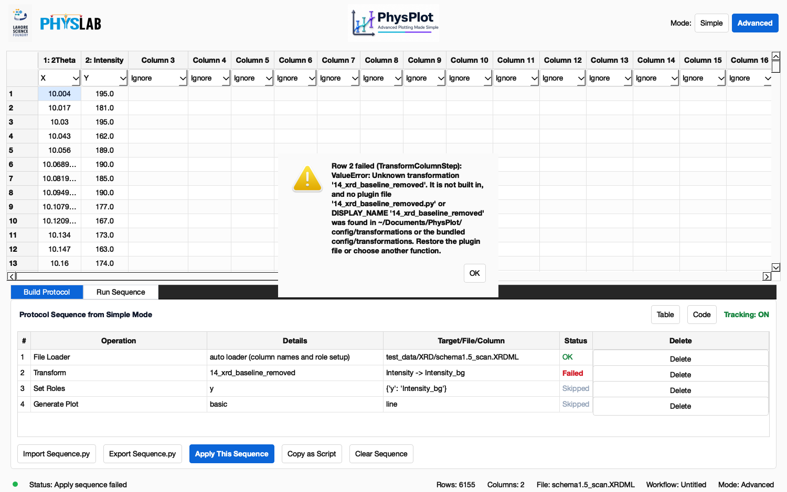
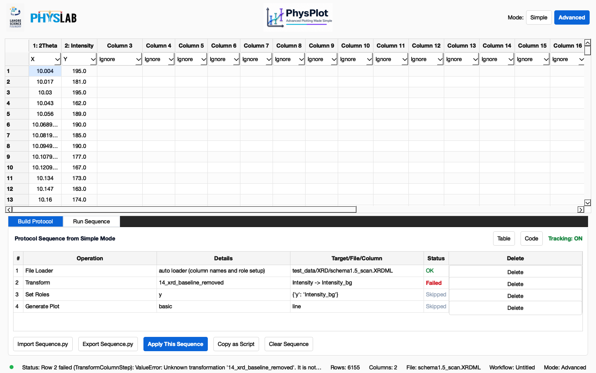
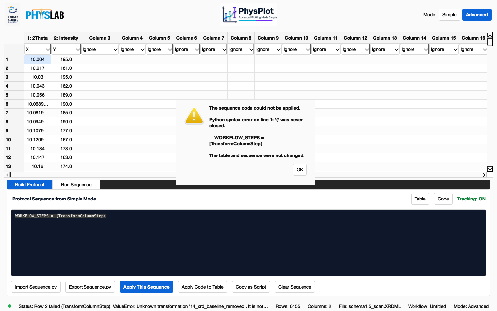
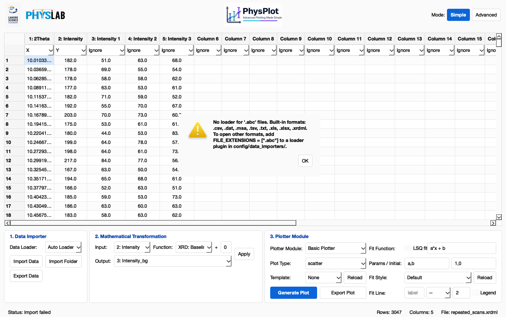

# Troubleshooting

PhysPlot reports problems in a dialog and in the status bar. Hover over the status
bar for the full message. When a protocol step fails, its row in **Build Protocol**
turns **Failed**.

## "Unknown transformation '…'"

The protocol refers to a transformation plugin that no longer exists, usually
because its file was renamed or deleted, or is missing on another computer:

The dialog names the missing plugin and where PhysPlot looked. After you close it,
the **Status** column shows which row failed and which rows were skipped. The table
keeps the state reached before the failure:

**Fix:** put the file back (same name) in `Documents/PhysPlot/config/transformations/`,
or change `function_name` in the Code view and press **Apply Code to Table**.

## "The sequence code could not be applied"

The Code view contains invalid Python:

The dialog gives the line number and the line itself, and the cursor jumps to it.
The protocol is not changed until the code is valid. Switching back to **Table**
with unapplied invalid code shows the same message, so edits aren't lost silently.

## "No loader for '…' files"

Auto Loader has no loader for this extension:

**Fix:** use a supported format, or add a loader plugin that declares the extension
(`FILE_EXTENSIONS = [".abc"]`). See [Extending PhysPlot](Extending-PhysPlot#file-loader-plugins).

## Other messages

| Message | Meaning and fix |
| --- | --- |
| `… is a binary file, not a text table` | The file isn't text (for example an AFM `.dat` scan). Export it as text or CSV from the instrument software. |
| `… is empty.` | The file has no content. |
| `… is not a readable Excel workbook` | The file is damaged or isn't really `.xls`/`.xlsx`. Re-save it from Excel. |
| `Column '…' does not contain numeric values for transformation.` | The input column is text. Pick a numeric input column. |
| `Unknown column '…'. Available columns: …` | The protocol refers to a column this file doesn't have. Rename the column or edit the step. |
| `Transformation '…' failed: <Error>: …` | The plugin's `transform()` raised an error. Fix the plugin; its file is named in the message. |
| `Transformation '…' returned None` | The plugin has no `return`. |
| `Transformation '…' returned an array of shape … for a column of N rows` | Return one value per input row. |
| `Bulk run stopped at <file>: …` | That input file failed. Earlier files were exported; fix or remove the file and run again. |
| `Figure Editor is not installed.` | Install it with `python -m pip install FigureForge`. |

## A plugin is missing from a menu

Look in the terminal for `Skipping transformation plugin …`. The file failed to
import, has no `transform` function, called `sys.exit()` while loading, or uses a
built-in name. Fix it, then choose **File → Reload Config Modules**.

## A transformation gave a strange result

Check **Input** first. It defaults to the Y column but can be changed. Hover over the
**Function** entry to read what it does. For example, `subtract first value` removes
one constant and is not a background fit; use `XRD: Baseline Remove` for that.

## Installation

- PhysPlot needs **Python 3.11–3.13** because of the Figure Editor (FigureForge),
  which also keeps **numpy below 2**. Newer numpy or Python versions will be possible
  once FigureForge supports them.
- `.xls` files need `xlrd`, which PhysPlot installs with its dependencies.
