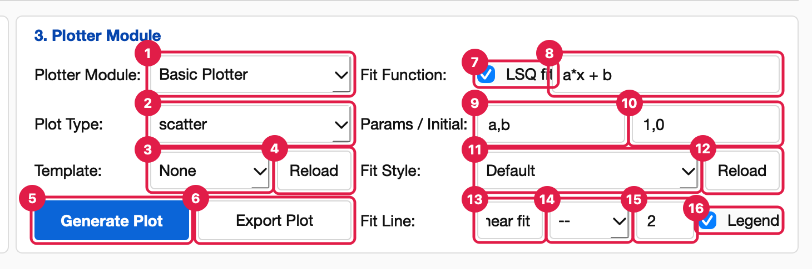
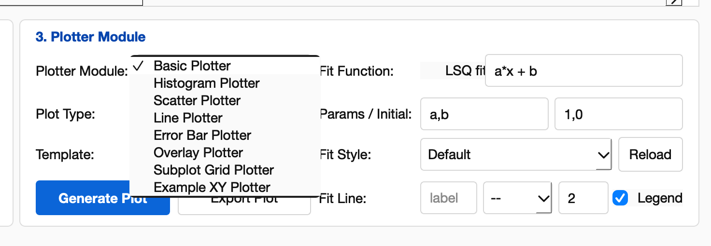
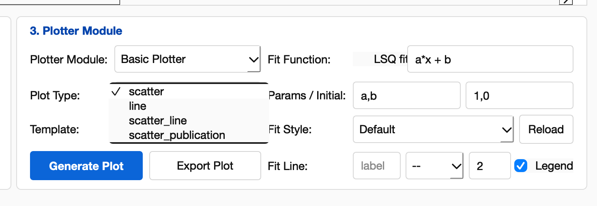

# Plotter Module

[UI Reference](UI-Reference) › Simple Mode › 3. Plotter Module

The third Simple Mode panel draws the table as a figure. It can style the figure with
a template and add a least-squares (LSQ) fit line. The left half chooses *what* to
plot; the right half sets up the optional fit.

**What to plot**

1. **Plotter Module.** The plotting engine (see [Plotters and plot types](#plotters-and-plot-types)).
   The list only shows plotters that can draw the current data.
2. **Plot Type.** The kind of figure the chosen plotter draws. Your choice is kept while
   you work. When you pick another plotter, the same type stays selected if that plotter
   offers it; otherwise its first type is selected.
3. **Template.** A saved figure style (fonts, sizes, colours, grid) applied after the
   plot is drawn. **None** leaves the plotter's own look. Templates are JSON files in
   `config/templates/`; make your own in the [Figure Editor](UI-Figure-Editor#save-as-template).
   The template is applied in the GUI only. It is not recorded in the protocol, so
   replays, `Sequence.py` files and bulk runs draw the plot without it.
4. **Reload** (next to Template). Re-scans `config/templates/` so a template you just
   saved appears without restarting.
5. **Generate Plot.** Draws the figure and opens it (see [Where the figure opens](#where-the-figure-opens)).
   It adds a *Generate Plot* row to the protocol, which stores the plotter, the plot
   type and the fit settings. The status bar shows *"Plot generated"*.
6. **Export Plot.** Saves the most recently generated figure (see [Export Plot](#export-plot)).

**Optional LSQ fit**

7. **LSQ fit.** Tick to add a fitted curve to the next plot. Unticked, the fields on
   the right are ignored.
8. **Fit Function.** The model *f(x)* as a Python expression in `x` and your parameter
   names, for example `a*x + b`, `A*exp(-x/t) + c` or `a*sin(w*x + p)`. Available
   functions are `exp`, `log`, `log10`, `sqrt`, `abs`, `sin`, `cos`, `tan`, `arcsin`,
   `arccos`, `arctan`, `sinh`, `cosh`, `tanh` and `np.<anything>`.
9. **Params.** The parameter names, separated by commas (`a,b`).
10. **Initial.** One starting value per parameter, in the same order (`1,0`). Good
    starting values matter for non-linear models.
11. **Fit Style.** A saved preset for the fit line. Choosing one fills fields 13–16.
    **Default** leaves the fields as they are.
12. **Reload** (next to Fit Style). Re-scans `config/figureforge_fit_styles/`.
13. **Fit Line label.** The legend text for the fitted curve. Leave it empty for an
    automatic label with the fitted values, for example
    `LSQ fit: a*x + b (a=2.013, b=-0.4981)`.
14. **Line style.** `--` dashed (default), `-` solid, `-.` dash-dot, `:` dotted.
15. **Line width.** In points (default `2`).
16. **Legend.** Show a legend on the plot.

Blank fit fields fall back to the defaults shown above. The fit uses the **X** and
**Y** columns and skips rows where either is blank. It is drawn on the first set of
axes, over the full X range, and the fitted values are saved as the latest fit result
(**Export Data** writes them to `fit.json`).

## Plotters and plot types

| Plotter | Plot types | Needs | Shown for |
| --- | --- | --- | --- |
| **Basic Plotter** | `scatter` (markers), `line`, `scatter_line` (markers joined by lines), `scatter_publication` (scatter with a light grid) | X, Y | Any data |
| **Histogram Plotter** | `histogram` (counts in 20 bins), `density_histogram` (normalised) | Y, or X if there is no Y | Any data |
| **Scatter Plotter** | `scatter` | X, Y | Any data |
| **Line Plotter** | `line` | X, Y | Any data |
| **Error Bar Plotter** | `x_y_errorbar`, `y_errorbar` | X, Y, and X Error and/or Y Error | Any data |
| **Overlay Plotter** | `overlay_by_group`, `overlay_by_dataset` | X, Y, and optionally Group or Label: one line per value, with a legend | Any data |
| **Subplot Grid Plotter** | `subplots_by_group`, `subplots_by_dataset` | X, Y, and optionally Group or Label: one small plot per value, up to three per row | Any data |
| **Nanoindentation Plotter** | `load_depth`, `hardness_depth`, `modulus_depth`, `stiffness_depth`, `contact_depth` | Columns found by name (load, depth, hardness, …) | Data imported with the **Nanoindentation Loader** |
| **Oliver-Pharr Plotter** | `load_depth_with_unloading_fit`, `unloading_fit`, `contact_stiffness_fit`, `area_function`, `hardness_summary`, `modulus_summary` | Load–depth curve | Data imported with the **Nanoindentation Loader** |
| **Example XY Plotter** | `xy_markers`, `xy_line` | X, Y | A sample user plotter from `config/plotter_modules/` |

More entries can appear:

- **Plot type presets** from `config/plot_types/*.json` add a named variant of an
  existing plot type (`scatter_publication` is one).
- **Your own plotters** from `Documents/PhysPlot/config/plotter_modules/`.
- **Loader plotters**, declared by the loader plugin that imported the current file.

Loader plotters are shown only while that loader's data is loaded. After adding a
file, choose **File → Reload Config Modules**. See [Extending PhysPlot](Extending-PhysPlot).

## Where the figure opens

| Plotter | Opens in | Template | LSQ fit |
| --- | --- | --- | --- |
| **Basic Plotter** | The [Figure Editor](UI-Figure-Editor), a separate window for detailed editing | Applied | Yes |
| Other built-in and user plotters | A plot window titled *PhysPlot - <plotter>: <plot type>* with the Matplotlib toolbar | Applied | Yes |
| Loader plotters | A plot window | Applied | No: *"LSQ fit from Simple Mode is available for backend plotter modules."* |

Each Generate Plot opens a new window; earlier windows stay open until you close them.
**Plot → Generate Plot** (Ctrl+G) is a shortcut for the Basic Plotter scatter plot with
the selected Template, without a fit.

## Export Plot

Saves the latest generated figure (including the fit line). Choose PNG, PDF or SVG in
the file dialog. The default name is `physplot_plot.png`, and images are written at
300 dpi. The status bar shows *"Plot exported"*.

- **No plot yet:** you get *Export plot failed: Generate a plot before exporting.*
- **Figure Editor changes:** these are not included, because the editor works on its
  own copy. Save from the editor's **File** menu instead.

## When plotting fails

A *Plot failed* dialog explains the problem and nothing is recorded. Common messages:

| Message | Fix |
| --- | --- |
| *No column has role 'X'.* (or `'Y'`) | Set the role in the column's dropdown. |
| *Column '…' does not contain numeric data.* | The X or Y column holds only text; pick another column or fix the values. |
| *LSQ initial guesses must match the parameter list.* | Give one Initial value per name in Params. |
| *Not enough numeric points for the requested LSQ fit.* | The fit needs at least as many X/Y pairs as parameters. |
| *Optimal parameters not found…* | The fit did not converge; try better Initial values or a simpler model. |
| *Figure Editor is not installed…* | Install it with `python -m pip install FigureForge`, or use a plotter other than Basic. |
