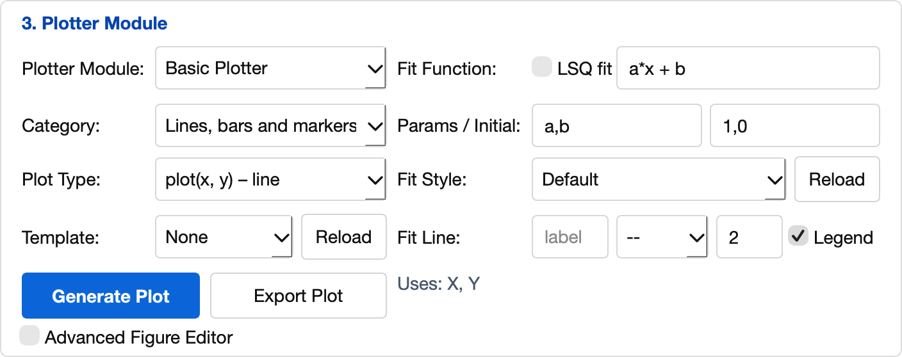
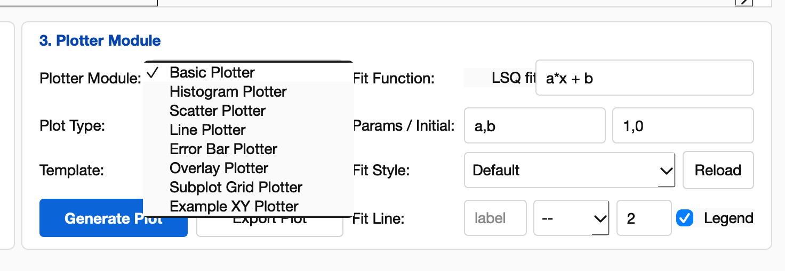
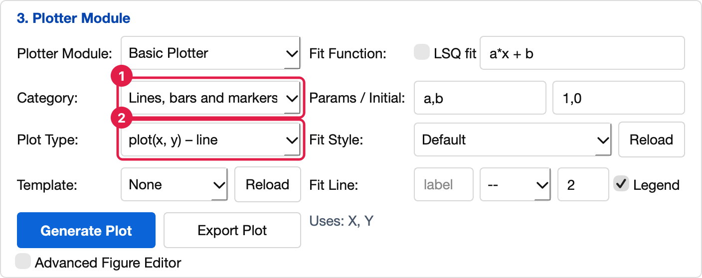

# Plotter Module

[UI Reference](UI-Reference) › Simple Mode › 3. Plotter Module

The third Simple Mode panel draws the table as a figure. It can style the figure with
a template and add a least-squares (LSQ) fit line. The left half chooses *what* to
plot; the right half sets up the optional fit.

**What to plot**

1. **Plotter Module.** The plotting engine (see [Plotters and plot types](#plotters-and-plot-types)).
   The list only shows plotters that can draw the current data.
2. **Category** and **Plot Type.** The kind of figure the chosen plotter draws. For the
   Basic Plotter, **Category** groups its 84 plot types like the Matplotlib gallery (see
   [Basic Plotter plot types](#basic-plotter-plot-types)); other plotters show only
   **Plot Type**. Picking a type limits the table's role menus to what it uses and fills
   in the roles it needs. Your choice is kept while
   you work. When you pick another plotter, the same type stays selected if that plotter
   offers it; otherwise its first type is selected.
3. **Template.** A saved figure style (fonts, sizes, colours, grid) applied after the
   plot is drawn. **None** leaves the plotter's own look. Templates are JSON files in
   `config/templates/`; make your own in the [Figure Editor](UI-Figure-Editor#save-as-template).
   The template is applied in the GUI only. It is not recorded in the protocol, so
   replays, `Sequence.py` files and bulk runs draw the plot without it.
4. **Reload** (next to Template). Re-scans `config/templates/` so a template you just
   saved appears without restarting.
5. **Generate Plot.** Draws the figure and opens it (see [Where the figure opens](#where-the-figure-opens)).
   It adds a *Generate Plot* row to the protocol, which stores the plotter, the plot
   type and the fit settings. The status bar shows *"Plot generated"*.
6. **Export Plot.** Saves the most recently generated figure (see [Export Plot](#export-plot)).

**Optional LSQ fit**

7. **LSQ fit.** Tick to add a fitted curve to the next plot. Unticked, the fields on
   the right are ignored.
8. **Fit Function.** The model *f(x)* as a Python expression in `x` and your parameter
   names, for example `a*x + b`, `A*exp(-x/t) + c` or `a*sin(w*x + p)`. Available
   functions are `exp`, `log`, `log10`, `sqrt`, `abs`, `sin`, `cos`, `tan`, `arcsin`,
   `arccos`, `arctan`, `sinh`, `cosh`, `tanh` and `np.<anything>`.
9. **Params.** The parameter names, separated by commas (`a,b`).
10. **Initial.** One starting value per parameter, in the same order (`1,0`). Good
    starting values matter for non-linear models.
11. **Fit Style.** A saved preset for the fit line. Choosing one fills fields 13–16.
    **Default** leaves the fields as they are.
12. **Reload** (next to Fit Style). Re-scans `config/figureforge_fit_styles/`.
13. **Fit Line label.** The legend text for the fitted curve. Leave it empty for an
    automatic label with the fitted values, for example
    `LSQ fit: a*x + b (a=2.013, b=-0.4981)`.
14. **Line style.** `--` dashed (default), `-` solid, `-.` dash-dot, `:` dotted.
15. **Line width.** In points (default `2`).
16. **Legend.** Show a legend on the plot.

Blank fit fields fall back to the defaults shown above. The fit uses the **X** and
**Y** columns and skips rows where either is blank. It is drawn on the first set of
axes, over the full X range, and the fitted values are saved as the latest fit result
(**Export Data** writes them to `fit.json`).

**Videos:** [Generating Plots](https://youtu.be/DbsN_NGNpCM) (0:19) · [Error Bars](https://youtu.be/4KBA064UiQc) (0:24) · [Curve Fitting](https://youtu.be/SnhtG1Fdh4Y) (0:23) · [all videos](Video-Tutorials)

  

## Basic Plotter plot types

The Basic Plotter offers every chart kind from the [Matplotlib plot types](https://matplotlib.org/stable/plot_types/)
page and the plotting sections of the [Matplotlib gallery](https://matplotlib.org/stable/gallery/),
grouped the same way. Pick a **Category**, then a **Plot Type** (shown as the Matplotlib call).

- The table's role menus then offer only the roles that plot type uses (plus **Ignore**,
  **Group**, **Label** and **Batch Key**). A column keeps a role the type does not use; it is
  shown greyed with the tooltip *Not used by the selected plot type*.
- When you pick a plotter, category or plot type, the table's role selections change to
  match it. Data roles it does not read (X, Y, Y2, Z, U, V, W, X Error, Y Error) go back
  to **Ignore**, then the roles it needs are given to the next free columns (numeric
  columns for X, Y, Z…, text columns for Label and Group) and recorded in the protocol.
  Group, Label, Batch Key and Fit Weight are never cleared. For example *hist(x)* leaves
  only Y set; going back to *scatter(x, y)* puts X on the first free numeric column again.
- The Histogram, Error Bar, Overlay and Subplot Grid plotters work the same way with the
  roles they read. The Nanoindentation and Oliver–Pharr plotters find their columns by
  name, so they offer every role. The status bar lists them, for example
  *Roles set for contourf(X, Y, Z): x → X, y → Y, z → Z*. The hint under **Fit Line**
  shows what the type uses, for example *Uses: X, Y (Y2 optional)*.
- Gridded types (images, contours, surfaces, Hinton, hillshading) take a long table, one
  row per point with X, Y and Z columns. A regular grid is used as is; scattered points
  are interpolated onto a 100 × 100 grid.

### Lines, bars and markers

| Plot type | Uses | Optional | Draws |
| --- | --- | --- | --- |
| `scatter(x, y)` (`scatter`) | X, Y | – | Markers at each point. |
| `plot(x, y) – line` (`line`) | X, Y | – | Line through the points. |
| `plot(x, y) – markers and line` (`scatter_line`) | X, Y | – | Markers joined by a line. |
| `scatter(x, y, c=z)` (`scatter_colored`) | X, Y, Z | – | Markers coloured by Z. |
| `scatter with histograms` (`scatter_hist`) | X, Y | – | Scatter with marginal histograms of X and Y. |
| `multicolored line (LineCollection)` (`multicolor_line`) | X, Y, Z | – | Line coloured by Z. |
| `step(x, y)` (`step`) | X, Y | – | Step line through the points. |
| `stairs(values)` (`stairs`) | Y | X | Step outline of the Y values. |
| `stem(x, y)` (`stem`) | X, Y | – | Vertical stems from the baseline. |
| `vlines(x, 0, y)` (`vlines`) | X, Y | – | A vertical line from zero to Y at each X. |
| `bar(x, height)` (`bar`) | X, Y | – | A bar per X, Y tall. |
| `barh(y, width)` (`barh`) | X, Y | – | Horizontal bars. |
| `grouped bar chart` (`bar_grouped`) | X, Y, Y2 | – | Y and Y2 bars side by side. |
| `stacked bar chart` (`bar_stacked`) | X, Y, Y2 | – | Y2 bars stacked on Y. |
| `bar(categories, values)` (`bar_categorical`) | Label, Y | – | A bar per Label text. |
| `broken_barh(xranges, yrange)` (`broken_barh`) | X, Y | Group | Bars from X lasting Y (a row per Group). |
| `fill(x, y) – filled polygon` (`fill`) | X, Y | – | Polygon through the points, filled. |
| `fill_between(x, y1, y2)` (`fill_between`) | X, Y | Y2 | Area between Y and Y2 (or zero). |
| `stackplot(x, y)` (`stackplot`) | X, Y | Y2 | Stacked areas of Y and Y2. |
| `stackplot(..., baseline='wiggle')` (`streamgraph`) | X, Y | Y2 | Streamgraph of Y and Y2. |
| `twin y axes (twinx)` (`twinx`) | X, Y, Y2 | – | Y on the left axis, Y2 on the right. |

### Statistics

| Plot type | Uses | Optional | Draws |
| --- | --- | --- | --- |
| `hist(x)` (`hist`) | Y | – | Histogram of the Y values. |
| `hist(x, histtype='step')` (`hist_step`) | Y | Y2 | Outline histograms of Y (and Y2). |
| `hist([y, y2]) – side by side` (`hist_multi`) | Y, Y2 | – | Histograms of Y and Y2 side by side. |
| `bihistogram` (`bihistogram`) | Y, Y2 | – | Y above, Y2 mirrored below. |
| `ecdf(x)` (`ecdf`) | Y | – | Empirical cumulative distribution of Y. |
| `boxplot(X)` (`boxplot`) | Y | Y2, Group | Box plot of Y (per Group, or Y and Y2). |
| `violinplot(D)` (`violinplot`) | Y | Y2, Group | Violin plot of Y (per Group, or Y and Y2). |
| `errorbar(x, y, yerr, xerr)` (`errorbar`) | X, Y | Y Error, X Error | Points with error bars. |
| `curve with error band` (`error_band`) | X, Y, Y Error | – | Line with a shaded ±error band. |
| `confidence ellipse` (`confidence_ellipse`) | X, Y | – | Scatter with 1σ, 2σ and 3σ covariance ellipses. |
| `hist2d(x, y)` (`hist2d`) | X, Y | – | 2D histogram of X and Y. |
| `hexbin(x, y, C)` (`hexbin`) | X, Y | Z | Hexagonal bins, coloured by count or mean Z. |
| `eventplot(D)` (`eventplot`) | Y | Group | A tick at each Y value (a row per Group). |
| `acorr(x)` (`acorr`) | Y | – | Autocorrelation of Y. |
| `xcorr(x, y)` (`xcorr`) | Y, Y2 | – | Cross-correlation of Y and Y2. |
| `psd(x)` (`psd`) | Y | X | Power spectral density of Y (sampling from X). |
| `csd(x, y)` (`csd`) | Y, Y2 | X | Cross spectral density of Y and Y2. |
| `cohere(x, y)` (`cohere`) | Y, Y2 | X | Coherence of Y and Y2. |
| `magnitude_spectrum(x)` (`magnitude_spectrum`) | Y | X | Magnitude spectrum of Y. |

### Images, contours and fields

| Plot type | Uses | Optional | Draws |
| --- | --- | --- | --- |
| `imshow(Z)` (`imshow`) | X, Y, Z | – | Z on the X, Y grid as an image. |
| `matshow(Z)` (`matshow`) | X, Y, Z | – | Z grid as a matrix. |
| `annotated heatmap` (`heatmap`) | X, Y, Z | – | Z grid with each value written in its cell. |
| `pcolor(X, Y, Z)` (`pcolor`) | X, Y, Z | – | Coloured grid cells (pcolor). |
| `pcolormesh(X, Y, Z)` (`pcolormesh`) | X, Y, Z | – | Coloured grid cells. |
| `contour(X, Y, Z)` (`contour`) | X, Y, Z | – | Labelled contour lines of Z. |
| `contourf(X, Y, Z)` (`contourf`) | X, Y, Z | – | Filled contours of Z. |
| `spy(Z)` (`spy`) | X, Y, Z | – | Non-zero pattern of the Z grid. |
| `specgram(x)` (`specgram`) | Y | X | Spectrogram of the signal Y. |
| `barcode` (`barcode`) | Y | – | Y as a one-row barcode image. |
| `barbs(X, Y, U, V)` (`barbs`) | X, Y, U, V | – | Wind barbs of the U, V field. |
| `quiver(X, Y, U, V)` (`quiver`) | X, Y, U, V | – | Arrows of the U, V field. |
| `streamplot(X, Y, U, V)` (`streamplot`) | X, Y, U, V | – | Streamlines of the U, V field. |
| `tricontour(x, y, z)` (`tricontour`) | X, Y, Z | – | Contour lines on scattered points. |
| `tricontourf(x, y, z)` (`tricontourf`) | X, Y, Z | – | Filled contours on scattered points. |
| `tripcolor(x, y, z)` (`tripcolor`) | X, Y, Z | – | Coloured triangles. |
| `triplot(x, y)` (`triplot`) | X, Y | – | The triangulation of the points. |

### Pie and polar charts

| Plot type | Uses | Optional | Draws |
| --- | --- | --- | --- |
| `pie(x)` (`pie`) | Y | Label | Pie of the Y values. |
| `pie(x, wedgeprops=width) – donut` (`donut`) | Y | Label | Donut chart of the Y values. |
| `nested pie` (`nested_pie`) | Y, Group | Label | Inner ring per Group, outer ring per row. |
| `polar plot` (`polar_line`) | X, Y | – | Y (radius) against X (angle, radians). |
| `scatter on polar axis` (`polar_scatter`) | X, Y | – | Markers at angle X, radius Y. |
| `bar on polar axis` (`polar_bar`) | X, Y | – | Bars at angle X, Y long. |
| `errorbar on polar axis` (`polar_errorbar`) | X, Y, Y Error | – | Polar points with radial error bars. |

### 3D plotting

| Plot type | Uses | Optional | Draws |
| --- | --- | --- | --- |
| `plot(xs, ys, zs)` (`plot3d`) | X, Y, Z | – | 3D line. |
| `scatter(xs, ys, zs)` (`scatter3d`) | X, Y, Z | – | 3D markers. |
| `stem(x, y, z)` (`stem3d`) | X, Y, Z | – | 3D stems. |
| `bar3d(x, y, z, dx, dy, dz)` (`bar3d`) | X, Y, Z | – | 3D bars Z tall at X, Y. |
| `3D histogram of 2D data` (`hist3d`) | X, Y | – | 3D bars counting X, Y pairs. |
| `fill_between(x1, y1, z1, x2, y2, z2)` (`fill_between3d`) | X, Y, Z | – | Area between the 3D curve and z = 0. |
| `quiver(X, Y, Z, U, V, W)` (`quiver3d`) | X, Y, Z, U, V, W | – | 3D arrows. |
| `plot_surface(X, Y, Z)` (`plot_surface`) | X, Y, Z | – | Surface of Z over X, Y. |
| `surface with projected contours` (`surface_projected`) | X, Y, Z | – | Surface with its contours on the walls. |
| `plot_wireframe(X, Y, Z)` (`plot_wireframe`) | X, Y, Z | – | Wireframe of Z over X, Y. |
| `plot_trisurf(x, y, z)` (`plot_trisurf`) | X, Y, Z | – | Surface through scattered points. |
| `contour(X, Y, Z) in 3D` (`contour3d`) | X, Y, Z | – | Contour lines at their Z height. |
| `contourf(X, Y, Z) in 3D` (`contourf3d`) | X, Y, Z | – | Filled contours in 3D. |
| `tricontour(x, y, z) in 3D` (`tricontour3d`) | X, Y, Z | – | Contours on scattered points in 3D. |
| `tricontourf(x, y, z) in 3D` (`tricontourf3d`) | X, Y, Z | – | Filled contours on scattered points in 3D. |
| `voxels([x, y, z], filled)` (`voxels`) | X, Y, Z | – | A cube at each integer X, Y, Z. |

### Specialty plots

| Plot type | Uses | Optional | Draws |
| --- | --- | --- | --- |
| `radar (spider) chart` (`radar`) | Label, Y | Y2 | A spoke per Label, Y (and Y2) as polygons. |
| `Hinton diagram` (`hinton`) | X, Y, Z | – | Squares sized by |Z|, coloured by sign. |
| `hillshading` (`hillshade`) | X, Y, Z | – | Z grid as a shaded relief. |
| `Sankey diagram` (`sankey`) | Y | Label | Flows: positive Y in, negative Y out. |

## Plotters and plot types

| Plotter | Plot types | Needs | Shown for |
| --- | --- | --- | --- |
| **Basic Plotter** | 84 plot types in 6 categories, from `scatter(x, y)` to `contourf(X, Y, Z)` and `plot_surface(X, Y, Z)` (see [Basic Plotter plot types](#basic-plotter-plot-types)); plus the `scatter_publication` preset | Depends on the plot type | Any data |
| **Histogram Plotter** | `histogram` (counts in 20 bins), `density_histogram` (normalised) | Y, or X if there is no Y | Any data |
| **Scatter Plotter** | `scatter` | X, Y | Any data |
| **Line Plotter** | `line` | X, Y | Any data |
| **Error Bar Plotter** | `x_y_errorbar`, `y_errorbar` | X, Y, and X Error and/or Y Error | Any data |
| **Overlay Plotter** | `overlay_by_group`, `overlay_by_dataset` | X, Y, and optionally Group or Label: one line per value, with a legend | Any data |
| **Subplot Grid Plotter** | `subplots_by_group`, `subplots_by_dataset` | X, Y, and optionally Group or Label: one small plot per value, up to three per row | Any data |
| **Nanoindentation Plotter** | `load_depth`, `hardness_depth`, `modulus_depth`, `stiffness_depth`, `contact_depth` | Columns found by name (load, depth, hardness, …) | Data imported with the **Nanoindentation Loader** |
| **Oliver-Pharr Plotter** | `load_depth_with_unloading_fit`, `unloading_fit`, `contact_stiffness_fit`, `area_function`, `hardness_summary`, `modulus_summary` | Load–depth curve | Data imported with the **Nanoindentation Loader** |
| **Example XY Plotter** | `xy_markers`, `xy_line` | X, Y | A sample user plotter from `config/plotter_modules/` |

More entries can appear:

- **Plot type presets** from `config/plot_types/*.json` add a named variant of an
  existing plot type (`scatter_publication` is one).
- **Your own plotters** from `Documents/PhysPlot/config/plotter_modules/`.
- **Loader plotters**, declared by the loader plugin that imported the current file.

Loader plotters are shown only while that loader's data is loaded. After adding a
file, choose **File → Reload Config Modules**. See [Extending PhysPlot](Extending-PhysPlot).

## Where the figure opens

| Plotter | Opens in | Template | LSQ fit |
| --- | --- | --- | --- |
| Built-in and user plotters (including **Basic Plotter**) | A plot window titled *PhysPlot - <plotter>: <plot type>* with the Matplotlib toolbar and **Advanced Styling…** (opens the [Figure Editor](UI-Figure-Editor)) | Applied | Yes |
| Loader plotters | The same plot window | Applied | No: *"LSQ fit from Simple Mode is available for backend plotter modules."* |

Tick **Advanced Figure Editor** (under **Generate Plot**) to open plots straight in the
[Figure Editor](UI-Figure-Editor) instead of a plot window; PhysPlot remembers the choice.

Each Generate Plot opens a new window; earlier windows stay open until you close them.
**Plot → Generate Plot** (Ctrl+G) is a shortcut for the Basic Plotter scatter plot with
the selected Template, without a fit.

## Export Plot

Saves the latest generated figure (including the fit line). Choose PNG, PDF or SVG in
the file dialog. The default name is `physplot_plot.png`, and images are written at
300 dpi. The status bar shows *"Plot exported"*.

- **No plot yet:** you get *Export plot failed: Generate a plot before exporting.*
- **Figure Editor changes:** these are included when the edited figure is the latest
  plot, because the editor edits the plot window's figure itself.

## When plotting fails

A *Plot failed* dialog explains the problem and nothing is recorded. Common messages:

| Message | Fix |
| --- | --- |
| *No column has role 'X'.* (or `'Y'`) | Set the role in the column's dropdown. |
| *Column '…' does not contain numeric data.* | The X or Y column holds only text; pick another column or fix the values. |
| *LSQ initial guesses must match the parameter list.* | Give one Initial value per name in Params. |
| *Not enough numeric points for the requested LSQ fit.* | The fit needs at least as many X/Y pairs as parameters. |
| *Optimal parameters not found…* | The fit did not converge; try better Initial values or a simpler model. |
