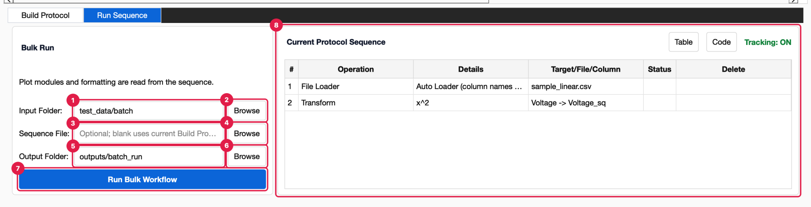

# Run Sequence

[UI Reference](UI-Reference) › Advanced Mode › Run Sequence

**Run Sequence** is the second Advanced Mode tab. It applies a protocol to every data
file in a folder and saves one result folder per file. Use it when you have many
measurements that need the same processing and plot.



1. **Input Folder.** The folder with the data files to process. Type a path or use
   **Browse**.
2. **Browse** opens a folder dialog (*Input Folder*).
3. **Sequence File.** Optional. A saved `Sequence.py` to run. Leave it blank to use
   the protocol currently shown in Build Protocol.
4. **Browse** opens a file dialog (*Sequence File*, Python files) in
   `Documents/PhysPlot/config/sequences/`.
5. **Output Folder.** Where results are written. It is created if it doesn't exist.
6. **Browse** opens a folder dialog (*Output Folder*).
7. **Run Bulk Workflow.** Starts the run. The window waits until every file is done.
8. **Current Protocol Sequence.** A read-only copy of the Build Protocol table, with
   the same **Table** / **Code** views and the status of the last run. It is here so
   you can check what will run. To change the protocol, use
   [Build Protocol](UI-Build-Protocol).

The note under **Bulk Run** is a reminder: *"Plot modules and formatting are read from
the sequence."* The plotter, plot type and LSQ fit come from the protocol's
*Generate Plot* steps, not from the Simple Mode panel's current settings.

## Which files are processed

Only files directly inside the input folder are processed (not subfolders), in
alphabetical order. Which files count depends on how the protocol's *File Loader*
step loaded its file:

| Protocol was recorded on… | Files processed |
| --- | --- |
| A `.csv`, `.txt`, `.dat`, `.tsv`, `.msa`, `.xls`, `.xlsx` or `.xrdml` file with a built-in loader | Every file with any of those extensions |
| A file loaded by a loader plugin (for example a Rigaku `.ras` scan) | Only files with that file's extension |
| Another extension | Only files with that extension |

Each file is loaded the same way as the recorded file, using the same loader or
loader plugin with the same column names and roles. The rest of the protocol then runs
on it. Protocol steps that refer to columns by name fall back to the column number
when a file uses different names.

## What is written

For every input file, a folder named after the file (without its extension) is
created in the output folder:

```text
Output Folder/
├── sample_01/
│   ├── data.csv       processed table
│   ├── columns.csv    column numbers, names, roles, types and units
│   ├── workflow.py    the protocol that produced it
│   ├── fit.json       LSQ fit parameters (when the protocol fits)
│   └── plot.png       the last plot (when the protocol plots)
└── sample_02/
    └── …
```

When the run finishes, the status bar shows *"Bulk complete: N outputs"*.


## When a run fails

The run stops at the first file that fails, and a *Bulk run failed* dialog says which
file and why:

> Bulk run stopped at sample_07.csv: Column 'Intensity' does not contain numeric
> values for transformation.
>
> Files before it in the input folder were exported; later files were not run.

Fix the file (or the protocol) and run again. Results already written are overwritten.

Other messages:

- *Build or import a protocol sequence before running bulk automation.* The Sequence
  File is blank and Build Protocol is empty.
- *No such file or directory…* A folder or the sequence file path is wrong.

The same run is available without the GUI. See
[Bulk Runs and Headless Use](Bulk-Runs-and-Headless).
